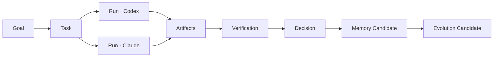
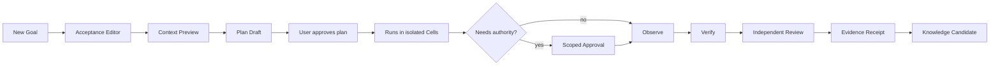
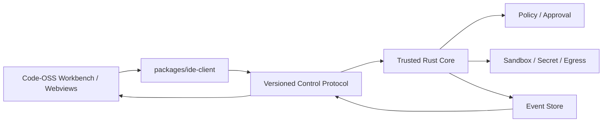

# Saber Studio 企业级 GUI 产品与交互设计

> 版本：1.0
>
> 日期：2026-08-28
>
> 状态：GUI 设计基线，不代表现有桌面实现已经完成
>
> 产品：Saber Studio（桌面 IDE）+ Saber Core（可信本地运行时）
>
> 目标平台：macOS、Windows、Linux；企业完整版采用 Code-OSS/Electron，Rust Core 独立进程

---

## 0. 设计结论

Saber Studio 不应只是“编辑器右边再放一个聊天框”，也不应把 Agent 的所有活动压缩成一段难以审计的聊天记录。它是一套以 **Goal 为根、Evidence 为完成依据、Continuity 为身份、Policy 为免疫系统** 的 Agentic Development Environment。

GUI 必须同时服务五件事：

1. **指导**：把自然语言愿望变成 Goal、验收标准、Task DAG 和风险预算。
2. **协作**：让用户同时监督多个模型、Agent、Subagent、Worktree 和执行环境。
3. **审查**：让每个修改、命令、网络访问、审批和结论都能回到证据。
4. **连续**：从 Codex、Claude Code、Cursor、ZCode、MiniMax Code 等外部会话继续工作，同时保留来源和环境漂移。
5. **成长与自愈**：让 Memory、Skill、Workflow、Code Capsule 和 Core PR 的进化过程可见、可评测、可拒绝、可回滚；让系统在异常时先止血、隔离，再诊断。

### 0.1 产品定位

```text
传统 IDE：File → Edit → Build
聊天型 CodingAgent：Prompt → Answer → Diff
Saber Studio：Goal → Context → Plan → Governed Run → Evidence → Review → Knowledge → Evolution
```

**桌面优先不变量**：Saber Studio Desktop 是主产品，启动或恢复工作区时默认进入完整的 Desktop Agent Workbench。Today / Command Center 是二级监督页面；`bin/saber ui` 是可选 Web Supervisor。两者都不得作为桌面 IDE 完成度的替代证据。

### 0.2 核心界面原则

- **Goal 不是聊天标题**：Goal 有验收、预算、依赖、负责人、状态和完成证据。
- **Conversation 不是事实库**：对话是协作视图；Event、Artifact、Decision 和 Memory 才是可治理对象。
- **进度不是“模型正在思考”**：只显示可观察事件、工具、文件、测试、等待、风险和结果，不显示或伪造隐藏推理。
- **批准不是“允许全部”**：Approval Card 必须展示动作、资源、原因、Secret、网络、期限和最小替代方案。
- **安全不是设置页里的开关**：Trust Cell、Policy、Sandbox、Egress、Secret 和 Health 必须在工作流中持续可见。
- **进化不是自动改 Prompt**：每个 Candidate 都必须显示证据、介质选择、评测、权限差异、责任人和回滚点。
- **隐喻服务理解，不替代专业语言**：默认使用企业术语；“大脑、感官、手、血管、免疫、装甲”作为可选解释层。

---

## 1. 竞品能力吸收与 Saber 取舍

本节只吸收公开可验证的产品模式，不猜测内部实现，也不复制品牌视觉。

| 产品 | 应吸收的 GUI 能力 | Saber 的升级 | 不照搬的部分 |
|---|---|---|---|
| Codex App | 项目化任务侧栏、多 Agent 并行、Worktree 隔离、线程内 Diff Review、Skills、Automations Review Queue | 把 Thread 提升为 Goal/Task/Run 谱系；任何自动任务进入统一 Evidence Inbox | 不让厂商 Thread 成为主数据；不把所有操作隐藏在聊天流 |
| Claude Code Desktop | 可拖拽 Chat/Diff/Preview/Terminal/File/Plan/Subagent 面板、Side Chat、视觉 Diff 评论、Local/SSH/Cloud 环境、权限模式 | Pane 布局成为可保存的 Workspace Lens；所有 Pane 共用同一 Trust Cell 和 Event Cursor | 不让 Renderer 直接拥有执行权；不把“自动安全检查”当确定性安全边界 |
| Cursor | Agent Sidepane、Background Agent 列表、远程任务接管、Review/Merge、Run Mode | 前台/后台/远程统一为 Run Realm；Run Mode 改为有证据的渐进自治 A0-A4 | 不提供无沙箱的“Run Everything”作为普通默认路径 |
| Zed | Agent Panel、Worktree Picker、Follow Agent、消息排队/Steer、Checkpoint、按 Hunk Keep/Reject、External Agent | Follow Agent 升级为可过滤 Event Timeline；Checkpoint 与 Event/Artifact hash 绑定 | 不把 Agent 对话等同于项目状态；不把权限只放在工具配置中 |
| ZCode | Task Sidebar、Goal Mode、`@` 文件/`#` 对话/`/` 命令/`$` Skill、执行模式、Browser Panel、项目 Memory、Subagent | 统一 Context Composer 语法；Conversation Link 先生成可核验 Resumption Capsule；Memory 可浏览、撤销、解释 | 不允许不可查看或不可清理的自动 Memory；Full Access 不能绕过 Core Policy |
| MiniMax Code | “目标→团队”、Agent Team、Memory & Evolution、Skills、Schedules、聊天平台入口 | Team Canvas 显示委派、能力衰减、预算、证据和故障域；Evolution 使用受治理供应链 | 不用“自动成长”模糊 Memory、Skill、代码和核心修改的权力差异 |
| VS Code/Copilot | Plan→Implement handoff、Todo、Checkpoint、编辑器原生 Diff/SCM/LSP/Terminal/Debug | 计划与执行者可替换，但 Goal、Acceptance 和 Evidence 不丢；Code-OSS 提供成熟 IDE 基座 | 不让普通扩展自动获得 Agent Memory、Secret、Egress 或 Core IPC |

### 1.1 官方研究来源

- OpenAI Codex App：<https://openai.com/index/introducing-the-codex-app/>
- Claude Code Desktop：<https://code.claude.com/docs/en/desktop>
- Cursor Agent：<https://cursor.com/docs/agent/overview>
- Cursor Background Agents：<https://docs.cursor.com/background-agent>
- Cursor Run Modes：<https://prod.cursor.com/docs/agent/security/run-modes>
- Zed Agent Panel：<https://zed.dev/docs/ai/agent-panel>
- ZCode Agent：<https://zcode.z.ai/cn/docs/agents>
- ZCode Subagents：<https://zcode.z.ai/en/docs/subagents>
- MiniMax Code：<https://agent.minimax.io/download>
- VS Code Agent Planning：<https://code.visualstudio.com/docs/agents/planning>

---

## 2. Saber 独有设计哲学

### 2.1 连续的软件主体

Saber 的“人”不是某一个 LLM。产品身份由 Constitution、Goal、Decision、Knowledge、Permission、Evidence 和责任谱系共同构成。模型可以更换，就像大脑皮层的某个认知模块可以替换；主体连续性不应随会话供应商消失。

GUI 使用一条始终存在的 **Continuity Spine（连续性脊柱）** 表达这件事：



在任何页面，用户都可以沿 Spine 回到“为什么开始、谁做过、依据是什么、现在能否继续”。

### 2.2 钢铁侠与浩克：外部装甲 + 内生能力

- **Armor Rack（装甲库）**：模型、外部 Agent、MCP、Connector、Plugin、Remote Realm、Browser、Simulator。
- **Capability Genome（能力基因组）**：内生的 Context Rule、Memory、Workflow、Skill、Strategy、Code Capsule、Core Change Proposal。
- 两者在 UI 中使用同一能力卡结构，但清楚区分来源、所有者、信任、运行位置、数据边界和撤销方式。
- 外部装甲可以卸载；内生能力可以降级、回滚、隔离；二者都不能修改 Constitution 和 E7 Trust Root。

### 2.3 人体与免疫系统

| 哲学隐喻 | 专业产品名称 | GUI 表达 |
|---|---|---|
| 大脑 | Model/Agent Router | 当前模型、Provider、理由、预算和替代路线 |
| 眼耳口 | Context/Conversation | Context Receipt、来源、敏感度、发送目标 |
| 手 | Tool/Agent/Plugin | Tool Call、Capability、资源、执行 Realm |
| 血管/神经 | Goal Plan + Event Flow | Continuity Spine、Timeline、因果线和 Event Cursor |
| 皮肤 | Trust Boundary | Trust Cell 边界、Sandbox、Egress、DLP |
| 白细胞 | Supervisor/Quarantine | 自动隔离、重启、撤销、降级和证据保全 |
| 血小板 | Transaction/Checkpoint | Stop、Rollback、Worktree、Circuit Breaker |
| 炎症 | Health Signal | 非模态 Vital Bar、严重度、影响面、自动处置 |
| 药物/医生 | External Authority | 人工审批、组织策略、厂商补丁、Support Bundle |

默认界面显示专业名称；开启“哲学解释层”后，在 Tooltip、Onboarding 和 Health 教学中补充隐喻。禁止把企业安全事故游戏化。

### 2.4 视觉母题

- **Spine**：细竖线和节点表达 Goal→Evidence 的连续性。
- **Pulse**：仅在真实事件到达时短暂出现，不用无意义循环动画冒充工作。
- **Cell**：每个 Workspace/Run 有明确边界、Realm、Policy 和 Health。
- **Receipt**：Context、Approval、Change、Knowledge 都有可展开的“收据”。
- **Scar**：已解决 Incident 留下可审计但低干扰的历史标记，提醒系统曾在哪里受伤及如何恢复。

---

## 3. 用户角色与核心任务

| 角色 | 首要任务 | GUI 默认视角 |
|---|---|---|
| Developer | 理解、修改、测试、提交代码 | Studio + Changes |
| Tech Lead | 拆 Goal、并行委派、审查证据 | Command Center + Goal Map |
| Reviewer | 审 Diff、测试、风险和 AI 来源 | Review Lens |
| Knowledge Curator | 接受/拒绝/修订 Memory | Knowledge + Evolution |
| Security/Platform | 管 Policy、Realm、Secret、Egress、Incident | Health + Governance |
| Enterprise Admin | 管租户、设备、模型、插件、审计与保留 | Admin Console |
| Individual Power User | 跨 Agent 续接、自动化、个人能力成长 | Today + Continue + Armor |

角色只改变默认布局和可见操作，不改变服务端/Core 权限。隐藏按钮不能替代授权控制。

---

## 4. 全局信息架构

### 4.1 一级结构

```text
Saber Studio
├── Desktop Agent Workbench（默认）
│   ├── Projects / Goals / Tasks / Conversations
│   ├── Agent Conversation & Plan
│   ├── Explorer / Editor / Diff / SCM
│   ├── Terminal / Tests / Problems / Preview
│   └── Evidence Drawer / Vital Bar
├── Today / Command Center（二级监督页）
├── Memory & Knowledge
├── Armor Rack
├── Evolution Workshop
├── Health Center
├── Automations
├── Evidence Inbox
└── Governance / Settings
```

Workbench 内的 Conversation、Plan、Editor、Changes 和 Runtime 是可组合 Pane，不是互相割裂的产品首页；Armor、Evolution、Health 属于跨 Workspace 的能力与治理面。

### 4.2 桌面壳区域

```text
┌ Global title bar: Workspace · Branch · Realm · Privacy · Autonomy · Health ┐
├ Rail ┬ Context sidebar ┬──────────── Workspace canvas ───────────┬ Evidence ┤
│ 56px │ 240–360px       │ editor/chat/plan/review                 │ drawer   │
├──────┴─────────────────┴────────────────────────────────────────┴──────────┤
│ Vital bar: Run state · queued approval · test · network · cost · incident  │
└─────────────────────────────────────────────────────────────────────────────┘
```

- **Global title bar**：身份与边界，不放低价值装饰。
- **Rail**：一级视图，图标 + 可访问标签；企业部署可固定 Governance。
- **Context sidebar**：Goal 树、Task、Thread、File、Memory 或 Agent 列表，随 Lens 改变。
- **Workspace canvas**：最多 3 个主 Pane，支持拖拽布局和保存角色模板。
- **Evidence drawer**：右侧按需展开，显示来源、Diff、测试、审批、Policy 和 Artifact。
- **Vital bar**：底部持续显示运行、风险和健康；严重事件升级为可操作 Banner。

### 4.3 窗口与 Pane 策略

- 默认“一窗多 Goal”，允许 Goal 弹出独立窗口。
- Pane 类型：Editor、Conversation、Plan、Diff、Preview、Terminal、Timeline、Knowledge、Agent、Browser、Incident。
- Pane Header 必须显示所属 Task/Run，防止用户在错误 Worktree、Realm 或 Agent 上操作。
- 布局按 `用户 × 角色 × Workspace 类型` 保存，本地加密同步；不得把窗口布局当权威任务状态。
- 关闭/崩溃 Renderer 不终止 Run；重启后从 Event Cursor 恢复。

---

## 5. 导航与核心页面设计

### 5.1 Desktop Agent Workbench（默认）

**目的**：在一个桌面窗口内完成真实 CodingAgent 主循环，而不是先进入运维仪表盘。

默认布局：

- 左侧：Projects、Goals、Tasks、历史 Conversation、后台 Runs、PR、Automations 与 Plugins。
- 中央：Agent Conversation、可编辑 Plan、Tool/Approval/Event 摘要和支持 `@/#//$` 的 Composer。
- 右侧：Code-OSS Explorer、Editor、Diff、SCM、Preview、Browser 等可组合 Pane。
- 底部：Terminal、Tests、Problems、Output；始终绑定当前 Task、Run、Worktree 和 Realm。
- 辅助层：Evidence Drawer 按需展开；Vital Bar 安静显示 Policy、Sandbox、Network、Cost、Health 和 Sync。

首次启动进入“打开/克隆仓库并创建 Goal”；再次启动恢复上次 Workbench。只有用户主动选择或角色策略明确配置时才进入 Command Center。

### 5.2 Today / Command Center

**目的**：10 秒内回答“什么在运行、什么需要我、什么失败、下一步是什么”。

布局：

- 左：Workspace 与 pinned Goal。
- 中上：Active Runs，按等待人、风险、失败、运行中排序，而非按最新聊天排序。
- 中下：Evidence Inbox，聚合 Review、Approval、Evolution、Incident、Automation 输出。
- 右：Today Brief，显示预算、设备/同步、组织公告和最近恢复点。

每个 Run Card 显示：Goal、Task、Agent/模型、Realm、Worktree、阶段、最近可观察事件、预计下一检查点、风险、预算、待用户动作。禁止用模糊百分比；只有具备可计算 DAG 时才显示完成比例。

核心操作：Open、Steer、Pause、Stop、Review、Take Over、Move Realm、Fork、Archive。

### 5.3 Goal & Plan

**目的**：让长期任务有可验证结构，而不是无限聊天。

布局：

- 左侧 Goal Outline：Objective、Acceptance、Constraints、Budget、Deadline、Owners。
- 中间 DAG Canvas：Task 节点显示依赖、Agent、Realm、状态和证据门。
- 右侧 Inspector：选中节点的输入、Capability、Context、Risk、Verification。
- 底部 Plan Timeline：计划版本、用户修改、Agent 提议、批准和偏离记录。

交互：

- 自然语言创建 Goal 后，先生成结构化草案；用户可逐项编辑验收标准。
- “Start implementation”必须明确选中计划版本、自治级别和执行 Realm。
- Plan 变化以 Diff 展示：新增/删除 Task、依赖、权限、预算和验收变化。
- Agent 可提出 Replan，但不能静默改写用户验收标准。

### 5.4 Conversation

**目的**：保留自然协作体验，同时把上下文和动作从聊天中解耦。

消息类型：User、Agent Summary、Question、Decision Proposal、Approval Request、Tool Summary、Artifact、Checkpoint、Incident、System Notice。

Composer 支持：

- `@` 文件、符号、Artifact、Issue。
- `#` 历史 Conversation、Goal、Decision、Run。
- `/` Command、Workflow、Automation。
- `$` Skill、Capability。
- `+` Attachment、Screenshot、PDF、External Source。
- Model、Agent Profile、Realm、Autonomy、Context Budget 作为明确选择器。

发送前可展开 **Context Preview**，显示将发送的来源、Token、敏感度、目标 Provider、DLP/脱敏和排除项。

消息细节：

- 默认折叠 Tool 调用，只显示“读了什么、改了什么、验证了什么”。
- 用户可切换 Summary / Normal / Evidence 模式；Evidence 模式显示全部可观察事件，不显示隐藏推理。
- 运行中消息可 Queue；开启 Steer 后在安全事件边界插入。
- 任何 Agent 结论旁可打开 Knowledge Receipt 和 Evidence Receipt。

### 5.5 Changes & Review

**目的**：把“Agent 说完成了”变成可独立审查的变更集。

布局：

- 左：Change Set 树，按 Task/Artifact 而非只按文件组织。
- 中：Unified/Split Diff、Inline Diagnostic、测试覆盖、Reviewer Comment。
- 右：Evidence Ladder：Intent → Decision → Edit → Test → Review → Apply。
- 下：验证控制台，显示命令、环境、退出码、日志摘要和 Artifact hash。

操作：Accept/Reject Hunk、Comment、Request Fix、Run Test Slice、Open Editor、Rollback Artifact、Create Commit、Open PR。

规则：

- Apply/Commit/Push 是不同动作和不同 Approval。
- AI 生成和人工修改以来源标签区分，但 Review 标准相同。
- 变更若超出 Goal scope、触碰 Trust Boundary 或增加 Capability，自动出现“Boundary Diff”。
- Review 完成必须绑定测试/证据；“看起来没问题”不能成为绿色状态。

### 5.6 Runtime & Timeline

**目的**：让长任务和多 Agent 可监督、可中断、可追责。

两种视图：

- **Timeline**：按因果顺序展示 Prompt Receipt、Model Call、Tool Intent、Policy Decision、Sandbox、Effect、Result、Verification、Incident。
- **Agent Map**：主 Agent、Subagent、外部 Agent 和 Reviewer 的委派树；显示能力衰减、预算和故障域。

过滤器：Run、Agent、Event Type、Risk、Realm、时间。默认不显示原始大日志，按需打开并做 Secret/DLP 处理。

实时操作：Steer、Pause、Cancel、Fork、Quarantine Agent、Open Terminal、Take Over。所有操作进入 Event Store。

### 5.7 Memory & Knowledge

**目的**：打破知识孤岛，但不给自动记忆无限权力。

页面结构：

- Search/Fabric：跨代码、对话、文档、Decision、Issue、Memory 的权限感知检索。
- Knowledge Graph：实体、来源、冲突、版本和引用，不用炫技式全屏关系图替代列表。
- Memory Ledger：Candidate、Accepted、Rejected、Revoked、Stale、Superseded。
- Context Usage：本次 Run 使用了哪些知识、为何选中、发往哪里。

每个知识条目必须显示 Provenance、Scope、Trust、Sensitivity、Freshness、Confidence、Owner、TTL、引用次数和撤销影响。

操作：Inspect Source、Compare Conflict、Accept、Edit then Accept、Reject、Revoke、Exclude from Context、Export、Delete。

### 5.8 Armor Rack

**目的**：统一管理外部装甲，而不是散落在多个设置页。

分类：Models、Coding Agents、MCP/Connectors、Plugins、Skills、Browsers/Simulators、Execution Realms。

能力卡字段：

- 名称、版本、来源、Publisher、Digest/Signature。
- 能力声明、所需权限、默认 Realm、网络目的地。
- 数据边界、保留策略、费用/预算、延迟、Health。
- 兼容矩阵、最近 Eval、替代能力、Last Known Good。
- Install/Enable/Disable/Quarantine/Rollback/Uninstall。

用“装甲轮廓 + 模块插槽”的轻量视觉表达外部增强，但操作区保持企业软件语义。

### 5.9 Evolution Workshop

**目的**：像 Code Review 一样审查系统“想学什么”。

Candidate 类型：Memory、Rule、Workflow、Skill、Strategy、Code Capsule、Plugin、Core PR。

三栏：

1. **Evidence**：观察到的问题、频率、来源可信度、反例。
2. **Proposal**：为何选择该介质、具体 Diff、Capability/数据边界变化。
3. **Evaluation**：Baseline/Variant、测试集、回归、安全门、成本和回滚。

状态：Observed → Proposed → Classified E0-E7 → Evaluating → Review → Canary → Promoted / Rejected / Quarantined / Rolled Back。

禁止：运行中 Agent 自批 E6、获取签名权、修改 E7 Trust Root、把一次对话直接升级为组织规则。

### 5.10 Health Center

**目的**：把自愈系统做成可操作的临床面板，而不是红色告警墙。

顶部显示 Trust Cell Vital：Healthy / Watching / Degraded / Contained / Safe Mode。

主体：

- Cell Map：Workspace、Core、Agent Host、Plugin、Indexer、Sync、Realm 的健康关系。
- Incident Timeline：Detect → Contain → Repair → Verify → Resolve。
- Automatic Actions：已停止的进程、撤销的 Secret、关闭的 Egress、回滚的能力、重建的索引。
- Escalation：需要用户、管理员、Security 或外部厂商的事项。
- Recovery Controls：Retry、Restore LKG、Rebuild、Export Support Bundle、Enter/Exit Safe Mode。

设计要求：先说明影响和已采取的止损，再提供诊断细节；H3/H4 不用 Toast 一闪而过。

### 5.11 Governance / Enterprise Admin

模块：Tenant、SSO/SCIM、Role/Attribute Policy、Signed Policy Bundle、Model Allowlist、Data Residency、Retention、Plugin Registry、Device Trust、KMS、Audit/SIEM、Break Glass。

管理员默认只见元数据和合规状态，不自动获得 Workspace 正文。任何 Break Glass 显示双人审批、TTL、目的、访问范围和审计回执。

### 5.12 Advanced Agent Body Inspectors

这组页面不是额外的 Web 监督台，而是 Desktop Agent Workbench 中按任务和边界
打开的原生 Pane/Editor。它们把“可替换大脑、外部装甲、神经反射、身体运行环境、
因果意识、注意力和免疫自愈”落成可操作界面。

**Capability and Agent Adapter Inspector（UI-36）**

- 顶部固定当前 Goal/Task、来源 Agent/Harness、协议、版本、配置与认证所有者。
- 中间用 Capability Graph 显示 Supported / Unsupported / Degraded、Provider、
  依赖与 Trust Class；缺口不能被 UI 统一外观隐藏。
- 右侧显示切换影响：Plan 假设、Context 格式、待审批、Tool、成本和恢复策略。
- `Switch` 先生成 Continuity Diff，再由 Core 记录切换；不能只换下拉框文案。

**Reflex and Hook Manager（UI-37）**

- Hook 列表按 Workspace / Goal / Task / global scope 分组，显示触发器、读写集、
  是否可阻断、预算、递归保护、Owner 和最后一次触发。
- `Simulate` 以真实事件结构运行但没有生产 Effect；结果显示会阻断、会调用什么、
  会消耗多少以及 Policy 决定。
- Circuit Breaker 与 Immune Override 始终可见；Unload 必须显示 listener/effect
  residue 验证，不以“扩展已消失”代替。

**Runtime/Sandbox Image Inspector（UI-38）**

- 显示 Image digest、构建来源、SBOM、工具链、CPU/架构、Mount、Network、Secret、
  资源上限、当前进程与 Attestation。
- Filesystem、Shell、PTY、LSP、Preview/Browser、Test 都显示同一 Realm/revision；
  不一致时整条 Evidence 标记为 Cross-Realm，需要重新验证。
- `Rebuild clean`、`Quarantine`、`Compare drift` 和 `Export metadata` 不暴露正文。

**Causal Timeline and Trajectory Replay（UI-39）**

- 分轨显示 Human Intent、Goal/Plan、Context Selection、Approval、Action、Observation、
  Change、Verification、Policy/Health；默认不展示或保存隐藏思维链。
- 可在任意 Event Cursor 打开“Model saw”视图，列出 Projection Recipe、来源、
  摘要、遗漏、脱敏、Token 与 Provider 格式。
- Replay 需要同时给出 canonical hash、projection hash 和 divergence/gap；聊天看起来
  完整但事件不完整时保持红色不确定状态。

**Specification Studio（UI-40）**

- 三列分别为 Requirements、Design Decisions、Tasks/Verification；每条都有 revision、
  owner、risk、status 和双向 trace。
- 自然语言可以生成草案，但 Accepted Requirement 必须由人或组织工作流确认。
- 设计或验收变更时，下游 Task/Evidence 自动标 Stale；不能仅更新 Markdown 后继续。

**Repository Map and Context Budget（UI-41）**

- 图视图与列表视图展示 symbol/file/community、排名原因、引用边、覆盖与 source revision。
- Context Nutrition Label 同时显示 Repo Map、Conversation、Decision、Memory、External
  Source 的预算、实际消耗、遗漏和 taint。
- `Drop and rebuild index` 是一等恢复旅程；Canonical code/chat/document records 不随
  向量、FTS、symbol 或 graph projection 一同删除。

**Recovery and Homeostasis Center（UI-42）**

- 比 Health Center 更聚焦一次事件的处置：Detect → Classify → Contain → Stabilize →
  Diagnose → Repair → Verify → Learn → Expire。
- 四个恢复域分别显示 Code、Canonical Events、Derived Context、External Effects；
  `Restore` 前展示 manual drift、不可逆动作和 uncertain 状态。
- H0-H4 由信号和影响计算，不由模型主观决定；Verify 失败返回 Contained 或 Escalated，
  不能显示 Recovered。
- H3/H4 的 Safe Mode 退出只接受 Core 所需的人类/安全权限，当前 Agent 与 Hook 无权退出。

---

## 6. 标志性组件规范

### 6.1 Continue Card

用于“继续昨天 Cursor/Claude/Codex 的任务”。

必须显示：来源、原 Session 的可验证程度、Repo/Branch/Commit、最后验证状态、已完成/未完成、Decision、环境漂移、敏感度、恢复置信度。

操作：Preview Capsule、Continue in Saber、Resume in Original Agent、Choose Another Candidate、Cancel。

文案必须诚实区分 Native Resume、Canonical Successor 和 Knowledge Continuation。

### 6.2 Context Nutrition Label

```text
Context 18.4k / 64k
Code 42% · Conversation 21% · Decisions 16% · Memory 9% · Other 12%
Sensitivity: Internal · Destination: local/qwen-coder
Redacted: 3 fields · Excluded: 2 sources · Freshness warning: 1
```

展开后逐条解释选择原因；用户可排除、撤销或调整预算。任何被发送内容必须能追溯来源。

### 6.3 Approval Card

视觉层级：

1. 动词和风险：`外发 2 个文件`、`删除 14 个路径`、`使用 production-read credential`。
2. 精确资源与目的地。
3. 为什么需要、由谁请求、属于哪个 Goal/Task/Run。
4. Sandbox、Secret、Egress、数据分类和可逆性。
5. 范围与期限：Once、Task、TTL；不能默认扩大。
6. 最小选项：Deny、Allow once、Narrow scope；高风险可增加 Review Details。

拒绝必须和允许同等可见；不得预选“永远允许”。卡片过期后就地变为 Expired，不能继续点击。

### 6.4 Evidence Receipt

每个“完成”旁的统一入口：

- Acceptance 条目及其 Evidence。
- Changed files / Artifacts / hashes。
- Tests、平台、时间、退出码。
- Reviewer、Decision、Policy snapshot。
- Known limitations、未验证项。

状态只允许：Unverified、Partially verified、Verified、Contradicted、Stale。禁止用纯绿色图标掩盖缺失证据。

### 6.5 Agent Cell Card

字段：Agent、Provider/Model、Task、Worktree、Realm、Capabilities、Context label、Budget、Health、Last event、Waiting reason。

卡片边框表达故障域，不用头像大小表达“智能程度”。并行 Agent 在同一 Goal 下按 Task 分组。

### 6.6 Vital Bar

固定底栏，只显示真正可操作的实时状态：

```text
Run 3 active · 1 waiting approval | Realm local-sandbox | Network deny
Policy 7f2a… | Context S2 | Cost ¥4.18 / ¥30 | Health H1 watching
```

点击任一段打开对应 Evidence Drawer。屏幕阅读器以完整句子播报状态变化。

---

## 7. 关键端到端流程

### 7.1 新 Goal 到可验证交付



### 7.2 跨 Agent 续接

1. 用户输入 `#` 或自然语言“继续某次会话”。
2. Saber 展示最多 3 个候选 Continue Card。
3. 用户检查环境漂移和来源边界。
4. Core 创建 Resumption Capsule，保留 `continued_from`。
5. 用户选择原 Agent、本地模型或其他 Provider 继续。
6. 新 Run 继承 Goal/Decision/Evidence，不继承不可见推理或未经批准的权限。

### 7.3 多 Agent 团队

1. Plan 中选择需要并行的 Task。
2. Team Canvas 推荐角色和模型，但用户可调整。
3. 委派时显示 Capability attenuation、预算、Realm、Worktree 和交付格式。
4. Subagent 输出先进入 Evidence Inbox；主 Agent 不能把子 Agent 的“声称成功”直接变成 Goal 完成。
5. 冲突在 Changes/Review 合并，Reviewer 与实现者可分离。

### 7.4 免疫反应

1. Health Signal 触发，Vital Bar 进入 Watching/Degraded。
2. Core 自动限制最小故障域：暂停 Egress、撤销 Secret、杀 Plugin、冻结 Candidate。
3. Incident Drawer 先展示“已止损什么”，再展示证据。
4. 可确定修复则执行并验证；不可确定则请求外部 Authority。
5. 恢复后留下 Scar Record 和回归测试候选。

---

## 8. 视觉系统

### 8.1 风格名称：Quiet Armor / 静默装甲

产品应像一套长期工作的专业仪器：克制、精确、坚固，有温度但不玩具化。视觉区别于常见“紫色 AI 渐变”和满屏聊天气泡。

### 8.2 色彩语义

| Token | Dark | Light | 用途 |
|---|---:|---:|---|
| `surface.nucleus` | `#0C1117` | `#F7F9FB` | 核心工作面 |
| `surface.raised` | `#141B23` | `#FFFFFF` | Pane、Card、Popover |
| `line.spine` | `#334252` | `#CBD5DF` | Continuity 和结构线 |
| `signal.cognition` | `#54B8FF` | `#0069A8` | Agent/模型/计划 |
| `signal.knowledge` | `#A78BFA` | `#6D46C7` | Memory/Context |
| `signal.verified` | `#55C896` | `#087A52` | 已验证证据 |
| `signal.approval` | `#F0B35A` | `#925500` | 等待人类授权 |
| `signal.incident` | `#FF6B78` | `#B42334` | Incident/Containment |
| `signal.offline` | `#93A4B7` | `#5A6878` | 离线/不可用 |

颜色不单独承担状态；同时使用图标、文字、形状或线型。对比度目标 WCAG 2.2 AA，关键小字达到 4.5:1。

### 8.3 字体与密度

- UI：Inter / 系统无衬线；中文优先 PingFang SC、Microsoft YaHei、Noto Sans CJK。
- Code/Hash/Event：IBM Plex Mono / 系统等宽。
- 基础字号 13px（Compact）或 14px（Comfortable）；正文行高 1.5。
- 4px 原子间距，8px 基础网格；Pane gap 1px；Card radius 8px；Modal radius 12px。
- 高密度列表仍保证目标高度至少 28px；触控环境至少 44px。

### 8.4 图标与插画

- 使用 1.5px 线性图标，语义优先，不混用 Emoji 作为状态图标。
- 哲学插画仅出现在 Onboarding、空状态和说明页；核心操作不画钢铁侠或人体器官。
- Agent Avatar 表达来源/角色，不表达能力高低；Enterprise 可禁用人格化头像。

### 8.5 动效

- Event Pulse 150–220ms，表示真实事件落盘。
- Pane/Drawer 120–180ms；不使用持续旋转表示无法观测的“思考”。
- 长任务显示最近事件和等待原因，不显示假进度条。
- 尊重 `prefers-reduced-motion`；所有动画可关闭。

---

## 9. 状态、错误与空页面

每个核心视图必须设计以下状态：Initial、Loading、Streaming、Empty、Partial、Waiting User、Waiting External、Offline、Permission Denied、Policy Denied、Degraded、Contained、Stale、Conflict、Completed、Archived。

错误文案使用四段式：

```text
发生了什么：Sandbox backend unavailable
影响：Run 未执行任何命令，Workspace 未修改
系统已做什么：已进入只读模式并保留 intent 证据
你可以做什么：Retry / Choose remote realm / Open diagnostics
```

禁止：`Something went wrong`、静默重试、用红色 Toast 承载不可逆失败。

---

## 10. 安全、隐私与企业 UX

### 10.1 Trust Cell 可视化

Title Bar 持续显示：Workspace、Tenant、Realm、Network、Data Mode、Policy Snapshot、Health。用户在 Local、SSH、Cloud、Browser/Computer Use 之间切换时必须看到边界变化。

### 10.2 数据去向

任何模型或外部服务调用前，Context Preview 必须能回答：

- 数据来自哪里？
- 为什么选择？
- 敏感度是什么？
- 发送给哪个 Provider/Region？
- 使用哪个 credential reference？
- 哪些字段被脱敏或拒绝？
- 是否保留、多久、能否撤回？

### 10.3 Secret UX

- UI 永远不回显 Secret 明文。
- 只展示 `credential_ref` 的别名、Scope、Issuer、Expiry、Last used。
- Copy、Reveal、Export 默认不存在；需要时走独立高风险管理流程。
- stdout/stderr 发生 Secret Canary 时，立即遮盖并生成 Incident。

### 10.4 Approval 防暗黑模式

- Deny 与 Allow 同等级可见。
- 不用恐吓或倒计时诱导授权；只显示事实上的 TTL。
- “Remember”必须明确 Scope 和期限；Critical Action 不提供长期记住。
- 请求变化、Redirect、资源扩大或 Hash 改变后，旧卡片失效并生成新请求。

### 10.5 企业策略

组织策略覆盖个人设置时，UI 同时显示“当前有效值”和“由谁管理”；禁用控件旁说明理由和 Policy ID，而不是单纯灰掉。

---

## 11. 可访问性、国际化与键盘

- WCAG 2.2 AA；关键审批与 Incident 流程纳入自动和人工无障碍测试。
- 完整键盘路径：Rail、Pane、Composer、Diff Hunk、Approval、Timeline、Dialog。
- 屏幕阅读器使用稳定 Live Region 汇报 Run/Approval/Incident，不朗读高频 Token 流。
- 中文、英文文案不依赖固定宽度；支持 30% 文本膨胀。
- 时间同时提供相对值与精确时间；金额显示币种；Hash 可复制且有完整 Tooltip。
- 色盲模式使用形状/纹理补充 Risk、Health 和 Diff。

建议快捷键：

| 快捷键 | 操作 |
|---|---|
| `⌘/Ctrl+K` | Command Palette |
| `⌘/Ctrl+N` | New Goal / Task |
| `⌘/Ctrl+1..5` | 五工作面 |
| `⌘/Ctrl+Shift+A` | Approval Queue |
| `⌘/Ctrl+Shift+R` | Review Changes |
| `⌘/Ctrl+Shift+T` | Runtime Timeline |
| `⌘/Ctrl+Shift+H` | Health Center |
| `Esc` | Stop streaming / close transient overlay，不自动取消 Run |

---

## 12. Renderer 与 Core 的实现边界



Renderer 只能：

- 编码意图、订阅事件、重放 View Model。
- 显示 Core 已裁决的 Approval、Context、Diff、Health 和 Evidence。
- 保存非权威布局和本地草稿。

Renderer 不能：

- 直连数据库、Keychain、Shell、Git、Network、Plugin Host。
- 自行决定 Run 成功、审批有效、Policy 允许、Evidence 通过。
- 缓存 Secret 或未脱敏正文到普通浏览器存储。
- 在 Webview 中启用 Node Integration 或任意远程脚本。

### 12.1 建议进程

| 进程 | 责任 |
|---|---|
| `saber-desktop` | Code-OSS Workbench、布局、渲染、无权威交互 |
| `saber-core` | Goal/Run、Policy、Event、Audit、Recovery 权威 |
| `saber-agent-host` | Orchestration、Provider、Context、Tools 的可替换逻辑 |
| `saber-plugin-host-*` | 单插件隔离域 |
| `saber-sandbox-*` | 不可信命令/代码执行域 |
| `saber-indexer` | 可重建检索索引 |

### 12.2 与现有仓库模块映射

| GUI 能力 | 现有契约/模块 | 仍需实现 |
|---|---|---|
| Run replay | `packages/ide-client/src/runView.ts` | Code-OSS Pane、持久 cursor、transport |
| Approval Card | `packages/ide-client/src/approvalCard.ts` | 企业级视觉、队列、无障碍、实际 resolve transport |
| Context Panel | `packages/ide-client/src/contextPanel.ts` | Context Preview/Receipt、排除和撤销 UX |
| Renderer protocol | `packages/ide-client/src/protocol.ts` | IPC/WebSocket transport、schema 生成、重连 |
| Goal/Task/Run | `crates/orchestrator`, `crates/event-store` | UI projections 与完整 Control methods |
| Policy/Sandbox/Secret/Egress | 对应 Rust crates | Trust Bar、Approval、Incident UI |
| Memory/Evolution | `crates/context-engine`, `memory-authority`, `evolution` | Ledger、Workshop、Graph |
| External conversations | `crates/cax`, `crates/resumption` | Import Wizard、Continue Card、lineage browser |
| Desktop shell | `apps/desktop-codeoss` | 当前几乎全部缺失；不能以 CLI Web console 代替 |

---

## 13. 响应式与多设备

### Desktop ≥ 1280px

Rail + Context Sidebar + 2–3 Pane Canvas + Evidence Drawer；完整 IDE 模式。

### Compact Desktop 900–1279px

Evidence Drawer 覆盖打开；Context Sidebar 可收起；最多 2 个主 Pane。

### Tablet/Web Supervisor 600–899px

只提供 Goal、Conversation、Approval、Review、Timeline、Health；编辑器为只读或轻编辑，不宣称完整 IDE。

### Mobile Supervisor < 600px

只处理通知、Steer、Approval、Review 摘要和 Incident；高风险审批需要完整详情，不因移动端而减少信息。复杂 Diff 提示转到 Desktop。

---

## 14. 设计度量

| 目标 | 指标 | 初始门槛 |
|---|---|---:|
| 快速获得价值 | 首次 Repo 到首个验证任务 | ≤ 30 分钟 |
| 多 Agent 可监督 | 等待用户事项被发现时间 | P95 ≤ 30 秒 |
| 上下文可解释 | 用户能找到任一 Context 来源 | 成功率 ≥ 95% |
| 审批可理解 | 用户正确回答动作/资源/期限 | ≥ 90% |
| 续接可信 | Capsule 环境漂移被正确发现 | ≥ 95% |
| Review 效率 | 从任务完成到接受/拒绝 | 比现有流程降低 30% |
| 恢复能力 | UI Crash 后恢复同一 Run View | ≥ 99.9% |
| 记忆治理 | 自动晋升未经审查的高风险 Memory | 0 |
| 安全 | GUI 绕过 Core effect path | 0 |
| 可访问性 | 核心流程 WCAG 2.2 AA 阻断缺陷 | 0 |

产品遥测默认只记录元数据和交互事件，不上传代码、Prompt、Secret、Diff 正文或 Conversation 内容。企业可完全关闭遥测。

---

## 15. 交付阶段

### Phase GUI-0：设计与契约修复（1–2 周）

- 冻结本文件、Screen Inventory、Design Tokens、Content Design。
- 补充真实 Desktop Shell ADR，纠正“模拟 Harness 等于 GUI 完成”的历史误判。
- 扩展 Control Protocol：workspace/goal/task/run/artifact/approval/context/health。
- 建 Storybook/组件测试和 Accessibility Gate。

### Phase GUI-1：可安装 Shell（2–3 周）

- Fork/定制 Code-OSS，完成 Saber 品牌、进程启动、窄 IPC、CSP、无 Node Integration。
- Workspace、File、Editor、Terminal、SCM 保持 Code-OSS 能力。
- Run View 重连/replay；UI crash 不杀 Run。

### Phase GUI-2：Desktop Agent Loop（3–4 周）

- Desktop Agent Workbench 默认入口、Goal/Plan、Conversation、Worktree/Realm。
- Composer 的 `@/#//$`、Context Preview、Steer、Pause/Cancel/Fork。
- Approval Queue 和 Vital Bar。

### Phase GUI-3：Evidence Review（2–3 周）

- Changes/Review、Diff comments、Test Evidence、Boundary Diff、Apply/Rollback/Commit/PR。
- Preview、Browser、Terminal 与同一 Run/Realm 绑定。

### Phase GUI-4：Continuity、Knowledge、Evolution（3–4 周）

- Import Wizard、Continue Card、Lineage Browser。
- Knowledge Receipt、Memory Ledger、Evolution Workshop、Armor Rack。

### Phase GUI-5：Health 与 Enterprise（2–3 周）

- Today / Command Center 多 Agent 监督页。
- Health Center、Safe Mode、Incident、Support Bundle。
- SSO/SCIM、Policy、Registry、Device、Audit、KMS 管理面。

### Phase GUI-6：产品化（2–4 周）

- 三平台安装、签名、自动更新、Crash reporting、离线包。
- 性能、可访问性、国际化、主题、恢复和安全红队。
- Design Partner 任务回放和成对 UX 测试。

---

## 16. 企业级验收矩阵

| Gate | 必须证明的结果 |
|---|---|
| Shell | 三平台可安装、启动、升级、回滚；自有品牌和许可证清单完整 |
| Renderer Boundary | Renderer 无 DB/Shell/Secret/Network 直连；所有 effect 走 Core |
| Crash Recovery | 杀 Renderer 不杀 Run；重启从 cursor 恢复一致视图 |
| Goal | Acceptance、Plan 版本、Task DAG、证据门可编辑且可追溯 |
| Multi-Agent | 每个 Agent 有独立 Task/Worktree/Realm/Budget/Capability；冲突可审查 |
| Context | 每个发送片段有来源/原因/敏感度/目的地；排除和撤销生效 |
| Approval | 无超范围、过期、无 Deny、暗黑模式或 TOCTOU；实际动作与卡片一致 |
| Review | Hunk、测试、Reviewer、Boundary Diff、Apply/Rollback 全链路可验证 |
| Continuity | 外部会话导入可重算；Resume 类型诚实；环境漂移可发现 |
| Knowledge | Memory 可浏览、冲突、修订、TTL、撤销；untrusted 不自动晋升 |
| Evolution | E0-E7、Eval、权限差异、Canary、LKG、Rollback 可视且不可越权 |
| Health | Detect→Contain→Repair→Verify 可见；H3/H4/Safe Mode 可操作 |
| Enterprise | SSO/SCIM/Policy/Registry/Audit/KMS/Break Glass 权限与正文边界正确 |
| Accessibility | 键盘、屏幕阅读器、缩放、对比度和减少动效通过 WCAG 2.2 AA |
| Performance | 冷启动、Workspace 打开、Event streaming、Diff 大文件达到设定 SLO |
| Privacy | UI 遥测、日志、Crash dump、缓存中无 Secret 和未授权正文 |

只有这些 Gate 有真实运行证据后，才能再次声明“桌面 IDE 纵向闭环完成”。

---

## 17. 非目标与边界

- 不重新实现成熟编辑器、LSP、Debugger、SCM 和 Terminal；复用 Code-OSS。
- 不把所有 Core 能力暴露成 Webview API。
- 不展示隐藏 chain-of-thought；只展示事件、摘要、证据和决策记录。
- 不把视觉隐喻变成权限模型或数据库 Schema。
- 不用最小 Web Command Console 冒充 IDE。
- 不同时长期维护 Code-OSS 和 Tauri 两条主线。
- 不因 GUI 更方便而降低 Policy、Sandbox、Secret、Egress、Audit 或 Recovery 边界。

---

## 18. 最终产品画面定义

用户打开 Saber Studio 时，第一眼看到的不是空聊天框，而是一个有生命但克制的工程主体：

- 左侧 Continuity Spine 告诉他正在推进哪个 Goal，哪些 Task 由哪些 Agent 负责。
- 中央 Workbench 是真正的代码、计划、对话、Diff 和 Preview。
- 右侧 Evidence Receipt 告诉他系统为什么这样做、依据是什么、哪里仍未验证。
- 底部 Vital Bar 告诉他系统是否健康、是否在隔离环境、网络和 Secret 是否受控。
- Armor Rack 让外部模型和 Agent 可插拔；Evolution Workshop 让内部能力成长可审查。
- 当局部“发炎”时，系统先止血和隔离，再请用户判断；当一切正常时，这些治理能力安静地退到背景。

这就是 Saber 区别于“聊天框 + 编辑器”的核心 GUI 风格：**以连续性建立身份，以证据建立信任，以边界保护行动，以进化积累能力。**
