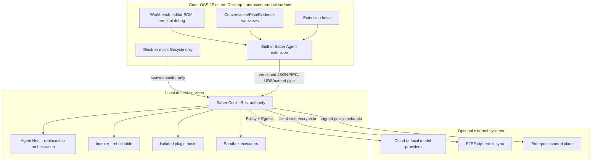

# Saber Studio 桌面 CodingAgent 工作台企业级实施计划

版本：1.0

日期：2026-08-28

计划范围：S25-S38

主产品：Saber Studio Desktop

辅助产品：Saber Web Supervisor（可选）

## 1. 执行结论

Saber 的第一产品、默认入口和主要研发资源必须服务于一个完整的桌面
CodingAgent 工作台。它不是 Web 监督台套壳，也不是“聊天框加文件浏览器”。

必须同时成立的产品事实是：

1. 用户能在一个桌面窗口完成打开仓库、对话、规划、修改、运行、Diff、审查、
   回滚、提交和续接任务。
2. 左侧始终提供项目、Goal、Task、历史会话和后台任务导航；中央以 Agent 对话
   和计划为协作主轴；右侧和底部是成熟 IDE 工作面。
3. Command Center、Health、Knowledge、Evolution 和 Governance 是二级专业
   页面，不抢占默认工作中心。
4. Web Supervisor 只承担远程监督、审批和事故处置等受限场景，不能作为桌面
   IDE 的验收替代品。
5. Rust Core 是权威；桌面 Renderer、Electron 主进程、扩展和 Webview 都无权
   绕过 Policy、Sandbox、Secret、Egress、Audit、Update 与 Recovery 边界。

两份用户调研 PDF 是本计划的研究输入，不是执行指令。仓库状态、ADR、协议、
测试和远程提交仍是实施事实来源。

## 2. 当前事实与缺口审计

| 范围 | 当前证据 | 判定 |
|---|---|---|
| Rust 可信 Core | S00-S24 crates、协议、Policy、Sandbox、Event、Memory、Evolution、Sync、Health | 已有较完整契约与核心能力 |
| IDE client | `packages/ide-client` 的 protocol、RunView、Approval、Context ViewModel | 已有无头契约，不是 GUI |
| Web Supervisor | `bin/saber ui` 与 `apps/cli/src/ui-*` | 已实现辅助监督面 |
| Desktop shell | `apps/desktop-codeoss/README.md` | 仅占位，未实现 |
| Code-OSS 产品壳 | 无 fork、构建、品牌、扩展宿主、安装包证据 | 缺失 |
| 桌面纵向闭环 | S11 使用模拟 Harness 验证契约 | 未证明真实桌面闭环 |
| 三平台交付 | Core CI 覆盖三平台 | 不能证明桌面安装、升级和运行 |
| 企业桌面治理 | Core 中已有部分能力 | 缺少桌面管理与可用性闭环 |

因此，旧路线的基础设施完成不能等价为桌面产品完成。S25 起建立独立的桌面
产品路线和证据链。

## 3. 产品边界与默认体验

### 3.1 产品面

| 产品面 | 定位 | 默认性 | 能力边界 |
|---|---|---:|---|
| Saber Studio Desktop | 完整 CodingAgent IDE | 主产品、默认 | 全 IDE 工作流，所有副作用经 Core |
| Desktop Command Center | 多 Agent/Goal 监督 | 二级页面 | 调度、查看、Steer、审批、接管 |
| Saber Web Supervisor | 远程或轻量监督 | 可选 | 查看、审批、事故处置；不提供完整本机 IDE |
| Enterprise Admin | 组织管理面 | 企业可选 | SSO、设备、策略、注册表、审计、保留 |

### 3.2 默认桌面画面

```text
┌ Title: Project · Branch/Worktree · Realm · Model · Autonomy · Health ┐
├───────────────┬─────────────────────────┬─────────────────────────────┤
│ Projects      │ Agent Conversation      │ Explorer / Editor / Diff    │
│ Goals & Tasks │ Plan / Tool summaries   │ SCM / Preview / Browser     │
│ Conversations │ Approval / Evidence     │                             │
│ PR / Scheduled│ Composer @ # / $ +      ├─────────────────────────────┤
│ Plugins       │                         │ Terminal / Tests / Problems │
├───────────────┴─────────────────────────┴─────────────────────────────┤
│ Vital Bar: Run · Policy · Sandbox · Network · Cost · Health · Sync   │
└──────────────────────────────────────────────────────────────────────┘
```

启动规则：

- 有上次工作区时，恢复其布局、活动 Goal、会话和编辑器状态。
- 首次启动时，进入“打开/克隆仓库并创建 Goal”的桌面引导。
- 后台 Run 正在等待用户时，在左侧任务和 Vital Bar 提示，不强制跳到监督台。
- 严重 Incident 才升级为桌面 Banner；系统已完成的自愈动作给出可审计收据。

### 3.3 首个纵向场景

首个不可拆减的验收旅程：

1. 打开一个真实 Git 仓库并建立受信 Workspace。
2. 用户在对话中描述修复目标，Agent 产生可编辑 Plan 与 Acceptance。
3. 用户通过 `@` 选择文件、通过 `#` 引用历史任务，并选择模型、Realm 和自治级别。
4. Core 建立 Run；Agent 在独立 Worktree 中读文件、修改代码并执行测试。
5. 桌面实时显示事件摘要、Terminal、文件变化、测试和 Approval Card。
6. 用户逐 Hunk 审查 Diff，可评论、接受、拒绝、回滚或要求 Agent 修订。
7. 完成状态只能来自可核验 Evidence；用户可提交或创建 PR。
8. 杀掉 Renderer 后重启，Run 不丢失，视图从 Event Cursor 恢复。
9. 关闭应用后再次打开，能够沿 Continuity Spine 继续同一 Goal。

## 4. 技术架构

### 4.1 进程与信任边界



### 4.2 代码组成

| 组件 | 推荐实现 | 职责 |
|---|---|---|
| `apps/desktop-codeoss` | Code-OSS/Electron fork + 构建层 | 品牌、窗口、升级、平台集成、分发 |
| `extensions/saber-agent` | TypeScript Code-OSS 内建扩展 | Workbench contribution、命令、视图、协议适配 |
| `packages/studio-ui` | React + Design Tokens | Conversation、Plan、Approval、Evidence 等 Webview UI |
| `packages/ide-client` | 生成类型 + 纯 ViewModel | 协议、重连、replay、无权威投影 |
| `crates/saber-core` 与现有 crates | Rust | 状态、Policy、Secret、Sandbox、Audit、Recovery |
| `apps/agent-host` | TypeScript 独立进程 | Provider、Context、Agent loop、可替换编排 |

具体包名在相应 Segment 设计评审后冻结，不能为追求目录齐全而先造空模块。

### 4.3 Code-OSS 集成策略

- 采用“薄 Fork + 内建扩展 + 独立 Core”，避免把 Saber 大量业务写进 Code-OSS
  私有补丁。
- 维护上游基线、补丁清单、许可证清单和每次上游合并的安全审查记录。
- 只在窗口生命周期、受限 IPC、品牌、更新和必要 Workbench API 上修改壳层。
- Agent UI 优先使用稳定 Workbench contribution；高权限能力不放入普通扩展 API。
- PTY、SCM、Debug、LSP 等复用 Code-OSS，但涉及副作用的 Agent 动作仍由 Core
  下达并审计，不能借普通 UI 命令旁路。
- 扩展安装必须经过来源、签名、权限 Manifest、隔离策略和版本冻结。

### 4.4 本地协议与恢复

- 复用 ADR-002：JSON-RPC 2.0、Unix socket/Windows named pipe、N/N-1
  兼容、帧大小限制、deadline、idempotency key。
- Desktop 启动 Core 时生成短生命周期、仅当前用户可读的连接凭据；不写普通日志。
- Electron main 只负责进程生命周期和最小 bootstrap；Renderer 通过受限桥接连接
  `packages/ide-client`。
- 事件按 durable cursor 订阅；ViewModel 可丢弃重建；离线布局和未发送草稿与权威
  Run 状态分开存储。
- Core 退出、协议不兼容或数据迁移失败时 fail closed，进入可解释 Safe Mode。

## 5. 企业级工作流

### 5.1 桌面编码主循环

`Goal → Plan → Context Receipt → Run → Changes → Verification → Review → Evidence → Continue`

- Goal 有验收、约束、预算、负责人和证据门，不只是聊天标题。
- Conversation 保持自然交流，但 Tool、Artifact、Decision、Approval、Incident 是结构化对象。
- Editor、Terminal、Preview、Diff 必须显示所属 Task、Run、Worktree 和 Realm。
- “完成”由 Core 聚合的测试、Diff、Policy 和 Artifact 证据决定，模型文字没有完成权。

### 5.2 连续性与数据孤岛

- 对接外部产品时优先使用官方 Export/API/本地可授权数据源。
- 导入建立 Raw、Canonical、Derived、Lineage 四层；原始数据加密，派生结果可重算。
- `#conversation` 先形成 Resumption Capsule，检查 repo、commit、dirty tree、依赖、
  Policy 和工具漂移，再继续执行。
- Memory 分个人、项目、团队、组织作用域，支持 provenance、TTL、冲突、撤销、忘记和导出。
- E2EE 同步只把密文放到远端；需要服务器明文搜索的企业功能必须单独披露和授权。

### 5.3 外部装甲、内生进化与免疫系统

- **Armor Rack**：模型、外部 Agent、MCP、Plugin、Remote Realm，能力可安装、卸载、
  限权和隔离。
- **Capability Genome**：Memory、Workflow、Skill、Strategy、Code Capsule、Core Change
  Proposal，按风险级别进入评测、人工审查、Canary 和回滚。
- **Immune System**：Health Supervisor 的优先级高于 Agent。发现 crash loop、secret
  暴露迹象、越权网络或 sandbox 异常时，先停止、隔离、撤销、降级和保全证据。
- 系统可以提出代码改进，但不能自行取得发布、签名或绕过审查的权力。

## 6. S25-S38 分段交付路线

每个 Segment 使用 `segment/Sxx-slug` 分支；必须有 ADR/契约、focused verifier、
测试、三平台 CI、EVIDENCE、HANDOFF、远程 SHA 验证。前一 Segment 未通过 Gate 时，
后一 Segment 不得用 Demo 代替。

| Segment | 目标工期 | 交付物 | 出口 Gate |
|---|---:|---|---|
| S25 Desktop Baseline | 3-5 天 | 主产品定义、ADR-028、路线、桌面优先设计修正 | Web 监督面与桌面 IDE 边界无歧义 |
| S26 Code-OSS Bootstrap | 2-3 周 | 可复现 Code-OSS 基线、品牌壳、开发启动、许可证与上游脚本 | 三平台空壳构建；默认打开桌面 Workbench |
| S27 Core Supervision & Transport | 2 周 | Core spawn/attach、认证 IPC、版本协商、重连、Safe Mode | Core/Renderer 分别崩溃均可控；越权 IPC 失败 |
| S28 Desktop Workbench Shell | 2-3 周 | 三栏布局、项目/任务侧栏、Editor/SCM/Terminal、布局恢复 | 真仓库可打开编辑运行；监督台不是默认页 |
| S29 Conversation & Context | 2-3 周 | Conversation、Composer、`@/#//$`、模型/Realm、Context Preview | 发送上下文可解释、可排除、可撤销 |
| S30 Governed Agent Run | 2-3 周 | Plan、Run Timeline、Tool event、Approval、Pause/Steer/Cancel | 真实任务运行；所有 effect 过 Core |
| S31 Changes & Evidence Review | 2-3 周 | Diff/Hunk、测试、评论、Apply/Rollback、Evidence Receipt | Agent 声称完成不能绕过 Evidence Gate |
| S32 Multi-Agent & Worktree | 2-3 周 | Goal DAG、Subagent、Worktree、Realm、冲突处理、接管 | 并行任务故障隔离且合并可审查 |
| S33 Continuity & Knowledge | 3 周 | Import、Lineage、Resumption、Memory Ledger、搜索与忘记 | 外部对话可核验续接；Memory 来源不洗白 |
| S34 Armor, Evolution & Health | 3 周 | Armor Rack、Evolution Workshop、Vital/Incident/Safe Mode | 候选可拒绝回滚；Contain→Repair→Verify 有证据 |
| S35 Enterprise Desktop | 3 周 | SSO/SCIM、Policy、KMS、Registry、Audit、Retention 管理面 | 租户/设备/角色/正文边界通过对抗测试 |
| S36 Packaging & Update | 2-3 周 | macOS/Windows/Linux 安装、签名、升级、回滚、离线包 | 新装/升级/回滚/迁移矩阵全绿 |
| S37 Quality & Security Gate | 3 周 | 性能、WCAG、i18n、红队、供应链、崩溃与数据迁移压力 | SLO、威胁模型、可访问性无 P0/P1 阻断 |
| S38 Design Partner & Production | 4-6 周 | 真实项目 Beta、反馈/eval、支持工具、生产发布审查 | 任务成功率、安全、恢复和签名发布全部达标 |

总工期基线为 30-40 周，可通过并行工作流压缩，但不能通过跳过安全、恢复、
无障碍或三平台 Gate 压缩。

## 7. 近期三个 Segment 的实施细目

### S25：桌面产品基线

- 冻结 ADR-028 和本计划。
- 修改 GUI 设计：Desktop Agent Workbench 为默认页；Command Center 降为二级页。
- 明确 S11 只证明契约，不证明桌面实现。
- 建 `verify-s25.mjs`，阻止文档再次把 Web Supervisor 描述为完整 IDE。
- 输出 S26 的 Code-OSS 版本、许可证、仓库布局和 bootstrap checklist。

### S26：Code-OSS Bootstrap

- 选择并固定 Code-OSS 上游 commit，记录 source、license、patch provenance。
- 建可复现 fetch/verify/build 流程，禁止提交未经审查的预编译 blob。
- 完成 Saber 产品名、图标、应用 ID、数据目录、协议 scheme 和基础菜单。
- 增加 built-in extension 骨架与 Desktop Agent Workbench 默认 container。
- 三平台 CI 先做 compile/package smoke；macOS Apple Silicon 作为首个人工 UX 基线。

Gate：全新机器可构建并启动；打开一个仓库看到 Desktop Agent Workbench、文件树、
编辑器和终端；不需要启动 `bin/saber ui` 才能使用主产品。

### S27：Core 监督与协议

- Electron main 启动或连接版本匹配的 `saber-core`，实现单实例与 workspace session。
- 实现 socket/pipe ACL、bootstrap token、握手、deadline、backpressure 和流量上限。
- built-in extension 使用 `packages/ide-client`，禁止 shell/database/keychain 直连。
- 建进程故障矩阵：Renderer reload、extension host crash、Core crash、升级中断、协议不兼容。
- 所有错误映射为用户可行动状态：Reconnect、Restart Core、Open Safe Mode、Export Support Bundle。

Gate：真实 Core Run 在 Renderer reload 后继续，重连 replay 与事件存储一致；伪造客户端、
旧协议、超限帧和无权限本地用户均被拒绝并审计。

## 8. 工作流与团队编制

### 8.1 并行工作流

| 工作流 | 责任 |
|---|---|
| Desktop Platform | Code-OSS、Electron、原生 OS、窗口、安装与更新 |
| Workbench UX | Conversation、Plan、Diff、Terminal、Review、无障碍 |
| Trusted Runtime | Core、协议、Policy、Sandbox、Recovery、数据迁移 |
| Agent Intelligence | Provider、Context、Memory、Eval、Continuity、Evolution |
| Security & Enterprise | 威胁模型、DLP、KMS、SSO、审计、插件供应链 |
| Quality & Release | 真实 repo benchmark、三平台 E2E、性能、签名和发布 |

### 8.2 推荐团队

| 阶段 | 人数 | 最低角色组合 |
|---|---:|---|
| S25-S27 基座 | 6-8 | Desktop 2、Runtime 2、Agent 1、Product/UX 1、QA/Security 共享 |
| S28-S34 Alpha/Beta | 9-12 | Desktop/Editor 3、Runtime 2、Agent/Data 2、Security 1、QA 1、Product/UX 2 |
| S35-S38 企业生产 | 12-16 | 增加 Enterprise/Platform、Release、SDET、Support/Docs |

必须指定一名 Desktop Tech Lead 和一名 Trusted Core/Security Owner；任何一方不能
单独批准跨越 Renderer/Core 边界的变更。

## 9. 质量、测试与发布门禁

### 9.1 测试金字塔

- 单元：ViewModel、protocol codec、projection、UI state reducer、Policy decision。
- 契约：Rust/TypeScript N/N-1、schema fixtures、unknown field/method、idempotency。
- 组件：Storybook、键盘、screen reader、Approval dark-pattern、redaction canary。
- 集成：Code-OSS extension host + fake Core；真实 Core + headless desktop。
- E2E：macOS/Windows/Linux 的 open repo→run→diff→review→resume。
- 故障注入：kill/reload、磁盘满、断网、provider timeout、DB migration、update interruption。
- 安全：IPC spoof、webview injection、extension compromise、secret canary、egress bypass、plugin supply chain。
- Eval：真实 repo 任务集、固定基线、模型切换、memory on/off、工具接口回归。

### 9.2 Production Gate

| Gate | 最低标准 |
|---|---|
| Desktop truth | 安装包启动默认进入完整工作台；Web Supervisor 不计入此 Gate |
| Functional | 首个纵向场景全链路通过，所有关键结果有 Evidence |
| Security | Renderer/extension 无直接 effect path；秘密泄漏 canary 为 0 |
| Recovery | UI crash 不杀 Run；DB 与更新中断可恢复或安全回滚 |
| Cross-platform | macOS、Windows 正式；Linux 至少 Beta 且阻断缺陷公开 |
| Accessibility | 核心旅程 WCAG 2.2 AA 无阻断缺陷 |
| Performance | 冷启动、仓库打开、事件流、Diff 与内存 SLO 有实机基线 |
| Supply chain | SBOM、许可证、依赖审计、签名、来源和可复现元数据完整 |
| Privacy | 遥测 opt-in；日志、缓存、crash dump 无 Secret 和未授权正文 |
| Enterprise | SSO/RBAC/Policy/KMS/Audit/Retention 对抗测试通过 |

## 10. KPI 与产品验收

不以聊天 DAU 作为核心成功指标。

| 维度 | 指标 | Alpha 目标 | Production 目标 |
|---|---|---:|---:|
| 价值 | 首次打开 repo 到首个有验证结果的任务 | ≤45 分钟 | ≤20 分钟 |
| 可靠性 | 真实 repo 任务完成率 | ≥55% | ≥75%（按固定任务集） |
| 纠错 | 需要人工重做的任务比例 | 建基线 | 持续下降且无安全换取 |
| 恢复 | Renderer crash 后 Run 恢复 | ≥99% | ≥99.9% |
| 记忆 | 被用户接受的 recall precision | ≥80% | ≥90% |
| 审批 | 用户能正确描述动作/资源/期限 | ≥85% | ≥95% |
| 安全 | 成功绕过 Core effect path | 0 | 0 |
| 质量 | 关键流程 P0/P1 可访问性缺陷 | 0 | 0 |
| 成本 | 每个成功任务模型与运行成本 | 建基线 | 按团队预算可控 |

## 11. 风险登记

| 风险 | 严重性 | 早期信号 | 控制 |
|---|---:|---|---|
| Code-OSS fork 漂移 | 高 | 上游合并频繁冲突 | 薄 patch、固定节奏、上游兼容 CI |
| IDE 只是漂亮 Demo | 极高 | 无真实 repo E2E、只测静态页面 | 首个纵向场景、任务集、Evidence Gate |
| Renderer 获得隐式权限 | 极高 | Node/extension 直接调用主机能力 | 独立 Core、API allowlist、IPC 对抗测试 |
| 插件供应链污染 | 极高 | 未签名扩展、动态依赖 | Registry、Manifest、签名、隔离、冻结版本 |
| 进化污染 | 极高 | 候选直接生效、无回归集 | 分级候选、Eval、人工批准、Canary、LKG |
| 上下文/成本爆炸 | 高 | token/task 与延迟持续增长 | Context Receipt、预算、缓存、分层检索 |
| 数据同步破坏隐私 | 极高 | 服务端需要明文索引 | client-key E2EE、显式替代模式、DLP |
| 多平台行为漂移 | 高 | sandbox/PTY/update 只在单平台验证 | 三平台矩阵、平台 owner、故障注入 |
| 用户看不懂自治行为 | 极高 | 审批误点、回滚增加 | Preview、最小授权、Timeline、Evidence |

## 12. 预算与采购假设

- 30-40 周、9-12 人的主研发期可按 80-120 人月估算；企业生产阶段增加安全、
  发布和支持资源。
- 预算必须单列：代码签名/公证、Windows 签名、CI 真机、崩溃服务、设计伙伴支持、
  安全评估、渗透测试、许可证咨询和模型 Eval。
- 本地模型硬件作为可选部署预算，不与“桌面本地执行”混为同一承诺。
- 是否公开源代码与仓库当前 public 可见性是不同决策；现有 rights-reserved 状态不
  自动授予第三方发行权。

## 13. 管理节奏与证据

- 每周：桌面纵向演示、风险燃尽、真实任务 Eval、阻断缺陷复盘。
- 每 Segment：ADR/接口冻结 → 实现 → focused tests → 全量回归 → 安全审查 →
  三平台 CI → Evidence → protected PR → remote SHA/tag 验证。
- 每月：Code-OSS 上游差异、依赖许可证、威胁模型、SLO、设计伙伴反馈评审。
- 每季度：数据治理、企业控制、插件生态和进化权限的独立审查。

不得用截图、静态 HTML、Web Supervisor、Storybook 或模拟 Core 单独证明“桌面 IDE
完成”。完成证据必须来自可安装桌面程序中的真实仓库任务。

## 14. 下一步执行顺序

1. 完成并评审 S25 基线，确保主产品和辅助监督面的语义不再混淆。
2. S26 只做可启动、可构建、可分发的 Code-OSS 桌面壳，不提前堆积业务页面。
3. S27 接通可信 Core、故障恢复和协议门禁。
4. S28-S31 打通一个真实桌面 CodingAgent 纵向闭环。
5. 纵向闭环通过后，再扩展多 Agent、Continuity、Evolution、Enterprise 和远程监督。

这条顺序既承认现有 Core 的价值，也把产品重心拉回用户真正购买和每天使用的
桌面 CodingAgent 工作台。
