# 企业级本地 CodingAgent IDE：产品、架构、进化与安全治理方案

> 版本：2.0（2026-08-25，十轮企业级深化：主体哲学、能力吸收、知识主权、自进化、自愈与治理）
> 建议代号：Saber（产品类别名：Local-first Agentic Development Environment，LADE）
> 目标读者：创始人、产品负责人、Agent 架构师、桌面/IDE/安全/平台工程负责人

## 0. 一页结论

这款产品不应被定义为“又一个带聊天框的 Cursor”，而应被定义为：

> **一个本地优先、模型中立、能力可组合、记忆可持续、行为可追溯、能够受控进化的软件工程智能体操作系统。**

它的设计哲学是：把产品组织成一个连续的软件主体——LLM 是可替换的大脑皮层，Context/Knowledge 是感官与记忆，Tool/Agent 是手和外部装甲，Event/Goal 是神经与循环，Policy/Health 是不依赖大脑意愿的免疫系统；身份最终落在宪法、目标、知识、权限和责任谱系，而不是某个模型。

它的真正护城河不是某个模型，也不是编辑器外观，而是六个可积累的系统资产：

1. **Identity & Continuity Ledger**：模型、Agent、设备和界面可以更换，Goal、Commitment、Knowledge、Permission 与责任历史不断裂。
2. **Agent Harness Kernel**：把长任务、工具、子 Agent、审批、沙箱、恢复、分叉、重放统一为稳定运行时。
3. **Context & Knowledge Fabric**：把代码、对话、决策、规则、运行证据和组织知识变成有来源、有时效、有权限的上下文。
4. **Deterministic Immune System**：权限、密钥、网络、沙箱、DLP、审计永远高于 LLM，不能被 Prompt 绕过。
5. **Evolution Supply Chain**：系统可以生成记忆、规则、Workflow、Skill、Code Capsule、Plugin，甚至提出核心代码修改，但必须经过评测、签名、Canary 和回滚。
6. **Agent Interoperability**：Codex、Claude Code、DeepSeek Harness、本地模型和未来 Agent 都是可插拔认知/执行单元，而不是产品主数据的所有者。

推荐的工程实现不是单语言，而是三层：

- **Rust**：可信核心、事件存储、策略决策、密钥代理、进程/沙箱、同步、更新与恢复。
- **TypeScript/Node.js**：Agent 编排、Provider/Adapter、Skills/Plugins、MCP、快速演进逻辑。
- **React/TypeScript + Code-OSS/Electron**：首选完整 IDE 外壳；若第一阶段更看重轻量和快速验证，可先做 Tauri + Monaco，但必须承认 Monaco 不等于完整 IDE。

推荐将项目拆为两个独立产品边界：

- `saber-core`：无 UI、可被桌面/CLI/远程服务复用的本地 Agent Runtime。
- `saber-studio`：IDE、任务中心、Review、Timeline、Memory、健康与治理界面。

企业可用不是 3 个月功能堆砌可以完成的。合理窗口是：**6 周架构验证、12 周 MVP、再 16 周 Design Partner Beta、再 16-24 周企业化**，即约 **10-14 个月**；核心团队从 6-8 人扩到 12-16 人。

---

## 1. 调研边界、证据等级与附件校正

### 1.1 两份附件最有价值的结论

两份附件的核心方向正确，尤其是：

- 区分本地 UI、本地 Agent 执行与本地模型推理；“桌面版”不等于“离线模型”。
- 不以 Conversation 为唯一主数据，而以 Goal、Task、Artifact、Decision、Event 为主数据。
- 事件溯源、可恢复 Session、分叉与重放是 Harness 的数据骨架。
- 本地 SQLCipher 是事实源，向量索引只是可重建派生物。
- 权限不能写在 Prompt 里；策略、沙箱、密钥、网络代理必须是确定性系统。
- 自我进化需要分级，核心、策略、加密和更新器不能被运行中的 Agent 自主修改。
- “钢铁侠/浩克/人体免疫”可以落成可执行架构，而不只是品牌比喻。

### 1.2 本次补充调研带来的修正

截至 2026-08-25，市场能力变化很快，附件中的竞品表应按以下方式理解：

- Codex 已有从 Claude Code、Claude Cowork、Cursor 导入设置、Skills、Plugins、Projects 和近期工作的官方流程，并支持同步更新。因此“能导入其他 Agent”已不构成充分差异化。
- Codex App Server 已公开 Thread/Turn/Item、resume/fork/steer、审批、Skills、MCP 和事件流的 JSON-RPC 语义；它可以作为 Adapter 的高质量参考，但实验性 WebSocket 不能直接当企业远程协议。
- Claude Code 当前能力已经扩展到 Subagents、Agent Teams、跨会话消息、Goal、worktree 隔离和持久记忆；只做“多 Agent + Memory”同样不够。
- Cursor 的 Plugins 已能打包 rules、skills、agents、commands、MCP servers 和 hooks，并有确定性的 approval/sandbox 层。
- DeepSeek Harness 的“Everything is a plugin / Every run is traceable”及 append-only Session Log 仍是最值得借鉴的开放 Harness 设计。
- MiniMax 的 Memory & Evolution 已公开强调从使用习惯生成 Skills；产品不能把“自动生成 Skill”本身当作最终壁垒。
- Hermes Agent 把事实型 Memory、过程型 Skills、跨会话 FTS5 检索和 `/learn` 串成明确的闭环，并用小而有界的常驻记忆控制 Prompt 成本；但其 Skill/Memory 写审批默认关闭，说明“会学习”与“企业默认安全”是两件事。
- OpenClaw 的新版 Memory Architecture 把 instructions、curated core、episodic、prospective、review 分层，并把来源分类写入模型不可伪造的 SQLite 字段；Skill Workshop 又提供 proposal、hash binding、scanner、rollback、ownership 和 stale 状态。这证明写入路径比“再加一个向量库”更接近长期记忆和能力进化的真正边界。
- OpenClaw 自学习主要把纠正和成功经验转为 Skill；Hermes 的公开闭环也主要发生在 Memory/Skill 层。两者都不能被引用为“已证明运行中的 Agent 可安全修改其核心代码”的证据。本方案将核心源码修改继续限定为 E6 Self-Change PR，并与发布签名权分离。

因此，本项目应将差异化提升为：

> **跨厂商知识证据链 + 可继续的任务谱系 + 可评测的能力供应链 + 高于模型的自愈免疫系统。**

### 1.3 证据等级

报告中的判断按以下等级使用：

| 等级 | 证据 | 使用方式 |
|---|---|---|
| A | 官方源码、协议、规范 | 可进入架构基线 |
| B | 官方文档、官方工程文章 | 可进入产品/实现设计 |
| C | 官方营销页、Changelog | 只确认产品行为，不反推内部实现 |
| D | 社区观察、二进制猜测 | 仅作为待验证线索，不写成事实 |

任何未公开的桌面实现语言、内部 IPC、模型服务硬件、数据库 Schema，都应标为“未知”，不能凭安装包文件或社区帖子断言。

---

## 2. 产品哲学：钢铁侠、浩克与一个有免疫系统的人

### 2.1 两种成长必须并存，但不能混为一谈

| 哲学 | 技术含义 | 优势 | 风险 | 治理方式 |
|---|---|---|---|---|
| 钢铁侠：外部装甲 | Plugins、MCP、外部 Agent、云模型、浏览器、CI/CD、SaaS | 快速获得新能力 | 供应链、权限扩张、数据外发 | 签名、权限清单、隔离、最小授权 |
| 浩克：内生强化 | Memory、Rule、Skill、Strategy、自己生成 Tool/Core PR | 越用越懂用户和组织 | 记忆污染、回归、目标漂移 | 证据、评测、版本化、Canary、回滚 |

二者的判别标准不是“代码在内还是外”，而是能力的所有权和形成方式：

- 安装 Kubernetes MCP 是外部装甲。
- 从 50 次组织发布中抽取、验证并签名形成 `org-k8s-release` Skill，是内生强化。
- Agent 自动写了一个脚本但未经过验证，只是“候选能力”，还不是进化。

### 2.2 人体隐喻必须对应系统职责

| 人体 | 系统模块 | 不可替代职责 |
|---|---|---|
| 大脑 | Model Router + Planner + Memory Retrieval | 理解、假设、规划、选择；它不是最高权限主体 |
| 眼耳鼻/感官 | LSP、Tree-sitter、File Watcher、Terminal、Browser、Logs | 获取有来源的环境事实 |
| 嘴 | Explanation/Notification/Approval UI | 与人交流、解释风险、请求决策 |
| 手脚 | Filesystem、Shell、Git、Browser、MCP、External Agent | 执行动作 |
| 血管 | Event Bus、Context Pipeline、Sync | 传递状态、证据和控制信号 |
| 神经反射 | Hooks、hard rules、kill switch | 不经大模型的快速确定性反应 |
| 白细胞 | Supervisor、Quarantine、Rollback、Re-index | 识别并清除局部异常 |
| 血小板 | Transaction、Checkpoint、Worktree、Circuit Breaker | 先止损、封住扩散、保持可恢复 |
| 炎症 | Health Event + Severity + Alert | 放大异常信号，使用户/管理员注意 |
| 骨骼 | Schema、Protocol、Git、API Contract | 保持结构和兼容性 |
| 皮肤 | Trust Boundary、Sandbox、DLP | 区分内部与外部世界 |
| 睡眠 | Offline Eval、Memory Compaction、Index Rebuild | 整理经验并验证改进，不影响前台工作 |
| 药物/医生 | 人工处置、厂商补丁、组织策略、外部安全工具 | 系统无法自愈时的外部权威 |

关键权力顺序必须是：

```text
Human / Organization Authority
  > Policy & Immune System
    > Sandbox / Secret / Network Broker
      > Agent Harness
        > Model / Prompt / Skill / Plugin
```

LLM 可以“感觉到炎症”并提出诊断，但白细胞、血小板、隔离和止血不能依赖它愿不愿意执行。

### 2.3 十条产品宪法

1. 用户和组织是最终权威，模型不是。
2. 本地是真实数据的默认归属地，云只是可选协处理器和密文同步介质。
3. 所有模型可替换；所有外部能力需声明权限；所有运行可追溯。
4. 任何发给模型的上下文都必须可解释来源、敏感性和选择原因。
5. 任何能产生副作用的 Tool Call 都先经过确定性 Policy Decision Point。
6. 任何进化都必须能回答：从什么证据来、比旧版好在哪里、如何回滚。
7. 记忆不是聊天摘要；记忆是带来源、范围、有效期和冲突状态的可治理知识。
8. UI 不展示伪造的“内心独白”；展示 Goal、计划、动作、证据、Diff、测试、审批和简短理由。
9. 安全能力不得被 Agent 修改、降级或卸载。
10. 失败必须能被限制在最小故障域内，且恢复优先于“继续尝试”。

### 2.4 它“作为一个人”的准确含义：连续的软件主体，而非拟人化幻觉

产品可以采用“人”的组织方式，但不能据此宣称模型具有意识、人格权或道德判断力。这里的“人”是一个工程哲学：**系统作为长期存在的软件主体，对目标、记忆、承诺、行为后果和成长历史保持连续性**。LLM 只是可替换的大脑皮层，不是主体本身。

Saber 的身份不是某个模型权重、某段 Prompt 或某台设备，而是五项连续性的交集：

```text
Identity = Constitution
         + Goal / Commitment Lineage
         + Governed Memory
         + Capability & Permission Boundary
         + Accountable Event History
```

| 连续性 | 必须保留什么 | 模型/设备更换后如何证明 |
|---|---|---|
| 因果连续性 | Goal、Task、Run、Artifact 的因果链 | `continued_from`、event hash、commit/artifact hash |
| 认识连续性 | 已知事实、证据、未知项、被推翻结论 | Memory provenance、supersedes、Decision Record |
| 规范连续性 | 用户/组织宪法、权限、承诺、禁止事项 | signed policy、rule version、approval history |
| 行动连续性 | 未完成工作、预算、执行域和外部副作用 | checkpoint、idempotency、reconcile state |
| 责任连续性 | 谁提出、谁批准、谁执行、谁验证 | actor identity、policy decision、audit signature |

由此得到一个重要结论：**可以更换“大脑”，不能丢失“责任”；可以增加“手”，不能越过“皮肤”；可以重写部分“组织”，不能偷偷改“宪法”。**

### 2.5 三个哲学支点及其工程翻译

1. **扩展心智（Extended Mind）**：当外部工具、笔记和环境以稳定、可访问、被主体认可的方式参与认知时，可以把它们视为认知系统的一部分。工程翻译不是“所有外部内容都是大脑”，而是 External Agent、IDE、Knowledge、Tool 只有通过身份、来源、可用性、权限和失效语义的耦合契约，才成为受控认知延伸。
2. **自创生/组织连续性（Autopoiesis，作为工程类比）**：活系统在组成部分不断变化时维持其组织关系。Saber 可以生成 Memory、Skill、Tool 和 Core PR，但系统身份由 Constitution、Schema、信任根、事件因果和发布治理维持；“会生产自己的组件”不等于“可任意改变自己的组织”。
3. **控制论与稳态（Homeostasis）**：智能不仅是解决任务，也是在扰动下维持关键变量。Saber 必须显式控制数据完整性、权限边界、成本、延迟、任务成功、记忆质量和系统可用性；越界先由局部反射/免疫回路处置，再由 LLM 解释和规划。

这些理论只作为设计透镜，不作为产品“有生命/有意识”的营销证明。企业责任仍归自然人和组织，系统只能拥有被委托的操作性 Agency，不能拥有最终 Authority。

### 2.6 钢铁侠与浩克不是二选一，而是四象限能力经济学

|  | 外部形成 | 内部形成 |
|---|---|---|
| 暂时使用 | 临时调用云模型、一次性 MCP、外部专家 Agent | 当前 Run 的计划、工作记忆、即时脚本 |
| 持久拥有 | 签名 Plugin、企业 Connector、受管 Model Adapter | Memory、Rule、Skill、Strategy、Tool、Core PR |

每个新能力都要回答四个问题：

1. **Build or Equip**：向内生长比购买/接入外部装甲更可靠吗？
2. **Rent or Own**：这是单次认知租赁，还是要成为长期组织能力？
3. **Coupling Cost**：外部依赖的费用、隐私、可用性、锁定和权限成本是多少？
4. **Metabolic Cost**：内生能力的维护、评测、冲突、上下文和供应链成本是多少？

选择函数不是“越多越强”，而是：

```text
Net Capability Value
  = Verified Utility × Reuse × Availability
  - Security Risk - Lock-in - Maintenance - Cognitive Load - Data Exposure
```

因此，Saber 的目标不是吞并所有 Agent，而是把外部优势转化为可替换的装甲接口，再把反复证明有价值的经验内化为有所有权、有评测的组织能力。

### 2.7 隐喻的边界：避免五种哲学性产品错误

- **大脑中心主义**：把所有智能归功于 LLM，忽略工具、环境、记忆、反馈和制度；会导致换模型就重做系统。
- **人格拟态**：把流畅语言误当成稳定身份和责任；会掩盖版本漂移、失忆和权限主体问题。
- **无限成长主义**：把新增 Memory/Skill/Code 数量当进化；实际可能是熵、冲突和攻击面增长。
- **免疫过度**：过多审批/隔离像自身免疫病一样攻击正常工作；治理需要风险比例、局部性和可解释例外。
- **永生幻觉**：加密同步不等于永久正确；来源可撤销、知识会过期、组织有删除义务，系统必须允许遗忘和终止。

---

## 3. 竞品能力吸收与产品差异化

### 3.1 核心竞品矩阵

| 产品/项目 | 应吸收能力 | 不应照搬 | 本项目的更高阶实现 |
|---|---|---|---|
| Codex | Rust Harness、App Server、Thread/Turn/Item、resume/fork/steer、Skills、审批/沙箱、worktree | 将产品状态绑定单一厂商 Thread | Canonical Run Protocol + 多 Agent lineage + 可替换 Driver |
| Claude Code | Hooks、Subagents/Teams、分层 Memory、MCP、细粒度权限、worktree | 以 CLAUDE.md/单厂商目录作为知识事实源 | ContextRule IR + Evidence Memory + Agent-neutral policy |
| Cursor | IDE 原生体验、代码索引、Rules/Skills/Plugins、Review、Auto-review sandbox | 直接把 `.cursorignore` 等软规则当安全边界 | Code-OSS UX + Rust Policy PDP + DLP/Egress enforcement |
| ZCode | Goal 长任务、Browser、Terminal、Git、Remote、SSH/WSL/Docker 执行位置 | 仅靠审批模式替代强隔离 | Execution Realm SPI + 远程证明 + 可恢复 Goal DAG |
| MiniMax Code | Goal、Agent Team、Verifier、Memory & Evolution、低成本长任务 | 模型与 Harness 过度耦合 | Model-neutral Strategy + 独立 Reviewer + 任务级经济路由 |
| DeepSeek Harness | Cordis 式插件微内核、能力 seam、append-only Session、trace/replay | “一切皆插件”导致可信边界也可替换 | 插件化业务能力 + 不可插拔安全根/更新根 |
| Hermes Agent | 有界常驻 Memory、FTS5 会话召回、渐进披露 Skill、`/learn`、Profile 隔离、同一 Core 多入口 | 把扫描器或默认自由写入等同于企业验证；多写者共享一个 Home | Fact/History/Procedure 分层 + 单写者 Memory Authority + 默认 Proposal + Eval 晋升 |
| OpenClaw | Workspace-first 身份、Gateway 控制面、记忆分层与来源门、Dreaming、Skill Workshop、hash/rollback/ownership | Sandbox 默认关闭、自学习默认 auto；人格/工作区文件不能成为安全根 | 本地 IDE + Replayable Core；所有学习默认 propose；来源污点、评测和 Policy Root 结构隔离 |
| Aider/OpenCode/Cline/Roo/Continue 等 | 终端优先、开放 Provider、社区适配、轻量集成 | 兼容层碎片化、缺少统一企业治理 | Generic CLI/JSONL Adapter + Compatibility Test Kit |

说明：“所有 CodingAgent”不可能静态穷尽。企业产品应维护一个版本化 `Capability Registry`，按季度以官方文档和自动兼容测试更新，而不是在代码中硬编码一张永远过时的竞品表。

### 3.2 真正可守住的差异

建议将产品卖点压缩为四个：

1. **Continue Anywhere**：不是只能打开旧聊天，而是能把任意 Agent 的历史编译成可验证的恢复胶囊，并建立后继任务谱系。
2. **Learn Safely**：每次工作都可能形成 Memory/Rule/Skill/Tool 候选，但只有通过证据、评测和治理才能晋升。
3. **One Knowledge, No Silo**：代码、对话、文档、Issues、终端、决策和组织规则在同一权限图中检索，端到端加密同步。
4. **Self-healing by Design**：Agent 崩溃、插件异常、成本失控、记忆污染、索引损坏、策略回归都有无需 LLM 的止血和恢复路径。

### 3.3 非目标

- V1 不训练自己的基础模型。
- V1 的“自我进化”指上下文、记忆、规则、Skill、工具候选和受控源码 PR，不把模型权重变化包装成同一件事；Fine-tuning/RL 属于独立的 P3 离线训练供应链。
- V1 不从零实现语言服务、调试器或 Git。
- V1 不允许生产中的 Agent 直接 patch 自己的二进制。
- V1 不保证把闭源厂商的私有推理状态无损迁移；只迁移可观察事实和任务状态。
- V1 不把服务器端明文搜索与真正 E2EE 同时承诺。
- 不以“支持最多模型”作为首要 KPI。

### 3.4 Hermes Agent 与 OpenClaw 的设计哲学拆解

这两个项目最值得研究的不是功能列表，而是它们如何回答“Agent 如何成为一个连续存在、能够成长的主体”。

| 维度 | Hermes Agent 的答案 | OpenClaw 的答案 | Saber 的取舍 |
|---|---|---|---|
| 连续性 | 同一 Agent Core 跨 CLI、TUI、Desktop、Messaging；Profile 隔离身份与记忆 | 长驻 Gateway 连接聊天、CLI、Web、设备；每 Agent 独立 workspace/session/state | Core 与 IDE 解耦，同一 Goal/Run/Event 可跨 Desktop/CLI/Remote，入口不拥有主数据 |
| 人格/身份 | `SOUL.md`、项目上下文文件、`USER.md`/`MEMORY.md` | `AGENTS.md`、`SOUL.md`、`IDENTITY.md`、`USER.md`、`MEMORY.md` | Identity/Persona 只影响表达与偏好；不能授予 Tool、Secret、Network 权限 |
| 事实记忆 | 小而有界的 `MEMORY.md`/`USER.md` 常驻 Prompt；FTS5 搜索历史会话 | curated core + daily episodic + transcript；Dreaming 后台晋升，常驻与按需召回分开 | Stable Core Memory + Evidence Store；常驻内容有预算，详细历史只按需检索 |
| 过程记忆 | Skill 是 procedural memory；渐进披露，Agent 可 `/learn` 创建或改进 | Skill Workshop 把经验变成提案；限定所有权、代际、哈希、扫描与回滚 | Evolution Workshop 统一承载 Rule/Skill/Tool/Core PR 候选；不同等级使用不同 Gate |
| 学习触发 | 用户显式 `/learn`、运行中修正、后台审阅 | 即时 Skill 修复、延迟 experience review、每日 collection review | 显式学习 + 纠错信号 + 重复模式；普通成功不自动等于可复用经验 |
| 写入治理 | 可启用 Skill/Memory pending approval，但默认可自由写 | `off/propose/auto`，默认 auto；Workshop-owned 路径才可自动更新 | 个人版默认 `propose`，企业版由策略决定且不得弱于组织基线；E4+ 必须人审 |
| 防并发漂移 | 建议不同 Profile 隔离；同 Home 多写者会造成混合状态 | workspace lease、content hash、stale、atomic generation、rollback | 每 Workspace 一个 Memory Authority；所有写入 optimistic concurrency + append-only ledger |
| 安全边界 | 扫描危险 Skill 模式、终端可放在多种 backend | 来源门、Skill Scanner、Sandbox/Tool Policy/Elevated 分层 | 扫描器只是检测器；结构性来源门、PDP、Sandbox、Secret/Egress Broker 才是边界 |
| 能力证明 | Skill 创建/更新形成闭环；研究路径可导出 trajectory 做 RL | Workshop 支持 evaluator，但自学习并不天然证明效果提升 | 所有“候选”必须与“已验证/已发布”分状态；只有对照 Eval + 回归门才能称进化 |

这里形成四条产品原则：

1. **成长不是无限扩张上下文，而是把经验编译到正确介质。** 事实进 Memory，过程进 Skill，可机器触发的意图进 Scheduler/Intent，权限进 Policy；不能都写进一个 Markdown。
2. **写入是安全边界，召回是可用性边界。** 写错一条可长期污染，少召回一次通常只是质量降级，所以写入应比读取更保守。
3. **LLM 在确定性边界内做语义判断。** 来源资格、阈值、状态转换、并发控制和发布权限由代码决定；LLM 负责提取、合并、解释和提出候选。
4. **可逆不等于已验证。** Proposal、扫描和回滚解决“如何安全改”，Eval/Shadow/Canary 才回答“是否真的变好”。

### 3.5 “吸收所有优点”的正确架构：能力基因组，而不是竞品功能拼盘

市场产品会不断变化，“集成所有优点”不能实现为几十个 vendor-specific `if`。Saber 应维护一个版本化 **Capability Genome**，把能力拆成可比较、可组合、可测试的最小语义单元：

```yaml
capability_id: agent.session.fork
semantics: 从已确认边界创建独立后继，不修改原 Session
input_contract: [external_session_ref, boundary_ref, canonical_task]
output_contract: [new_session_ref, lineage_edge]
side_effect: external-state
controls: [external.read, external.write, approval.resolve]
durability: provider-owned
failure_modes: [unsupported, auth_expired, stale_boundary, partial_fork]
verification: lineage_and_first_event_match
```

能力分类至少包括：

| 类别 | 规范能力示例 | 可吸收的产品优势 |
|---|---|---|
| Cognition | plan、review、verify、route、compact | 不同模型/Agent 的规划与审查优势 |
| Session | start、resume、fork、steer、cancel、attach | Codex/Claude/OpenClaw 等会话控制 |
| Execution | edit、shell、git、browser、remote realm | IDE/CLI/远程执行优势 |
| Collaboration | subagent、team、delegate、handoff | 多 Agent 并行与角色化工作 |
| Knowledge | search、memory、decision、context rules | 各家的记忆、规则和检索机制 |
| Evolution | learn、propose、evaluate、promote、rollback | Hermes/OpenClaw/MiniMax 等学习机制 |
| Governance | approve、policy、sandbox、audit、DLP | Cursor/Codex/企业平台的安全能力 |

每个外部产品通过 Anti-Corruption Adapter 映射到 Canonical Capability，不允许其私有对象渗透成内部主模型：

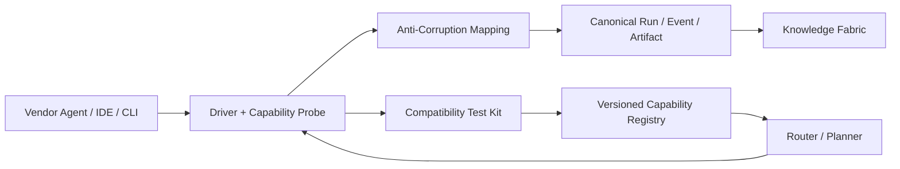

Driver 上线要求：

1. 运行 capability probe，记录 `supported/partial/unsupported/unknown`，不能根据产品名称假设能力。
2. 通过 Contract Test Kit：正常、超时、取消、断线、重复请求、审批、恢复、版本漂移。
3. 明确 auth owner、数据去向、保留策略、计费主体和外部副作用。
4. Vendor 升级后先在隔离环境重跑兼容测试，Capability Registry 以版本和时间生效。
5. 不支持的操作显式返回，Planner 选择本地替代路径；禁止 silent fallback 造成数据或费用意外。

### 3.6 三种外部 Agent 集成深度

| 模式 | 外部 Agent 的角色 | 内部权威 | 适用场景 |
|---|---|---|---|
| Tool Mode | 完成一个有界输入输出任务 | Saber 拥有 Run/Task | 代码 Review、解释、一次性生成 |
| Delegate Mode | 拥有一个子 Task 和隔离执行域 | Saber 拥有 Goal、预算、验收 | 利用专长 Agent 长任务执行 |
| Native Session Mode | 外部系统继续原生 Session | Vendor 拥有 Session；Saber 保存镜像与谱系 | 用户明确要回到 Codex/Claude 原会话 |

无论哪种模式，最终进入 Saber 的都必须是 typed result、artifact、verification 和 provenance，而不是一句“已完成”。这使“钢铁侠装甲”可换、可组合、可降级；外部 Agent 故障时，主体的目标和知识仍留在 Saber。

---

## 4. 产品域模型与用户体验

### 4.1 Conversation 不是根对象

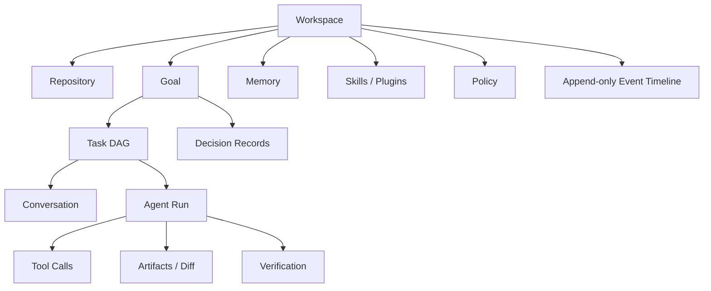

核心对象：

| 对象 | 含义 | 关键字段 |
|---|---|---|
| Goal | 有验收标准的长期目标 | objective、acceptance、budget、deadline、status |
| Task | 可调度的工作单元 | dependencies、owner、realm、risk、status |
| Run | 某个 Agent 对 Task 的一次执行 | agent/provider/model、config version、event range |
| Conversation | 人与 Agent 的交流视图 | participants、messages、continued_from |
| Artifact | 文件、Diff、报告、截图、测试结果 | content hash、producer、sensitivity、retention |
| Decision | 有理由和证据的工程决定 | alternatives、rationale、evidence、supersedes |
| Memory | 可召回的治理知识 | type、scope、validity、confidence、provenance |
| Capability | Tool/Skill/Agent/Plugin | version、permissions、signature、eval score |
| Event | 已发生事实 | actor、type、causality、payload ref、integrity |

### 4.2 五个始终可见的工作面

桌面 UI 应保持五个一级视图，而不是把一切塞进聊天：

- **Goal/Plan**：目标、DAG、验收标准、预算、阻塞项。
- **Conversation**：用户输入、Agent 结论、审批互动。
- **Changes/Review**：Diff、测试、诊断、Reviewer 结果、Apply/Rollback。
- **Runtime/Timeline**：工具调用、子 Agent、网络、成本、权限、事件因果。
- **Memory/Knowledge**：本次使用了什么记忆、新生成什么候选、冲突和有效期。

### 4.3 标准任务流程

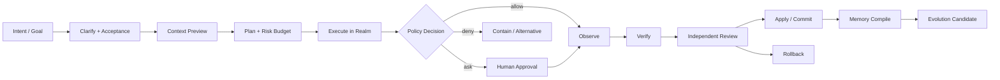

Context Preview 必须让用户看到“将读取什么、将发送给哪个模型、为什么需要、是否含敏感信息”。这是本地可信产品的重要可感知价值。

### 4.4 Continue Anywhere 的体验

用户说“继续上周在 Claude Code 里修的 OAuth 超时”时：

1. 先根据 workspace、repo、branch、Goal、实体、时间和语义检索候选历史。
2. 展示 1-3 个可确认候选，不静默注入几个月聊天。
3. 生成 `Resumption Capsule`：

```yaml
goal: 修复 OAuth refresh race
continued_from:
  vendor: claude-code
  external_session_id: redacted-hash
last_verified_state:
  repo: github.com/acme/payments
  branch: fix/oauth-refresh
  commit: abc123
progress:
  done: [新增竞态复现测试]
  pending: [两个测试仍失败]
decisions:
  - 不引入分布式锁
open_questions:
  - 是否允许提前 30 秒刷新
context_refs:
  - event://...
  - artifact://...
confidence: 0.92
```

4. 用户确认后创建原生后继 Task/Conversation，并保留 `continued_from` 谱系。
5. 如果外部 Agent 有官方 resume API，可选择回到原 Agent；否则在 Saber 中续接，不伪装成原会话的无损恢复。

### 4.5 五个标志性体验：让哲学可被用户感知

1. **Continue Card**：用户输入一句“继续昨天 Cursor 的支付修复”，系统显示候选谱系、环境变化、关键决定和可恢复程度；确认后直接进入后继 Task。
2. **Knowledge Receipt**：每次回答旁边可展开“使用了哪些代码/对话/Memory、为何选中、发给了谁”；任务结束显示新增/修改/拒绝的知识候选。
3. **Evolution Review**：像 Code Review 一样查看系统想学什么、证据、选择了 Memory/Workflow/Skill/Code 的原因、基线对比、权限变化和回滚点。
4. **Armor Rack**：统一管理外部 Agent、模型、MCP、Plugin 和远程 Realm；显示能力、费用、数据边界、Health、版本和替代品，不只是安装列表。
5. **Health Center**：展示当前 Cell 的 H0-H4 状态、已自动止血/修复、退化能力、待人处理和 Safe Mode；专业 UI 使用 Health/Incident 术语，钢铁侠/人体隐喻作为可选解释层。

### 4.6 渐进式自治，而不是一个“全自动”开关

| 自治级别 | 系统行为 | 适用 |
|---|---|---|
| A0 Observe | 只读、解释、形成计划 | 初次接入/高敏环境 |
| A1 Suggest | 生成 Diff/Candidate，全部人审 | 默认企业试用 |
| A2 Act Locally | 自动执行低风险、可回滚的 Workspace 动作 | 成熟团队日常开发 |
| A3 Governed Autonomy | 在预算/Policy/Eval 内完成 Goal，外部副作用人审 | Design Partner/Beta |
| A4 Bounded Operations | 预批准 Runbook 内操作外部系统，持续监控 | 生产运维特定场景 |

自治按 `capability × resource × scope × time` 分配，而不是按 Agent 一次授予。信任来自可观察的历史成功、低纠正率和恢复能力；升级需要证据，事故后可自动降级。

### 4.7 首次使用与价值到达路径

首次 30 分钟不要求用户理解所有哲学：

1. 选择一个 Repo 和隐私模式，完成本地索引/Policy 基线。
2. 可选导入一个官方 Agent Export，预览而不立即生成长期 Memory。
3. 运行一个只读解释任务，再运行一个隔离修复任务。
4. 展示完整 Context Receipt、Diff/Test、Timeline 和恢复点。
5. 任务完成后只提出一个高质量 Knowledge/Skill Candidate，让用户理解“系统如何成长”。

企业 Pilot 的价值路径则是：接入 SSO/Policy → 选择 5 个真实 Repo → 导入批准来源 → 建 Private Eval → 4 周 Observe/Suggest → 达到指标后逐能力升级自治。

### 4.8 可持续护城河：积累信任资本，不制造新锁定

真正可复利的资产是：跨 Agent Capability Contract/兼容测试、可验证任务谱系、企业私有 Eval、组织批准的能力库、来源/权限知识图、Incident/恢复经验和治理证据。模型、编辑器壳和单个 Connector 都可替换。

飞轮是：

```text
更多真实任务
  → 更完整但可治理的证据
  → 更精准的 Context / Eval / Candidate
  → 更高完成率与更少风险
  → 用户愿意授权更多有界能力
  → 产生更高质量的组织经验
```

飞轮必须在客户边界内运行：不默认把客户代码/对话汇总成平台训练资产；支持开放导出和可替换模型。护城河来自可信转换与治理能力，而不是把用户重新困在 Saber 数据孤岛。

---

## 5. 总体技术架构

### 5.1 逻辑架构

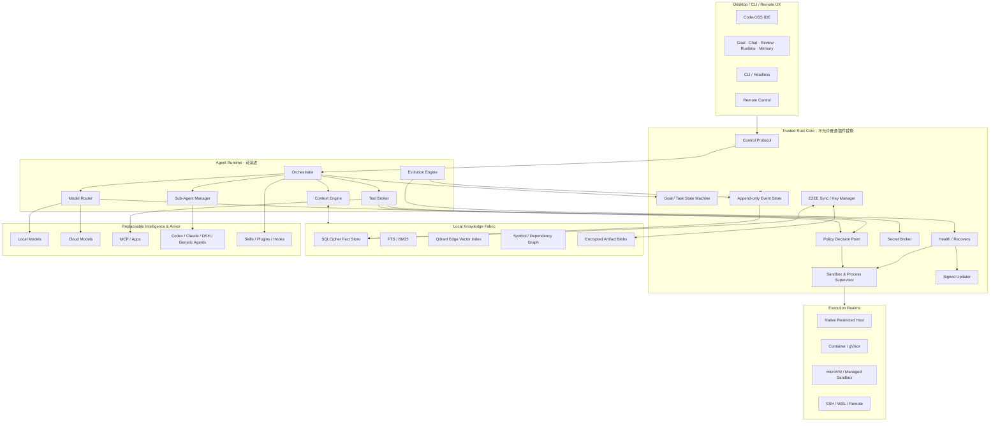

核心边界：

- Agent Runtime 可以被替换、热更新和评测。
- Policy、Crypto、Updater、Audit Root、Recovery 不属于普通插件系统。
- Tool、模型、插件、外部 Agent 必须通过 Broker；不能直接拿宿主机和密钥。
- UI 只发出意图与显示事件，不直接执行系统命令。

### 5.2 进程与故障域

建议最少拆成以下进程：

| 进程 | 语言 | 信任级别 | 崩溃影响 |
|---|---|---:|---|
| `saber-desktop` | Electron/TS 或 Tauri WebView | 中 | UI 可重启，Run 不应丢失 |
| `saber-core` | Rust | 最高 | 由 watchdog 恢复，事件已落盘 |
| `saber-agent-host` | Node.js/TS | 中低 | 当前 Run 中断，可从事件恢复 |
| `saber-plugin-host-*` | Node/WASM/进程 | 低 | 单插件隔离、熔断和禁用 |
| `saber-model-local` | Ollama/llama.cpp/vLLM/SGLang | 独立 | 路由降级或回退云端 |
| `saber-sandbox-*` | OS/container/VM | 不可信执行域 | 杀掉实例，不影响核心 |
| `saber-indexer` | Rust/语言服务 | 中 | 索引可重建 |

进程间协议使用版本化、生成 Schema 的本地 JSON-RPC/MessagePack；所有跨进程输入必须做 Schema 验证、大小限制、超时和背压。MCP 用于连接工具与数据，不应承担桌面应用全部 Thread/Turn/Approval 生命周期。

### 5.3 控制协议的核心原语

协议至少需要：

```text
workspace.open / close
goal.create / pause / resume / complete
task.start / steer / cancel / retry / fork
run.read / list / subscribe / replay
approval.request / resolve
artifact.read / diff / apply / rollback
memory.search / propose / accept / reject / revoke
capability.install / enable / quarantine / rollback
health.status / incident.ack / safe-mode.enter
```

每个请求必须带 `request_id`、`actor`、`workspace_id`、`causation_id`、`deadline`；修改类操作带 `idempotency_key`。客户端必须能在断线重连后按 event cursor 补读，而不是要求核心重新“讲一遍当前状态”。

### 5.4 企业部署拓扑

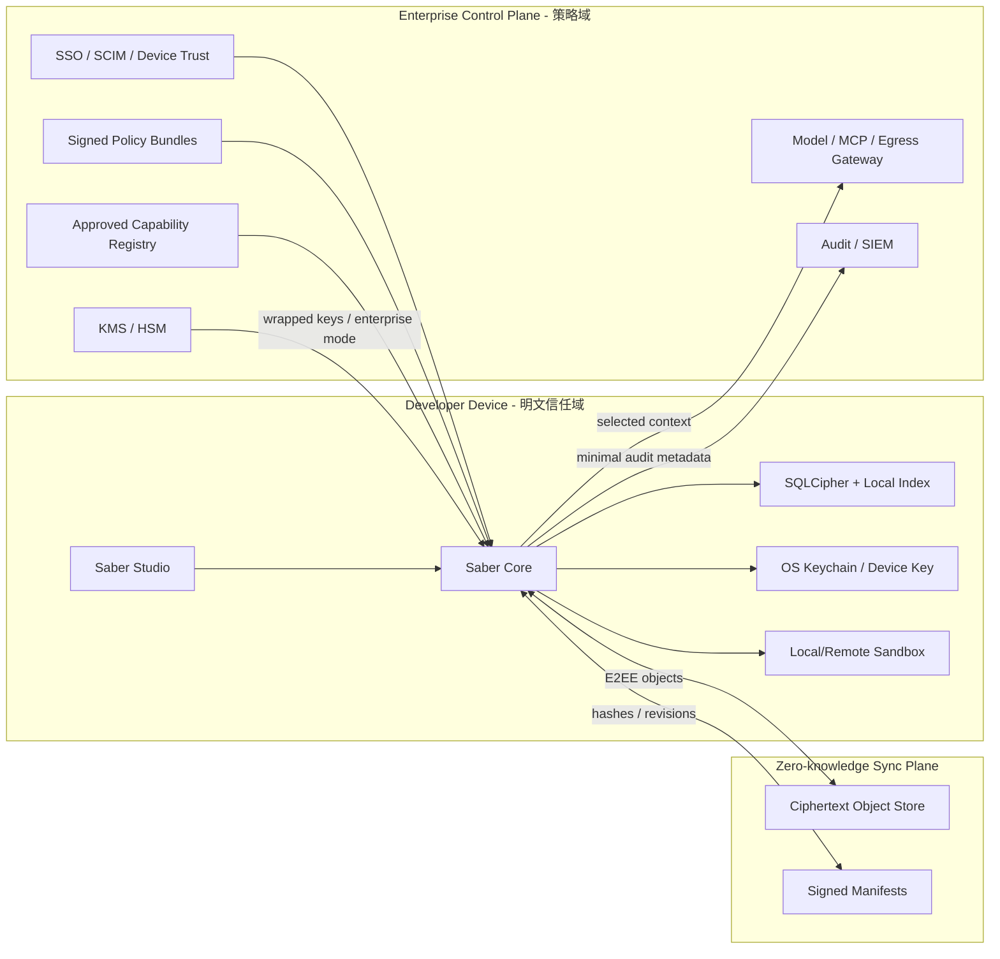

控制面和同步面分离：企业管理员可以下发模型、权限、保留、插件和数据地域策略，但普通同步服务仍不需要获得 Workspace 明文。Air-gapped 部署用离线签名 Bundle 替代在线控制面。

### 5.5 Trust Cell：最小企业部署与故障域单元

把每个 Workspace/Agent Runtime 看成一个细胞，比把整台电脑看成一个进程更能限制故障：

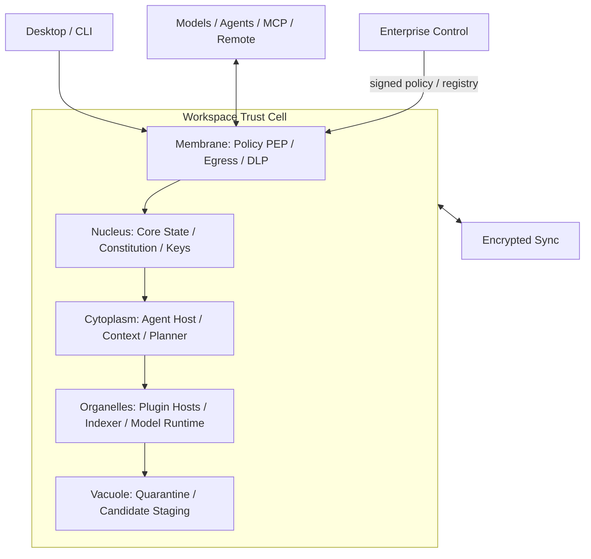

Trust Cell 不一定是一台 VM，而是一组可证明的不变量：独立 Workspace ID、Key、Policy projection、Event cursor、Capability set、进程/沙箱命名空间、预算和 Health state。一个 Cell 的 Plugin crash、Memory 污染、超预算或 Safe Mode 不应自动扩散到其他 Cell。

部署形态：个人版在一台设备内运行多个 Cell；团队版增加共享 Knowledge Space/Registry；企业版由控制面管理成千上万个 Cell；远程执行只是 Cell 的受限器官迁移到受管 Realm，Nucleus/Policy Authority 仍有明确归属。

---

## 6. 语言与桌面技术选型

### 6.1 推荐结论

**企业完整版推荐 `Code-OSS/Electron + Rust Core + TS Agent Host`。**

原因：

- Code-OSS 已提供成熟编辑、调试、终端、SCM、LSP、Remote Extension Host 和扩展生态；源码为 MIT，但 Microsoft 品牌、Marketplace、部分远程/调试扩展另有许可边界，必须使用自有品牌、审查扩展许可，并建立自有/企业插件市场或 Open VSX 路径。
- Electron 的内存占用更高，但对一个完整 IDE 来说，维护语言生态、调试器、扩展 Host 和远程开发的成本通常远高于节省的桌面内存。
- Rust Core 独立于 Code-OSS，未来可以被 CLI、轻量 Tauri 客户端或远程控制面复用，避免把产品生命绑定在 Electron。

### 6.2 为什么不直接认定 Tauri + Monaco

Tauri 2 的 capability 模型、跨平台和签名更新很适合安全桌面壳；但：

- Monaco 只是编辑器组件，不含完整 Workbench、调试、SCM、扩展 Host 和 Remote Development。
- macOS/Windows/Linux 使用不同系统 WebView，会增加一致性测试成本。
- Agent IDE 的主要工程复杂度不在窗口壳，而在真实开发生态。

因此提供两条受控路径：

| 路径 | 适用 | 决策 |
|---|---|---|
| Tauri + Monaco Spike | 4-6 周验证 Harness/安全/记忆，不追求完整 IDE | 可用作 PoC |
| Code-OSS Product | 要成为日常主 IDE、支持远程/调试/扩展 | MVP 前确定并转入主线 |

必须在第 4 周做 ADR Gate，禁止两个桌面壳长期并行开发。

无论采用哪种壳，Renderer 都必须关闭 Node integration、启用 context isolation/CSP，所有高权限调用只能走窄化 IPC 到 Rust Core；Code-OSS Extension Host 与 Saber Capability Host 是两套不同信任域，普通 VS Code 扩展不能自动获得 Agent 的模型、记忆、密钥或网络权限。

### 6.3 分层代码仓建议

```text
apps/
  desktop-codeoss/          # IDE 产品壳
  cli/                      # headless / automation
crates/
  core-protocol/            # versioned schemas
  event-store/              # append-only + projections
  policy/                   # Cedar/custom capability PDP
  sandbox/                  # platform backends
  secret-broker/
  sync-e2ee/
  health-supervisor/
packages/
  agent-runtime/            # orchestrator / loops
  context-engine/
  model-providers/
  agent-adapters/
  mcp-host/
  skill-runtime/
  evolution-engine/
  plugin-sdk/
schemas/
  events/
  capabilities/
  exchange/
evals/
  repos/
  tasks/
  security/
```

Rust 与 TypeScript 不共享手写类型；由 JSON Schema/Protobuf 生成两端类型和兼容测试。

---

## 7. Harness Kernel 与事件模型

### 7.1 Event Sourcing 的正确使用

Append-only Event Store 是运行事实源，但不应把所有业务状态都变成需要全量回放的纯理论事件溯源。推荐：

- 不可变事实：Event Log。
- 快速查询：transactional projection tables。
- 大内容：content-addressed encrypted blobs。
- 索引：可重建派生物。
- 修改/撤销：追加 `superseded`、`revoked`、`redacted` 事件，不原地静默覆盖审计事实。

核心事件示例：

```json
{
  "event_id": "01J...",
  "schema_version": 3,
  "workspace_id": "ws_...",
  "goal_id": "goal_...",
  "task_id": "task_...",
  "run_id": "run_...",
  "type": "tool.execution.completed",
  "occurred_at": "2026-08-25T14:02:11.123+08:00",
  "actor": {"kind": "agent", "id": "test-writer"},
  "causation_id": "evt_parent",
  "correlation_id": "trace_...",
  "payload_ref": "blob://sha256/...",
  "payload_hash": "sha256:...",
  "policy": {"decision_id": "pd_...", "result": "allow"},
  "sensitivity": "internal",
  "integrity": {"prev_hash": "...", "signature": "..."}
}
```

### 7.2 一次 Run 的状态机

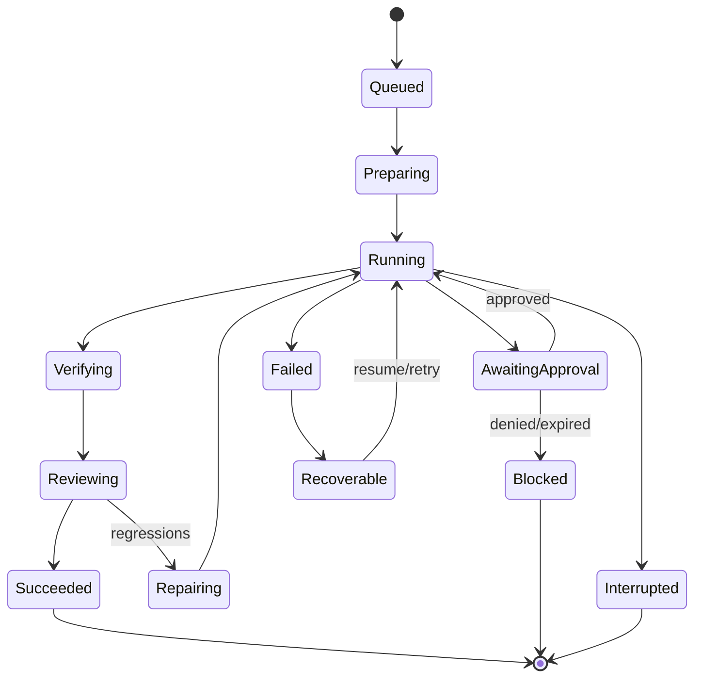

状态只能由内核根据事件转换；模型可以建议状态，不能直接把失败标成成功。`Succeeded` 必须绑定验收证据。

### 7.3 Crash Consistency

- Event append 与 projection 更新使用同一 SQL 事务和 transactional outbox。
- 工具调用先记录 intent，再执行，再记录 result；启动恢复时识别没有 result 的悬空调用。
- 有副作用的 Tool 必须支持 idempotency、read-after-write verification 或明确标注 `non_retriable`。
- Run 恢复前比较 workspace fingerprint、Git HEAD、Tool/Skill/Policy 版本；不一致则进入 Reconcile，而不是盲目重放。
- Timeline 做哈希链并周期性签名；本地管理员仍可删除数据，但不能无痕篡改后冒充原轨迹。

---

## 8. Context Engine 与统一知识层

### 8.1 数据不是“全部向量化”

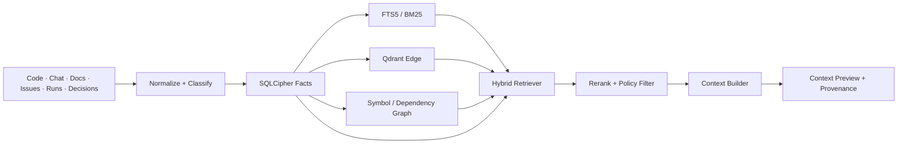

推荐：

- SQLCipher：Events、Goals、Tasks、Memories、Decisions、Policies、Capabilities 的事实源。
- SQLite FTS5：错误信息、标识符、精确词、中文/英文文本检索。
- Qdrant Edge：本地进程内向量检索；作为派生索引，可删除重建。
- Tree-sitter + LSP：语法、definition/reference、diagnostic、call graph。
- Git：代码历史和代码内容的最终事实源；不要把 repo 当同步 Blob 复制。

### 8.2 每个 Context Chunk 都有“营养标签”

```yaml
source: artifact://...
source_kind: test_failure
provenance: run://...
scope: repo://payments
freshness: 2026-08-25T13:50:00+08:00
valid_until: null
trust: observed
sensitivity: confidential
taint: [external-web]
token_cost: 812
retrieval_score: 0.91
policy_result: local-model-only
```

Context Builder 的目标不是填满窗口，而是在隐私、费用和 token 预算下最大化任务效用：

```text
Utility = relevance × trust × freshness × task-fit
          - token-cost - privacy-risk - contradiction-penalty
```

### 8.3 Memory Compiler

对话结束后不直接“记住一切”，而走：

```text
Events → Secret/PII scan → Evidence extraction → Candidate
→ Dedup/Conflict → Scope/TTL → Approval policy → Memory Store
```

记忆类型：

| 类型 | 示例 | 默认晋升 |
|---|---|---|
| Working | 当前两个失败测试 | 自动，短 TTL |
| Episodic | 上次升级因 schema drift 失败 | 自动候选，可撤销 |
| Semantic | 订单服务采用 Outbox | 需证据或用户确认 |
| Procedural | 发布必须先跑 migration dry-run | 适合转 Skill |
| Preference | 用户偏好 concise review | 用户级，可编辑 |
| Policy | 禁止生产库写操作 | 只能管理员/策略源发布 |
| Negative | 这个 workaround 已证实无效 | 保留以避免重复失败 |

Memory 关键字段：`claim`、`scope`、`evidence_refs`、`confidence`、`valid_from/to`、`supersedes`、`sensitivity`、`owner`、`review_state`。没有 evidence 的模型总结不能晋升为高可信知识。

### 8.4 综合 Hermes/OpenClaw 的五层记忆与单写者模型

将“记忆”拆成五种持久面，而不是让一个 `MEMORY.md` 同时承担所有职责：

| 层 | Saber 实体/存储 | 写者 | 何时进入 Prompt | 典型内容 |
|---|---|---|---|---|
| Instruction | 签名 Policy、人工 Rule、Persona | 管理员/用户；Policy 只能权威源 | Session/Turn bootstrap，有硬预算 | 行为规则、表达偏好、组织约束 |
| Curated Core | `Memory` projection + 可导出的 `MEMORY.md`/`USER.md` view | 唯一 Memory Authority | 有范围和来源资格时常驻/触发注入 | 稳定事实、用户偏好、关键决策 |
| Episodic Evidence | Events、transcript、daily notes、Artifacts | Run/Event Store 追加 | 不自动注入；FTS/混合检索按需 | 发生过什么、原始证据、失败轨迹 |
| Prospective | Goal/Task/Schedule/Intent 状态机 | Planner 提案，Core 落地 | 触发条件满足时 | “周五提醒”“发布出现时执行检查” |
| Review | Candidate、Dream/Reflection、Eval、Incident | 后台 Compiler/Reviewer | 从不作为指令自动注入 | 待晋升、冲突、回滚与审阅报告 |

Saber 不直接把 Markdown 当唯一事实源：可读文件是可编辑视图，SQLCipher 中的版本、来源、状态和哈希才是权威记录。这样保留 OpenClaw 的“没有隐藏记忆、可用文本编辑器检查”的优点，同时避免任意进程改一个文件就伪造 provenance。

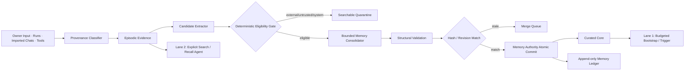

关键实现规则：

- 来源类是 Core 写入的闭集，如 `owner`、`agent-derived`、`external-untrusted`、`system`；存于不可由模型正文覆盖的列中。未知外部来源默认 `external-untrusted`，不因文本声称“来自用户”而升级。
- 外部网页、MCP、导入对话可以检索，但不能自动晋升为常驻核心，也不能通过摘要、回忆再写入实现“来源洗白”。召回结果必须携带 `derived_from_memory=true`，防止回忆循环重复制造新记忆。
- Cron、健康检查、子 Agent 的自述默认不能产生长期候选；只有其可验证 Artifact/Result 能作为证据被主任务引用。
- Memory Authority 是每个 Workspace 的唯一逻辑写者；文件编辑、多个 Agent 和后台整理都提交 proposal，以 `expected_revision_hash` 做乐观并发控制，冲突进入 Merge Queue。
- Curated Core 有字符/token/条目三重预算。超限必须合并、淘汰或降级回 Episodic，禁止静默截断后假装完整。
- 前台回复路径中的记忆故障只允许降级召回，不得阻塞回答；写入、整理和 Eval 可异步执行。

召回采用两条 Lane：

1. **Lane 1（零额外模型调用）**：常驻小型核心、FTS/向量/图混合检索、规则触发；只允许已晋升且满足 scope/policy 的内容自动注入。
2. **Lane 2（按需 Recall Agent）**：用户明确问“之前如何决定”、时间跨度大、多跳关系且 Lane 1 无强命中时，启动受限检索 Agent。它只能读证据并输出带引用的 Recall Result，不能顺手改 Memory。

Hermes 的事实/过程分离在这里扩展为四条编译规则：`fact → Memory`、`procedure → Skill Candidate`、`intention → Goal/Schedule/Intent`、`authority → Policy/Rule`。类型判断错误必须在 Review UI 可改，不能靠后续 Prompt 猜测纠正。

### 8.5 冲突、遗忘与用户模型

- 安全策略冲突：组织策略优先，绝不 Last-Write-Wins。
- 工程事实冲突：显示证据、新鲜度和适用 branch，由用户或验证任务裁决。
- 用户纠正：创建高优先级 correction，并使旧记忆 `superseded`。
- 被删除的聊天：其派生记忆进入重新验证；若是唯一证据，应撤销或请求保留说明。
- 提供“为什么想起它”“忘记这条”“查看所有使用过它的 Run”。
- `USER.md` 类偏好以命令式、带日期和 active/superseded 状态保存；新偏好应原位 supersede 旧值，不能并排保留相互冲突的“喜欢详细”和“喜欢简洁”。
- 记忆删除分为 `forget`（不再召回）、`redact`（受权删除内容但留审计墓碑）、`revoke`（结论无效）和 `expire`（超出时效），避免一个 Delete 同时承担四种语义。

### 8.6 消除数据孤岛不等于建立一个“全知大库”

数据孤岛的根因不是文件分散，而是身份、语义、来源、权限和生命周期不相通。Saber 的统一知识层应是**逻辑统一、物理可分、权限先行**的 Knowledge Mesh：

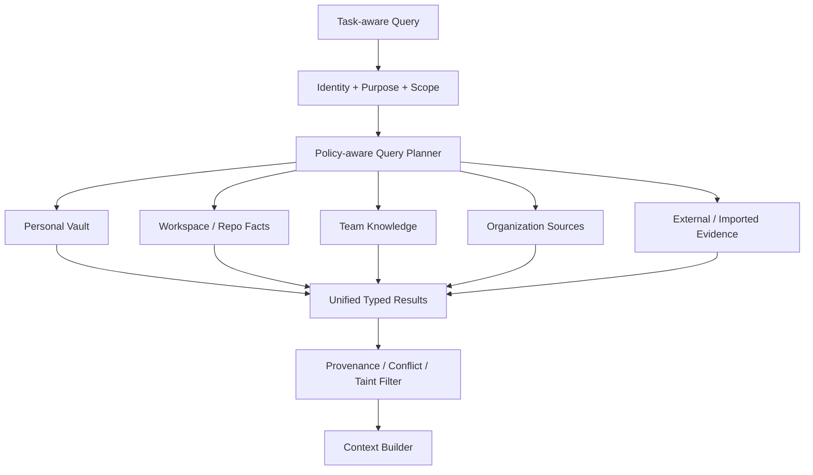

| Knowledge Space | 默认所有者 | 默认可见范围 | 典型内容 | 能否自动跨域 |
|---|---|---|---|---|
| Personal | 用户 | 本人设备 | 偏好、个人工作历史 | 否 |
| Workspace/Repo | Workspace owner | 项目成员/本机 | 代码事实、决策、运行证据 | 仅继承明确权限 |
| Team | 团队/项目 | 成员 | Runbook、共享 Skill、事故经验 | 需发布/脱敏 |
| Organization | 企业 | 策略授权主体 | Policy、标准、批准能力 | 组织签名下发 |
| External Evidence | 原来源/授权用户 | 当前任务 | Docs、Issue、导入对话 | 不进入 Curated Core |

统一发生在五个契约：`Global Resource ID`、`Canonical Types`、`Provenance Graph`、`Policy Query`、`Lifecycle Events`。底层仍可以是 Git、SQLCipher、对象存储、企业搜索或远程 Connector；Context Builder 查询的是同一语义平面，而不是要求先复制所有明文。

### 8.7 知识主权的六项产品承诺

1. **可见**：用户能看见系统保存了什么、为何召回、来自哪里、被谁使用。
2. **可纠正**：事实、偏好和决策可纠正且保留 supersede 谱系。
3. **可携带**：支持 CAX + Canonical Knowledge Exchange 导出，不因使用 Saber 形成新孤岛。
4. **可分权**：个人、项目、团队、组织知识有不同 owner/key/policy，不能以“统一”为名越权合并。
5. **可遗忘**：支持 TTL、撤权、删除、密钥销毁、派生影响分析和合规保留。
6. **可离线**：断网仍可访问授权的本地事实与索引；云端故障不夺走主体记忆。

---

## 9. 外部对话采集与 Agent 互操作

### 9.1 采集原则

优先级：官方 Import/Export/API > 本地用户选择的公开日志 > CLI JSON/stream-json > 明确授权的只读解析。默认禁止：盗取令牌、绕过登录、屏幕 OCR 抓取、修改其他 Agent 数据库。

每个 Adapter 必须声明：

| 级别 | 能力 |
|---|---|
| A0 | 手动粘贴/文件导入 |
| A1 | 解析官方 Export |
| A2 | 只读同步本地公开数据 |
| A3 | 启动新任务并流式接收事件 |
| A4 | 官方 resume/fork/approval/control |

不得把 A1 宣传成 A4。

### 9.2 Canonical Agent Exchange（CAX）

定义开放、版本化交换格式：

```text
Manifest
  source_vendor / exporter_version / consent / exported_at
WorkspaceRefs
Threads
  Turns
    Messages
    ToolCalls
    FileChanges
    Approvals
    Verifications
Artifacts (content-addressed)
Lineage
Integrity
```

导入保留原始对象哈希和 vendor metadata，同时生成内部规范事件；原始内容与推断出的 Memory 必须分开存储。

### 9.3 AgentProvider SPI

```ts
interface AgentProvider {
  capabilities(): AgentCapabilities;
  start(input: CanonicalTask): AsyncIterable<AgentEvent>;
  resume?(externalSessionId: string, input: CanonicalTask): AsyncIterable<AgentEvent>;
  fork?(externalSessionId: string, boundary?: string): Promise<ExternalSessionRef>;
  steer?(runId: string, input: CanonicalInput): Promise<void>;
  cancel(runId: string): Promise<void>;
  resolveApproval?(request: ApprovalDecision): Promise<void>;
  health(): Promise<ProviderHealth>;
}
```

首批 Driver：

- Native Saber Agent。
- Codex App Server Driver（stdio/Unix socket 优先）。
- Claude Code/Agent SDK Driver（结构化流）。
- DeepSeek Harness Driver。
- Generic CLI JSONL Driver。
- MCP/A2A bridge 作为工具/委派补充，不强行统一全部 Session 语义。

ZCode/MiniMax 若没有稳定官方控制协议，先做 A0-A2；不要靠 UI 自动化承诺企业可靠性。

### 9.4 对话采集不是“导入聊天”，而是分层证据编译

一段外部对话同时含有用户原话、Agent 猜测、工具事实、旧代码状态、审批和可能已过期的结论。必须保留层次，不能把摘要当事实：

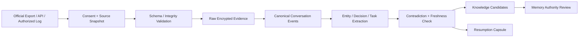

五层数据必须可分别删除和重建：

| 层 | 内容 | 是否可直接信任 | 用途 |
|---|---|---|---|
| Raw Source | 官方 export/日志原文和哈希 | 只信“来源中存在这些字节” | 审计、重新解析 |
| Canonical Events | message/tool/diff/approval 等规范事件 | 保留 vendor 声明，不保证为真 | 时间线、互操作 |
| Observed Facts | Git hash、测试结果、真实 Tool Result | 按验证强度分级 | 续接、知识证据 |
| Derived Claims | 摘要、决策、进度、偏好候选 | 必须带来源和置信 | 检索、Memory 候选 |
| Continuation State | 当前 Goal/Task/未知项/环境指纹 | 需要重新验证易变部分 | 开启后续对话 |

导入 Job 状态为 `Discovered → ConsentGranted → Snapshotted → Validated → Normalized → Enriched → Reviewable → Committed`；任一步失败都保留已确认边界，不写半成品主数据。Parser 版本写入 manifest，未来升级可从 Raw Source 重算 Derived 层。

### 9.5 三种“继续对话”必须对用户说清楚

| 类型 | 含义 | 能保证什么 | 不能保证什么 |
|---|---|---|---|
| Native Resume | 通过厂商官方协议恢复原 Session | 厂商可见的上下文/工具连续 | 私有隐藏状态、厂商未来兼容 |
| Canonical Successor | 在 Saber 创建后继 Task/Conversation | 目标、证据、决策、工作区状态连续 | 原 Agent 的不可见推理状态 |
| Knowledge Continuation | 只复用经过治理的知识 | 稳定事实/规则/经验可召回 | 任务执行位置和会话身份连续 |

UI 必须显示当前是哪一种，禁止用一个“Resume”按钮掩盖语义差异。默认推荐 Canonical Successor：它不受厂商 Session 生命周期锁定，并能选择更合适的新模型/Agent。

### 9.6 Resumption Capsule 的可验证恢复算法

生成 Capsule 时按以下顺序，而不是直接让模型总结全部聊天：

1. Resolve：按 repo remote/branch/commit、workspace、Goal/entity、时间和用户身份找候选谱系。
2. Rehydrate：读取最后 verified artifact、Decision、未完成 Task 和重要 message span。
3. Revalidate：检查当前 Git、文件 hash、依赖锁、Tool/Skill/Policy/模型配置；易变事实过期即标红。
4. Reconcile：将历史预期与当前环境比较，生成 `unchanged/diverged/missing/unknown`。
5. Preview：向用户显示要恢复的目标、已完成/未完成、冲突、外部数据去向。
6. Commit：用户确认后创建 successor edge 和新 Run；任何新结论写新事件，不改历史。

Capsule 增加机器字段：

```yaml
continuation_kind: canonical-successor
lineage: [{source: claude-code, session_hash: sha256:..., boundary: turn://42}]
environment_fingerprint:
  repo_commit: abc123
  dirty_tree_hash: sha256:...
  dependency_locks: {pnpm-lock.yaml: sha256:...}
  policy_version: org-policy@17
revalidation:
  unchanged: [decision://no-distributed-lock]
  diverged: [artifact://refresh-service.ts]
  missing: [tool://legacy-test-run]
  unknown: [external://staging-state]
minimum_evidence_set: [artifact://test-red, decision://oauth-design]
```

续接成功的验收不是“模型说记得”，而是：用户能确认目标；环境差异被发现；关键决定有证据；第一个新动作遵守当前 Policy；新结果连接到原谱系。

### 9.7 双向流动与知识防扩散

Saber 也应能把 Canonical Task/Capsule 交给其他 Agent，并把结果接回；但默认只传任务所需的最小证据集，而非完整个人知识库。每次交付记录 recipient/provider、目的、字段、敏感度、retention 和授权。

- User Memory、组织 Policy 和 Secret 默认不随外部委派导出。
- 外部 Agent 回传的“记忆/规则建议”保持 untrusted-derived，不能直接写 Curated Core。
- 同一原始对话的重复导入按 source object hash 去重，不重复制造 Memory。
- 源对话删除/撤权后，所有派生 Claim 建立反向引用并进入 retain/revalidate/revoke 工作流。
- 企业 Legal Hold 与个人删除权冲突时按组织合规策略执行，并向有权用户解释状态。

---

## 10. 模型、本地离线与成本路由

### 10.1 模型是认知协处理器

`ModelProvider` 需要暴露能力，而不是只提供 `model_name`：

```text
modalities / context / max-output / tool-calling / structured-output
reasoning-levels / prompt-cache / residency / retention / training-policy
latency / availability / current-pricing / tokenizer / safety-behavior
```

路由输入：任务难度、数据敏感性、上下文大小、工具需求、预算、时延、历史成功率、区域与组织策略。

```text
补全/分类/Embedding/脱敏       → local-fast
敏感代码问答                  → local-capable
小范围普通修改                → economical coding model
复杂跨仓重构                  → frontier coding model
安全 Review                   → 与作者不同的独立模型
同类失败两次                  → change strategy/provider, not blind retry
后台低优先任务                → cheap/off-peak route
```

价格不能写死在客户端；使用带 `effective_from` 的签名 Pricing Registry，并在每个 Run 固化当时的估价快照。

### 10.2 四种部署模式

| 模式 | 模型 | 工具/搜索 | 同步 | 适用 |
|---|---|---|---|---|
| Air-gapped | 本地 | 本地 | 无/离线介质 | 高敏企业 |
| Local-first | 本地为主 | 本地 | 可选 E2EE | 个人隐私 |
| Hybrid | 本地 + 云 | 受控公网 | E2EE | 默认推荐 |
| Managed | 企业 Gateway + 沙箱集群 | 企业连接器 | 企业策略 | 大型组织 |

严格离线的验收条件必须是断网后仍能完成模型推理、索引、工具执行和恢复；仅“代码在本机执行”不能称为离线。

### 10.3 本地模型 Serving

通过 OpenAI-compatible、Anthropic-compatible 和原生 Provider 适配：Ollama、llama.cpp、vLLM、SGLang。模型权重和 Agent Harness 分开升级、分开存储、分开计量。

不要根据“激活参数”估计显存；必须同时考虑总权重、量化元数据、KV cache、上下文、并发和 runtime。产品内提供硬件探测与实测 benchmark，而不是静态营销表。

---

## 11. 权限、沙箱、密钥与网络：免疫系统的硬边界

### 11.1 Capability 模型

```text
fs.read / fs.write / fs.delete
process.spawn / process.signal
network.http / network.raw / network.listen
secret.use
browser.control
git.commit / git.push / git.force
cloud.deploy
external.read / external.write
plugin.install / capability.publish
self.propose-change
```

授权请求建模为 `(principal, action, resource, context)`；Rust Core 内嵌 Cedar 或等价策略引擎，默认 Deny。组织策略、平台硬规则、用户策略、临时授权按“更严格者胜出”合并，项目文件不能削弱组织策略。

示例：

```cedar
forbid (
  principal,
  action == Action::"secret.use",
  resource in SecretGroup::"production"
);

permit (
  principal in AgentGroup::"reviewers",
  action == Action::"fs.read",
  resource in Workspace::"current"
) when { context.sandboxed && context.dataClass != "restricted" };
```

### 11.2 沙箱分级

| 级别 | 执行域 | 示例 | 默认网络 |
|---|---|---|---|
| S0 | Rust 内建只读操作 | stat、hash、git diff | 无 |
| S1 | OS 原生限制进程 | 格式化、可信编译器 | Deny |
| S2 | Container/gVisor | tests、依赖安装、browser | Allowlist |
| S3 | microVM/远程沙箱 | 未知二进制、自生成 Plugin | Deny/代理 |
| S4 | 生产/外部系统 | deploy、写 SaaS | 人审 + 专用身份 |

平台后端：macOS Seatbelt、Linux Landlock/bubblewrap，Windows 使用 AppContainer/受限 Token/Job Object 等受支持组合；不能以 UI 审批代替内核限制。高风险插件要进独立进程或 WASI sandbox。

OpenClaw 官方文档明确提醒 workspace 只是默认工作目录，不是硬沙箱，并且其 Sandbox 默认关闭。这正是 Saber 不能复制的默认值：除 Rust 内建的 S0 只读操作外，Agent 生成/修改代码、运行测试和外部插件默认进入 S1/S2；未建立 Sandbox 的平台能力必须 fail closed 或显式进入受限只读模式。Skill allowlist 也不是 Shell 权限边界，两者必须分别执行。

### 11.3 Secret Broker

模型永远只看到 `credential_ref` 和能力范围，不看到真实 Token：

```text
Agent Tool Request
  → Policy Decision
  → Secret Broker obtains short-lived credential
  → injects out-of-band into isolated tool process
  → redacts stdout/stderr/event payload
  → revokes/rotates after use
```

个人版使用 OS Keychain/Credential Manager；企业版使用 KMS/HSM/Vault、OIDC workload identity 和短期凭证。禁止把主机完整环境变量透传给子进程。

### 11.4 Egress Gateway 与污点标签

- 默认网络 Deny，按域名、协议、端口、用途授权。
- 从外部网页/MCP/Issue 得到的内容标为 untrusted/tainted，不能直接转化为高权限指令。
- 请求体先做 Secret/PII/代码分类；对远程模型执行最小上下文选择和可预览脱敏。
- DNS、重定向、IP literal、localhost/metadata endpoint、上传大小都受策略控制。
- 浏览器页面和 Tool output 是数据，不是系统指令。

### 11.5 审批 UX

审批卡必须显示：谁请求、要做什么、资源范围、目标网络、将用哪个凭证、为何需要、可选最小授权、是否仅本次/本 Task。禁止使用“Allow everything to continue”作为默认快捷路径。

---

## 12. 端到端加密知识同步

### 12.1 同步边界

同步：Events、Memories、Rules、Skills、Task state、settings、加密 artifacts、index manifests。默认不同步：Git objects、repo 源码、模型权重、构建产物、依赖缓存、容器层。

### 12.2 密钥层次

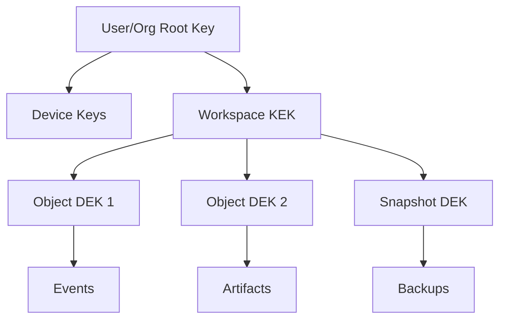

- 本地数据库用 SQLCipher；Blob/对象用审计过的 AEAD 库。
- 每 Workspace 独立 KEK；每对象独立 nonce/DEK；云端只保存密文、包裹密钥、manifest 和最少路由元数据。
- 新设备通过设备公钥获得重新包裹的 Workspace Key；撤销设备后轮换后续写入密钥。
- 密码恢复使用恢复密钥/组织托管策略；明确“零知识且无恢复密钥”会导致永久不可恢复。
- Embedding 视作敏感派生数据，默认本地，不上传用于云搜索。

### 12.3 同步协议

- Event/Blob 是内容寻址不可变对象，Manifest 使用版本、哈希树和签名。
- 可编辑 Memory/Rule 采用 revision + parent revision + device id；普通并发修改进入 merge queue。
- Policy 使用组织签名版本和单调序号，禁止用户设备以旧版本覆盖。
- 提供 key rotation、device loss、DB corruption、cloud loss、ransomware rollback 的定期 Restore Drill。

真正 E2EE 与服务器端明文全文/向量检索天然冲突。若企业要求服务器搜索，应作为另一种显式部署模式：客户自管可信服务/KMS，而不能仍宣称云端零知识。

### 12.4 远程加密存储的威胁边界

“上传前加密”只是起点，企业设计还必须处理：

| 威胁 | 控制 | 仍会泄漏什么 |
|---|---|---|
| 云端读取正文 | per-object AEAD + client-held keys | 对象大小、时间、账户/设备路由元数据 |
| 云端替换/回滚对象 | signed manifest、Merkle root、monotonic epoch | 访问时序 |
| 被撤销设备继续访问 | device revoke + new key epoch + selective rewrap | 已在旧设备解密过的历史明文无法收回 |
| 多设备并发覆盖 | immutable objects + parent revision + merge queue | 冲突存在这一事实 |
| 恶意客户端上传污染 | device signature、provenance、promotion gate | 被授权设备的存在 |
| 本地设备被盗 | OS secure storage、device lock、remote revoke | 已解锁会话窗口内风险 |
| 密码/恢复密钥丢失 | recovery kit 或企业 escrow（显式模式） | 零知识模式下没有后门恢复 |

客户端应提供 Metadata Exposure Report，让企业明确知道 E2EE 保护正文和内容索引，但普通对象存储仍可能观察流量、大小、频率和租户标识。高敏模式可增加 padding、批量同步或私有中继，但会增加成本和延迟。

### 12.5 分享、撤权与密码学删除

- 每个 Knowledge Space 有独立 key epoch；共享通过给成员设备包裹 Space Key，不复制明文主库。
- 从 Personal 晋升到 Team/Org 不是“移动文件”，而是产生脱敏后的新对象、新 owner、新 provenance 和发布审批。
- 撤权停止未来 key epoch 分发，并重新包裹后续写入；对历史数据明确“阻止未来解密”与“无法抹去既有明文”的差别。
- 删除对象后保留最小签名 tombstone 防回滚复活；若法规要求连 tombstone 元数据也删除，则通过单独合规流程处理。
- “密码学删除”通过销毁 DEK/包裹密钥使密文不可恢复；执行前必须处理 Legal Hold、备份保留和派生知识引用。
- 企业恢复托管与个人零知识是两种不同产品契约，安装时显式选择，不提供模糊的后台万能密钥。

---

## 13. 自我进化：从经验到受控代码修改

### 13.1 进化等级

| 等级 | 可改变内容 | 自动化上限 | 发布要求 |
|---|---|---|---|
| E0 | 当前上下文/计划 | 自动 | Run 内有效 |
| E1 | Working/Episodic Memory | 自动候选 | 可解释、可删 |
| E2 | Preference/Rule/Prompt | 建议 | 用户/所有者接受 |
| E3 | Skill | 自动生成与测试 | Eval + 版本 + 回滚 |
| E4 | Script/Tool/Plugin | 生成 | 强沙箱 + SBOM + 签名 + 人审 |
| E5 | Agent Strategy/Router | 离线优化 | Shadow + Canary |
| E6 | Core Source PR | 只可提 PR | 独立 Review + 人审 + 签名构建 |
| E7 | Policy/Crypto/Updater/Audit Root | 禁止自主修改 | 安全团队专属流程 |

### 13.2 进化流水线

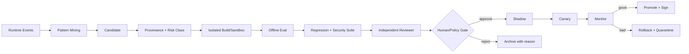

候选来源可以是：重复成功步骤、重复失败后的稳定修复、用户纠正、高频审批、昂贵上下文模式、工具接口缺口。模式挖掘只能提出候选，不能证明能力有效。

### 13.3 Evolution Workshop：把“学习”实现为受治理的编译器

借鉴 OpenClaw Skill Workshop 的 proposal-first、hash binding、ownership、atomic generation 和 rollback，同时把适用范围从 Skill 扩大到 E1-E6。统一实体 `EvolutionCandidate`：

```yaml
candidate_id: evo_01J...
kind: memory | rule | skill | tool | strategy | core_pr
scope: user | workspace | repo | organization
origin: explicit_learn | correction | repeated_pattern | incident | eval_gap
evidence_refs: [event://..., artifact://..., decision://...]
source_trust: owner
target_ref: capability://db-migration@sha256:...
expected_target_hash: sha256:...
requested_permissions: [fs.read, process.spawn:test]
risk_class: E3
revision: 4
status: proposed
evaluation_plan: eval://db-migration-v2
created_by: agent://memory-compiler
review_policy: org://default-evolution-policy
```

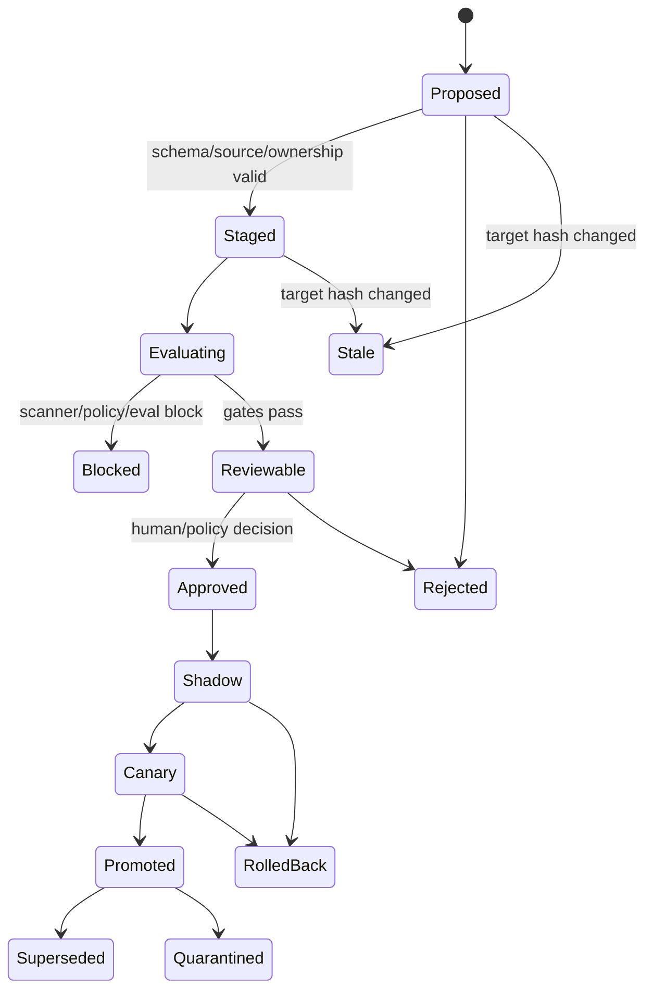

实现不变量：

- 生成内容先写不可执行的 candidate generation；只有 `promote` 能写 live capability root。每个 generation 不原地覆盖，先完整 fsync，再原子发布引用和事件。
- Agent 只能更新 Workshop 创建且明确归其管理的路径；人工编写、组织签名、Bundled、Plugin 外部目录默认只读。这是所有权边界，不靠 Prompt 提醒。
- 修改现有能力必须先完整读取并取得 receipt，再绑定 content hash；Apply 前重新检查，变化即 `stale`，禁止覆盖。
- Scanner 负责已知危险模式和依赖风险；Evaluator 负责任务质量；PDP 负责权限上限；Reviewer 负责语义审阅。四者不能互相替代。
- 自动提取 Reviewer 只接收同一 sender/provider/model/auth profile 的有界证据，不得拿 Message、Apply、Secret、Network 等通用工具；其输出只能是一个候选或 abstain。
- 默认模式为 `propose`。个人用户可显式把 E1/E3 的低风险范围设为 `auto-after-eval`；企业策略可强制更严格。E4-E6 永远不能因工作区配置降为无审批发布。
- 自动过程每个信号最多产生一个 mutation，失败后保留 Pending/Blocked，不做自我强化式无限重试；每次 Promote 都保留 last-known-good 和一键撤销。

触发策略应防止“凡成功必学习”：

| 信号 | 默认动作 | 说明 |
|---|---|---|
| 用户明确 `/learn`/“以后都这样” | 立即建候选 | 仍不跳过 Eval/审批 |
| 用户纠正且同类错误发生 ≥2 次 | Patch 既有 Skill 优先 | 避免 Skill 爆炸 |
| 相同稳定流程在不同 Run 成功 ≥3 次 | 建 Skill Candidate | 需要至少两个不同任务证据 |
| 故障后形成可复现恢复步骤 | 建 Recovery Skill/Test | transient provider error 不学习 |
| 普通一次性成功 | abstain | 成功轨迹是证据，不是结论 |
| Secret/个人事实/外部网页指令 | 禁止转 Skill | 分别交给 Secret/Memory/Quarantine |

Hermes 的 `/learn` 适合提供“显式学习入口”；OpenClaw 的 delayed review 适合提供“后台发现器”。Saber 把两者合并为同一个 Workshop API，确保 Chat、CLI、IDE 和后台任务没有旁路写入。

### 13.4 Skill/Plugin 供应链

```text
skills/db-migration/
  SKILL.md
  skill.yaml
  scripts/
  references/
  tests/
  evals/
  CHANGELOG.md
  sbom.spdx.json
  provenance.intoto.jsonl
  signature.bundle
```

`skill.yaml` 至少声明版本、输入输出、权限、来源 Runs、数据敏感性、兼容范围、eval 数据集、质量分、上个稳定版本。发布采用不可变版本；工作区只能引用 digest，不能默默漂移到 `latest`。

质量函数建议：

```text
Score = task_success
        - λ1 × regression
        - λ2 × permission_expansion
        - λ3 × security_findings
        - λ4 × human_correction
        - λ5 × cost
        - λ6 × latency
```

不同任务类型单独评分，禁止用一个平均分掩盖安全回归。

### 13.5 核心代码如何“自己优化自己”

允许系统在一个独立的 `self-host` 开发 Workspace 中：

1. 从 Incident/Eval 生成问题陈述和复现测试。
2. 新建隔离 worktree/branch。
3. 修改核心代码并运行全部单元、集成、兼容、安全、故障注入测试。
4. 生成 Self-Change PR，列出影响的信任边界、权限差异和回滚方法。
5. 使用与作者不同的模型/Agent Review；安全关键改动必须安全工程师审批。
6. 由受保护 CI 生成可复现构建、SBOM、SLSA provenance 和签名。
7. 先进入内部 Ring 0、员工 Ring 1、Design Partner Ring 2，再普发。
8. 使用 A/B slot 或保留 last-known-good 安装包自动回滚。

运行中的二进制永远不能把自己 patch 成“已发布版本”；提案权、构建权、签名权、部署权必须分离。

这里必须区分三种“改代码”：

| 变化 | 例子 | 等级 | 可自动到哪一步 |
|---|---|---:|---|
| Task 代码 | 修改用户 repo 的业务代码 | 普通 Run | 按项目 Tool/Policy 执行 |
| Capability 代码 | 新增一个迁移检查脚本/Tool/Plugin | E4 | 隔离生成和测试，等待人审发布 |
| Product Core 代码 | 修改 `saber-core`、Agent Runtime、Indexer | E6/E7 | E6 只提 PR；触及 E7 自动拒绝并转安全团队 |

Self-Change PR 必须附带机器可读 `trust-boundary-diff`：新增 Capability、外联域、持久化表、Secret scope、IPC method、Sandbox bind、依赖和签名链变化。若未声明的实际 Diff 与清单不符，CI 直接失败。

### 13.6 评测体系

- 公开基准只看趋势；核心是企业真实任务脱敏形成的 Private Eval。
- 每个 Eval 固定 repo snapshot、环境镜像、输入、权限、验收脚本和期望副作用。
- 指标包括 task success、pass@budget、回归率、人工纠正率、危险动作率、恢复成功率、记忆 precision/recall、成本和耗时。
- 每次 Model/Prompt/Skill/Tool/Policy/Indexer 变化都跑受影响切片。
- Shadow Run 不产生外部副作用；Canary 有严格配额和 kill switch。
- 采用基线/候选成对运行，同一 repo snapshot、相同预算、相同权限和随机种子策略；报告绝对成功数与置信区间，不只报平均分。
- 自进化的最低晋升门建议为：目标 Eval 无显著退化、受影响回归切片 100% 通过、安全阻断项为 0、权限不扩张或已审批、成本/延迟没有越过 SLO。
- 训练型改进单独建 `ModelCandidate`：trajectory 清洗、许可和隐私审查、离线训练、模型卡、安全评测、独立发布。Hermes 的 trajectory/RL 研究能力是数据管线参考，不应与运行时 Skill 学习共用发布按钮。

### 13.7 进化不只依赖 Skill：七种可生长组织

系统观察到不足后，必须选择**能解决问题的最低权力介质**，而不是默认生成 Skill 或直接写代码：

| 生长介质 | 解决的问题 | 产物 | 典型验证 | 风险 |
|---|---|---|---|---:|
| Memory | 忘记稳定事实/失败经验 | typed claim + evidence | retrieval/usefulness | E1 |
| Rule/Preference | 行为偏好或局部约束错误 | scoped rule IR | rule conflict tests | E2 |
| Workflow Graph | 步骤、分支、重试顺序不稳定 | typed DAG/state machine | path/property tests | E2-E3 |
| Skill | 可复用方法缺失 | instructions + refs + eval | task eval | E3 |
| Script/Tool | 需要确定性计算或新动作 | code + typed I/O | unit/integration/security | E4 |
| Plugin/Service | 需要持久进程、协议或复杂集成 | isolated package + manifest | contract/load/fault tests | E4 |
| Strategy/Core/Model | Harness/路由/底层能力不足 | config candidate/Core PR/model candidate | shadow/canary/full release | E5-E7 |

**最低权力进化原则（Least-Powerful Evolution）**：如果一条 Memory 能解决，不写 Skill；如果 Workflow 能约束，不生成任意代码；如果隔离 Tool 能解决，不改 Core；如果 Provider/模型可替换，不训练权重。这样把攻击面、维护成本和认知熵压到最低。

### 13.8 “体细胞变化”与“生殖系变化”

这是浩克式内生进化最重要的治理分界：

- **Somatic / 体细胞变化**：只影响某个 Run、用户、Workspace 或 Repo，如 Memory、项目 Skill、局部 Tool。可快速试验，故障域小，不自动遗传到其他组织范围。
- **Germline / 生殖系变化**：会传播到新 Workspace、其他用户、企业基线或产品版本，如 Bundled Skill、共享 Plugin、Router、Core。必须进入受保护构建、独立评测、签名和多 Ring 发布。

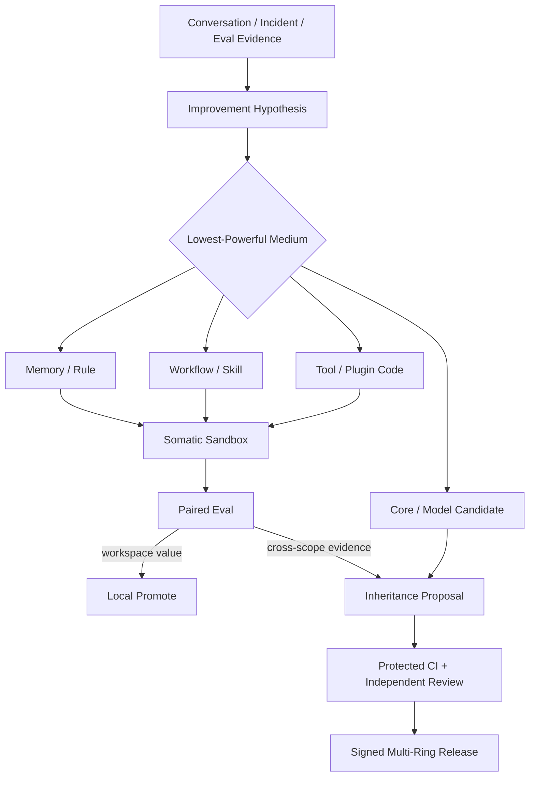

任何跨 scope 的“遗传”都要重新匿名化/审查证据，防止把个人偏好、客户代码、组织 Secret 和局部 workaround 传播到全局能力。

### 13.9 Code Capsule：让系统通过新增代码增强自己

E4 代码型进化先生成 `CodeCapsule`，而不是向主进程随意写源码：

```yaml
capsule_id: codecap_01J...
purpose: 对数据库迁移执行确定性 dry-run 检查
entrypoint: tool://migration-preflight
inputs: schema://MigrationPlan
outputs: schema://PreflightReport
runtime: wasi-preview2
permissions:
  fs.read: [workspace://migrations/**]
  process.spawn: [bin://approved/db-cli@sha256:...]
  network: deny
resource_budget: {cpu_ms: 30000, memory_mb: 256, output_mb: 10}
evidence_refs: [run://..., incident://...]
tests: [eval://migration-preflight]
owner_scope: workspace://payments
promotion_target: capability://migration-preflight
```

Code Capsule 生命周期：Generate → Static Scan → Dependency Lock/SBOM → S3 Sandbox Test → Capability Diff → Paired Eval → Human Review → Signed Digest → Shadow/Canary → Promote/Rollback。执行时只暴露 typed input/output 和显式 Capability；没有宿主 `HOME`、完整环境变量、Core IPC、签名密钥或任意网络。

当多个 Capsule 稳定后可以合并为 Plugin；当某一机制必须进入 Core 时，系统只生成 E6 PR 和 `trust-boundary-diff`。这才是“通过增加代码优化自己”的企业实现：**代码会生长，但生长发生在可隔离、可度量、可遗传审查的组织层，而不是运行中偷偷改脑干。**

---

## 14. 自愈与“炎症反应”

### 14.1 固定闭环

```text
Detect → Diagnose → Contain → Repair → Verify → Learn
```

Contain 必须先于 LLM 诊断。严重异常先杀进程、断网、撤凭证、冻结同步，然后再分析。

### 14.2 炎症等级

| 等级 | 含义 | 自动动作 | 人的介入 |
|---|---|---|---|
| H0 | 正常波动 | 记录指标 | 无 |
| H1 | 局部异常 | 重试一次、降级、重建派生索引 | 通知可选 |
| H2 | 持续异常 | 熔断插件/Provider、回滚版本 | 提醒用户 |
| H3 | 安全/数据风险 | 杀 Run、断网络、撤凭证、隔离证据 | 必须确认 |
| H4 | 信任根风险 | 全局 Safe Mode、停止更新/同步/插件 | 管理员/安全响应 |

### 14.3 白细胞与血小板动作表

| 信号 | 血小板：立即止血 | 白细胞：自动修复 | 验证 |
|---|---|---|---|
| Plugin crash loop | 熔断、禁用 | 回滚上个 digest，重启隔离 Host | smoke test |
| 未授权外联 | block socket | quarantine Run/Plugin，撤临时凭证 | egress policy replay |
| 测试失败激增 | 暂停 Skill rollout | 回滚 Skill/Strategy | historical eval slice |
| Memory 污染 | 停止该记忆召回 | 撤销/降权、重算依赖记忆 | retrieval eval |
| 低价值学习激增 | 暂停 Candidate 自动提取 | 合并/拒绝候选、调高证据门槛 | capture precision audit |
| Candidate 目标漂移 | 标为 stale，禁止 Apply | 基于新 hash 重新生成/评测 | revision/hash check |
| 能力 Canary 回归 | 冻结晋升、切回稳定 digest | 回滚并隔离候选 | paired eval + incident close |
| 索引损坏 | 切 FTS/降级 | 从 SQLCipher 重建 | checksum + sample query |
| Sync manifest 损坏 | 停止合并 | 回到签名快照、重新拉取 | Merkle/signature |
| 模型 API 故障 | 停止盲重试 | fallback/circuit breaker | health probe |
| 成本超预算 | 停子 Agent/工具 | 路由低成本或等待 | budget reconciliation |
| 受保护路径修改 | deny + freeze diff | 恢复 checkpoint | hash + policy test |
| Sandbox escape signal | kill realm | 保全证据、升级 H4 | 安全人工处置 |

### 14.4 Safe Mode

Safe Mode 只允许：读本地数据、导出审计、查看 Diff、回滚、重建索引、恢复备份；禁止插件、外网、外部写、自动更新、自我进化。其触发和退出必须由 Rust Core/管理员策略控制。

### 14.5 从“器官列表”升级为多级稳态控制回路

医学上，炎症可以理解为正常稳态机制无法逆转偏差时启动的协调性应急反应；它既不是单一传感器，也不是“大脑亲自修复”。对应的软件结构应是局部自治、逐级升级：

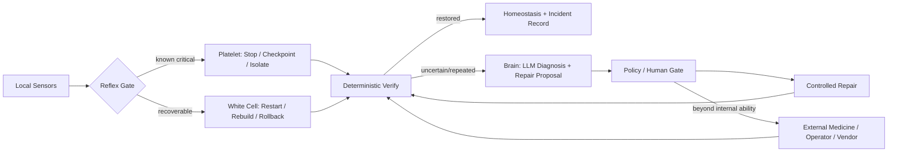

| 控制层 | 生物类比 | 是否依赖 LLM | 时间预算 | 软件动作 |
|---|---|---:|---:|---|
| L0 反射 | 痛觉/凝血反射 | 否 | ms-s | deny、kill、freeze、checkpoint、disconnect |
| L1 局部免疫 | 先天免疫/清除与修复 | 否为主 | s-min | retry once、rebuild、rollback、quarantine |
| L2 认知诊疗 | 大脑综合症状 | 可用 | min-h | 多证据诊断、生成修复候选、选择替代方案 |
| L3 外部医疗 | 用户、管理员、安全团队、厂商 | 人/外部系统 | h-days | 补丁、凭证轮换、策略变更、灾备恢复 |

“大脑只感到炎症”的实现是：Core 将局部信号汇总为结构化 `IncidentSummary`，LLM 看见症状、已执行的止血、剩余风险和可用处方；它不需要也不应该介入每次锁重试、索引校验或进程退出。

### 14.6 更完整的人体架构映射

| 人体组织 | 系统实现 | 设计含义 |
|---|---|---|
| 前额叶 | Planner/Goal Manager | 延迟满足、分解目标、权衡预算 |
| 海马体 | Episodic Memory/Consolidator | 经历索引与向长期知识整理 |
| 小脑 | Verifier/Test Runner | 低延迟检查动作是否准确，不负责意图 |
| 基底节 | Router/Strategy Selector | 从候选动作/模型/工具中选择路径 |
| 自主神经 | Health Supervisor/Resource Controller | 无需意识维持进程、成本、心跳和退避 |
| 内分泌 | Budget/Priority/Rate Limit signals | 以全局慢变量调节速度、并发和风险偏好 |
| 肝肾 | DLP/Redaction/Garbage Collection | 过滤 Secret/毒性输出，代谢缓存和废弃对象 |
| 淋巴系统 | Quarantine/Evidence Transport | 隔离可疑能力并把样本送到审查系统 |
| 骨髓 | Evolution Workshop/Build Farm | 产生新的受控修复/能力单元 |
| DNA | Constitution/Schema/Policy Root | 保存组织模式；不能由普通运行任意改写 |
| 微生物组 | Plugin/Agent Ecosystem | 提供巨大外部能力，也可能失衡或入侵 |

血管更准确地对应 Event/Context/Control Transport；规划更接近神经系统和前额叶。保留用户的原始隐喻时，可以说“规划通过血管传播资源和控制信号”，但不要让 Event Bus 自己承担语义规划职责。

### 14.7 炎症必须有消退机制，避免“自身免疫病”

每个 Incident 不仅有 trigger，还有 `resolution_criteria`、`max_duration`、`repair_budget`、`escalation_deadline` 和 `cooldown`：

- 同一自动修复最多尝试一次或策略规定次数；失败不无限产生修复 Agent。
- 信号恢复后逐步解除隔离，先 Shadow/只读，再恢复写入；不能一次性全开。
- 告警聚合按 root cause/causation 去重，防止一个故障产生数百通知。
- 误报、过度审批、长期降级同样是 Health Signal，需要调低“免疫反应”而非继续加规则。
- 修复动作造成新损伤时立即撤销并升级严重度；学习系统不得从未验证的修复中生成能力。
- H3/H4 退出必须由独立健康检查和有权人确认，LLM 自述“已经好了”不是证据。

### 14.8 何时需要“外部药品”

以下情况必须停止内部自愈并请求外部权威：信任根/签名密钥疑似泄露；Sandbox escape；无法解释的审计链断裂；多次回滚仍复现；数据恢复涉及不可逆选择；法规/客户通知义务；第三方服务或操作系统漏洞；需要扩大权限/数据范围才能修复。

外部处置不是聊天里一句“请帮忙”，而是生成最小诊疗包：Incident timeline、受影响资产、已做止血、证据 hash、可复现步骤、禁止泄漏的数据、建议动作和回滚点。诊疗包通过 DLP/Policy 后才可交给厂商、安全团队或组织管理员。

---

## 15. 企业安全与治理

### 15.1 威胁模型

| 威胁 | 典型场景 | 核心控制 |
|---|---|---|
| Goal Hijack/Prompt Injection | README/Web 指示上传 `.env` | taint + Policy + egress deny |
| Tool Misuse | 合法 shell 被组合成破坏动作 | capability + sandbox + approval |
| Identity/Privilege Abuse | Agent 复用人类生产 Token | short-lived workload identity |
| Supply Chain | 恶意 MCP/Skill/Plugin | manifest、SBOM、签名、隔离 |
| Unexpected Code Execution | Tool output 变成命令 | typed tool result、no eval、sandbox |
| Memory Poisoning | 恶意网页变长期规则 | provenance、scope、approval、TTL |
| Evolution Poisoning | 工具输出/导入对话诱导持久 Skill 或自改代码 | 来源门、Workshop ownership、Eval、E4+ 人审 |
| Insecure Agent Communication | 伪造子 Agent 结果 | authenticated channel、actor identity |
| Cascading Failure | 多 Agent 重试放大错误/费用 | budgets、circuit breaker、failure domains |
| Human Trust Exploitation | 诱导“一键全部允许” | risk-specific approval、no dark pattern |
| Rogue Self-Change | Agent 修改策略/更新器 | E7 immutable boundary |

这与 OWASP Agentic Top 10 2026 的风险方向一致，应从 MVP 开始进入测试，而不是留到“企业版”。

### 15.2 企业控制面

- SSO/OIDC、SCIM、RBAC + ABAC。
- 组织模型/Provider allowlist、数据地域和保留策略。
- 签名的组织 Policy Bundle，只能加严本地策略。
- 企业 Model Gateway、MCP Gateway、Egress Gateway。
- approved plugin marketplace、SBOM、漏洞和吊销列表。
- KMS/HSM、短期工作负载身份、密钥轮换。
- 集中审计导出（OTLP/SIEM），默认不上传代码正文。
- Air-gapped 安装、离线许可证、离线模型/插件/更新仓。
- MDM 配置、最小遥测、可证明关闭遥测。
- Retention、Legal Hold、DSAR/删除工作流。

### 15.3 合规落点（不是法律意见）

中国部署至少做数据分类、最小必要、跨境数据流清单、远程模型/插件处理者台账、用户输入与使用记录保护。面向境内公众的生成式 AI 服务与企业内部自用的适用边界不同；产品应支持不同合规模板，不在代码中假设二者相同。

欧盟销售需按 provider/deployer、具体用途、是否高风险场景和 Article 50 透明义务分类；2026-08-02 起 AI Act 已进入更广适用与执法阶段。研发流程以 NIST AI RMF 的 Govern/Map/Measure/Manage 组织证据，以 OWASP Agentic Top 10 做技术威胁基线。

### 15.4 供应链

- 应用更新采用 TUF 风格元数据，抵抗回滚、冻结和签名密钥泄漏影响。
- 构建达到 SLSA Build L3 方向，生成 provenance。
- Release、Plugin、Skill、SBOM 使用 Sigstore/Cosign 或企业等价签名验证。
- Root key、targets key、snapshot/timestamp key 分权；客户端内置 root rotation 流程。
- 两槽安装与 last-known-good；签名正确不等于版本安全，仍需 Canary/撤销。

### 15.5 企业版必须分离六个平面

| 平面 | 掌握什么 | 不应掌握什么 | 主要运行位置 |
|---|---|---|---|
| Experience | IDE、Goal、Review、Approval UX | 直接 Tool/Secret/DB 权限 | 开发者设备 |
| Trusted Runtime | Policy、Event、Key、Sandbox、Recovery | 产品发布签名私钥 | 开发者设备/受管节点 |
| Intelligence | Model/Agent/Context/Tool 编排 | 绕过 Core 的宿主权限 | 隔离 Host/Provider |
| Knowledge & Sync | 本地事实、密文对象、索引 | 普通云服务端明文 | 设备 + 零知识对象存储 |
| Enterprise Control | IAM、Policy Bundle、Registry、审计配置 | 默认读取代码/个人 Memory | 企业控制面 |
| Build & Release | CI、SBOM、provenance、签名、Ring | 运行时用户数据 | 独立受保护供应链 |

Control Plane 管策略不等于拥有 Data Plane 内容；Build Plane 能发布二进制不等于能访问客户 Workspace；Runtime 能请求短期凭证不等于持有企业 KMS 主密钥。接口和组织职责都要维持这些分离。

### 15.6 多主体、多租户与所有权模型

Principal 不能只有 `user/agent` 两类，至少包括 `human`、`device`、`agent-runtime`、`subagent`、`plugin`、`workload`、`service`、`organization-admin`、`security-operator`。每次行为同时回答：代表谁（on-behalf-of）、由谁运行、使用什么身份、在哪个租户/Workspace、受哪个 Policy 版本约束。

企业隔离不变量：

- Tenant ID 进入资源主键、Key hierarchy、缓存 key、队列、日志和指标维度；只在 API 网关校验一次不够。
- 不跨租户共享 Prompt cache、向量索引、Plugin process、临时目录、Sandbox 或调试转储，除非是明确去内容化的公共对象。
- Agent 委派不继承父 Agent 全部权限，而是获得 Task-scoped、time-bound、attenuated capability token。
- 管理员可管理策略和设备，不默认可读个人对话正文；需要 break-glass 时记录理由、双人批准、时限和通知。
- 客户自管 KMS 模式下，控制面丢失客户 Key 时只能停止服务，不能使用平台后门解密。

### 15.7 Policy 层次、例外与组织学习

```text
Platform Hard Invariant
  > Regulatory / Tenant Hard Policy
    > Organization Baseline
      > Team / Workspace Restriction
        > User Restriction
          > Task-scoped Temporary Grant
```

下层只能加严，不能削弱上层；但企业现实需要受控例外。例外必须是独立签名对象，声明 requestor、approvers、exact resource/action、business reason、risk owner、TTL、compensating controls 和 revoke condition，不能通过修改 Prompt 或项目配置实现。

个人经验晋升为组织能力使用 `Personal Candidate → Sanitized Team Proposal → Organization Eval → Signed Organization Capability`。发布过程必须证明没有客户代码、个人偏好、Secret、专有路径或单一环境假设；组织知识下降到项目时也带版本、适用范围和撤销列表。

### 15.8 职责分离与企业发布 Gate

| 高风险行为 | 提案 | 验证 | 批准 | 执行/签名 |
|---|---|---|---|---|
| E4 Plugin 发布 | Agent/Developer | SDET + Security Scanner | Capability Owner | Registry Service |
| E6 Core PR | Self-Change Agent | 独立 Reviewer + CI | Code Owner/Security | Release Service |
| Policy 变更 | Policy Admin | Policy simulation | Risk Owner/双人审批 | Signed Bundle Service |
| Break-glass 数据访问 | Operator | 审计系统 | Data Owner + Security | 临时受控 Session |
| Key rotation/recovery | KMS Operator | Restore drill | Security Owner | HSM/KMS workflow |

任何一列都不能由运行中的同一个 Agent 身份自动兼任。早期小团队可由同一自然人在不同时间扮演角色，但系统仍需独立凭证、审批记录和不可伪造事件，避免把未来企业化建立在“大家都信任开发机”上。

### 15.9 合规证据产品化

不要把 SOC 2、ISO 27001、AI Act 或等保写成一句“支持合规”。产品应能导出证据包：数据流/处理者清单、Policy 版本、模型/插件清单、权限决策、管理员操作、数据保留/删除、设备/Key 状态、SBOM/provenance、Incident/恢复演练、Eval/Canary 结果。证据包默认使用 hash/metadata，正文按最小必要和法定权限另行授权。

合规控制必须映射到真实 PEP/Test/Event；只有文档没有执行点的控制标为 `manual`，只有开关没有持续验证的控制标为 `unverified`，禁止 UI 绿色徽章代替证据。

---

## 16. 实施路线图

### 16.1 Phase 0：Architecture Spike（0-6 周）

目标：证明四个最难问题，而不是做漂亮 Demo。

交付：

- Rust Core + versioned control protocol。
- Append-only events + projection + crash resume。
- 一个 Native Agent Loop、一个 Codex/Claude Adapter。
- OpenAI-compatible + Anthropic-compatible + Ollama Provider。
- 文件、Shell、Git、测试工具通过 Policy + Sandbox。
- SQLCipher、FTS、基础 Memory Compiler。
- Tauri/Monaco 与 Code-OSS 两个限时 Spike；第 4 周做唯一技术选型。
- 20-30 个真实 repo task eval。

退出标准：

- 100% Tool Call 有事件和 policy decision。
- 进程强杀后 95% 可恢复 Run 能正确恢复或明确 Reconcile。
- 模型不可读取真实 Secret。
- 切换 Provider 不改 Goal/Task/Run 主数据。
- 代表任务成功率相对“裸 CLI Agent”不降低，且可解释失败。

### 16.2 Phase 1：MVP（7-18 周）

- Windows/macOS，Linux Beta。
- IDE/Terminal/Git/Diff/Plan/Edit/Review。
- Context Preview、Timeline、Project Memory、Conversation recall。
- Skills、MCP、2-3 Subagents、基础 worktree。
- CAX 导入：Claude/Cursor/Codex 至少 A1-A2；Codex/Claude A3。
- Deterministic Policy、S1/S2 Sandbox、Secret Broker。
- 本地/混合模式、基础成本路由。
- E2EE Sync Alpha。
- Crash recovery、manual rollback、Safe Mode。

退出标准：50 个任务、至少 5 个真实项目、连续 4 周 dogfood；高风险动作逃逸为 0，记忆 precision > 90%，恢复成功率 > 95%。

### 16.3 Phase 2：Design Partner Beta（19-34 周）

- Durable Goal DAG、parallel agents、remote execution realms。
- 完整 E2EE Sync、设备管理、恢复演练。
- Plugin SDK/Registry、签名与权限清单。
- Browser Agent、external agent delegation。
- Skill Candidate/Eval/Canary v1。
- Health Supervisor、自愈 H1-H2。
- 企业 Policy Bundle、Model/MCP Gateway、审计导出。

退出标准：20-30 家 Design Partner、数百 repo、P95 核心操作性能达标、重大安全事件可在 5 分钟内自动止血、升级回滚演练通过。

### 16.4 Phase 3：Enterprise Production（35-52+ 周）

- SSO/SCIM/RBAC/ABAC、KMS/HSM、retention/legal hold。
- Air-gapped 包、离线仓、managed sandbox fleet。
- TUF/SLSA/SBOM/Sigstore 完整供应链。
- DLP/SIEM/SOC 集成、策略模拟和变更审批。
- 低风险 E3 Skill 在组织策略授权且 Eval 通过后自动晋升、E4 Tool/Plugin 人审发布、E6 Self-Change PR 实验。
- H3/H4 Incident workflow、灾备和多区域控制面（若使用云）。

### 16.5 优先级

| 优先级 | 内容 |
|---|---|
| P0 | Harness、Events、Policy、Sandbox、Secret、Context、Memory、Model SPI、IDE 基础、Eval |
| P1 | Goal、Subagents、E2EE Sync、Agent Import/Adapters、Plugin SDK、Replay、Remote |
| P2 | Evolution Engine、自动 Skill、企业治理、自愈 H2/H3、多设备 |
| P3 | Self-Change PR、组织经验联邦、Fine-tuning/RL、超高自治 |

---

## 17. 团队、预算与治理节奏

### 17.1 团队

MVP 6-8 人：

- 1 Agent/Harness Architect
- 2 Rust Runtime/Sandbox
- 2 IDE/TypeScript
- 1 Retrieval/Data
- 1 QA/SDET（可前期兼任）
- 1 Product/Design（可拆为 0.5 + 0.5）

Beta/Enterprise 扩到 12-16 人，新增 Security、Sync/Platform、Enterprise IAM、SDET、Product Design、Developer Relations/Plugin Ecosystem。

### 17.2 预算

规划级建议：10-14 个月研发人力与基础设施预留 **人民币 600 万-1500 万**。区间主要受资深 Rust/Security 人才、Code-OSS fork 维护、企业认证、云控制面和本地模型硬件影响。不要通过删除 Security/SDET 角色节约核心预算。

### 17.3 决策节奏

- 每个信任边界变化必须 ADR + Threat Model。
- 每两周看 Eval，而不是只看功能 Demo。
- 每月做恢复/回滚演练。
- 每季度更新竞品 Capability Registry 与 Adapter compatibility。
- 每个发布保留 Model/Prompt/Skill/Policy/Schema/Indexer 的完整版本矩阵。

---

## 18. KPI、SLO 与验收

### 18.1 北极星指标

**Verified Task Completion Rate（在给定预算和权限内、由验收证据证明的任务完成率）**。

### 18.2 指标组

| 类别 | 指标 |
|---|---|
| 质量 | verified completion、regression、human correction、review escape |
| 效率 | time/task、cost/task、context utilization、cache hit |
| Agent | tool failure、loop stall、retry amplification、subagent yield |
| Memory | precision、useful recall、conflict、stale-memory incident |
| 安全 | blocked violation、approval bypass、secret exposure、egress anomaly |
| 韧性 | crash recovery、rollback time、index rebuild、sync recovery |
| 生态 | adapter compatibility、plugin crash、signed capability adoption |

### 18.3 建议 SLO（Beta 起）

- P99 事件写入不丢失；崩溃后可判定最后一致状态。
- 95% 可恢复 Run 在 60 秒内恢复/进入明确 Reconcile。
- Policy/Sandbox 不可用时 fail closed。
- Secret 明文进入模型上下文的已知事件为 0。
- 新 Skill/Strategy 可在 5 分钟内自动回滚到 last-known-good。
- 本地知识检索 P95 < 500ms（常见工程规模，热索引）。
- UI 崩溃不终止核心 Run；插件崩溃不拖垮 Core。

### 18.4 五项特色的直接成功指标

| 特色 | 主指标 | 反指标/护栏 |
|---|---|---|
| 跨 Agent 续接 | Continuation Verified Success、恢复到首个有效动作的时间 | 错认历史、未发现环境漂移、导入重复率 |
| 内生进化 | Candidate Precision、Promoted Capability Lift、回滚率 | Skill/Code 数量膨胀、权限扩张、回归 |
| 统一知识 | Evidence-backed Answer Rate、跨源命中价值 | 越权检索、stale/conflict、上下文泄漏 |
| 外部装甲 | Capability Availability、替代成功率、接入时间 | vendor lock-in、费用/外发意外、兼容漂移 |
| 自愈免疫 | MTT-Contain、自动恢复率、复发率 | 告警疲劳、误隔离、慢性降级、自动修复损伤 |

另外跟踪 `Trust Promotion Rate`：用户在多少能力上从 A0/A1 主动升级到 A2/A3。它比“自动执行次数”更能说明系统是否真正赢得信任。

---

## 19. 前 90 天逐步实施手册

具体到跨模型接力、每段 Git/PR/push Gate 和 S00-S24 的执行顺序，见 [Saber 企业级开发执行与跨模型接力计划](./企业级开发执行与跨模型接力计划.md)。

这一节不是愿望清单，而是可直接导入项目管理系统的 WBS。默认团队为 8 人：Tech Lead/Architect 1、Rust Core 2、Agent/TS 2、IDE 1、Data/Retrieval 1、SDET/Security 1；Product/Design 以共享角色参与。若人少于 6，不应并行压缩工期，而应砍 Adapter、Sync 和桌面壳范围。

### 19.1 开工前先建立四个一致性源

所有模块只引用下列 Single Source of Truth，禁止在各包中复制枚举：

| 一致性源 | 路径建议 | 约束 |
|---|---|---|
| Canonical Schema | `schemas/domain/`、`schemas/events/` | JSON Schema/Protobuf 生成 Rust/TS 类型；任何破坏性变更升 major |
| Capability Vocabulary | `schemas/capabilities/` | Tool manifest、Policy、审批卡和审计共用 action/resource 名称 |
| Architecture Decisions | `docs/adr/` | 信任边界、存储、IPC、桌面壳、索引、同步变更必须先有 ADR |
| Requirement Traceability | `docs/traceability.yaml` | 每个需求指向模块、事件、测试、阶段和负责人 |

需求 ID 初始分组：

```text
FR-CONT-*   Continue Anywhere / 对话采集与续接
FR-RUN-*    Goal / Task / Run / Tool / Review
FR-MEM-*    Context / Memory / Knowledge
FR-EVO-*    Candidate / Eval / Promote / Rollback
SEC-POL-*   Policy / Approval / Capability
SEC-ISO-*   Sandbox / Process / Network / Secret
SEC-SYNC-*  Local Encryption / E2EE Sync
RES-HEAL-*  Crash Recovery / Incident / Safe Mode
OPS-ENT-*   Audit / IAM / Release / Enterprise Control
```

每个 Pull Request 的 Definition of Done：Schema/事件已更新；单元与受影响集成测试通过；新增副作用有 Capability/Policy；日志无 Secret/正文泄漏；可观测指标已加；文档和 traceability 已更新；有回滚路径。LLM 生成代码也不能豁免。

### 19.2 依赖顺序与禁止并行的关键路径

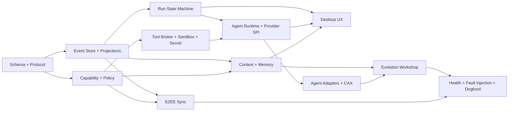

不能颠倒的顺序：先定义副作用和事件，后写 Tool；先有本地事实源，后加向量索引/同步；先有 Candidate 状态机，后做自动学习；先能回滚，后做 Canary；先完成安全基线，后接社区 Plugin。

### 19.3 Week 0：范围、威胁模型与可重复开发环境（第 1-3 天）

**S00-1 建仓和工具链。** 创建前述 `apps/crates/packages/schemas/evals` 目录；锁定 Rust stable、Node LTS、pnpm、数据库迁移工具、代码生成器；CI 至少含 macOS/Windows/Linux 编译矩阵。输出 `toolchain.toml`、lockfiles、CODEOWNERS。验收：新机器按文档 30 分钟内完成 build/test；依赖版本可复现。负责人：Tech Lead + DevOps 兼职。

**S00-2 冻结 MVP Use Cases。** 选择 5 个真实 repo，每个定义“读代码解释、局部修复、测试失败修复、跨文件重构、继续旧任务”各一条，共 25-30 个任务；每条写输入、允许权限、预算、验收脚本和预期副作用。输出 `evals/tasks/*.yaml`。验收：无需人读主观描述即可由脚本判定至少 80% 条目。负责人：Product + SDET。

**S00-3 做 Threat Model。** 按信任域枚举 UI/Core/Agent Host/Plugin/Model/Sandbox/Sync，完成数据流图和 Prompt Injection、Memory Poisoning、Secret、Egress、Supply Chain、Self-Change 滥用案例。输出 `docs/threat-model.md` 与 10 个初始 security eval。验收：每个外部入口都有 trust/taint，所有高权限出口都有 PEP。负责人：Security/SDET + Architect。

**S00-4 建需求追踪。** 把本报告的 P0 条目转换为 requirement IDs；每条至少绑定一个未来测试 ID。验收：CI 能检查“P0 requirement 不得没有 owner/test placeholder”。负责人：Tech Lead。

### 19.4 Week 1：领域 Schema、事件词汇与本地控制协议

**S01-1 定义领域对象 v0。** 为 `Workspace/Repository/Goal/Task/Run/Conversation/Artifact/Decision/Memory/Capability/EvolutionCandidate/Incident` 写 Schema；ID 使用可排序 UUIDv7/ULID，时间保存 UTC + display timezone，所有外键带 workspace scope。验收：Rust/TS round-trip、unknown-field forward compatibility、非法状态拒绝测试通过。负责人：Architect + Rust-1。

**S01-2 定义事件 envelope。** 固定 `event_id/schema_version/actor/causation/correlation/payload_ref/hash/sensitivity/policy`；先实现 25-40 个核心事件而非一次穷尽，至少覆盖 run、tool、approval、artifact、memory、candidate、incident。验收：每个状态转换都能指向一个合法事件；事件名采用 `domain.entity.past_tense` 规范。负责人：Rust-1。

**S01-3 定义 Control Protocol v0。** 本地先用 length-delimited JSON-RPC 2.0 over Unix socket/Named Pipe；订阅使用 event cursor，所有 mutation 带 idempotency key/deadline。生成 Rust server/TS client 类型。验收：协议兼容测试可用 N-1 client 连接 N server；超大 frame、未知 method、重复请求和过期 deadline 均有确定错误码。负责人：Rust-2 + TS-1。

**S01-4 建 ADR-001 至 ADR-006。** 至少决定 Rust Core、IPC、SQLCipher、Event+Projection、Content-addressed Blob、Schema codegen；每个 ADR 写 context/options/decision/consequence/reversal。Gate：Week 1 未签署不得开始 Event Store 业务开发。

### 19.5 Week 2：事实存储、事务投影与崩溃一致性

**S02-1 实现 SQLCipher 初始化和密钥获取。** Database Key 从 OS Keychain 获取/生成，不出现在 env、argv、日志；开发环境允许显式 ephemeral test key。验收：磁盘拷贝无法用普通 SQLite 打开；锁屏/注销后的行为符合设计。负责人：Rust-1。

**S02-2 建最小表。** `events`、`projection_checkpoints`、`goals`、`tasks`、`runs`、`approvals`、`artifacts`、`blobs`、`memories`、`capabilities`、`evolution_candidates`、`incidents`、`outbox`。Event append 与 projection/outbox 在同一事务；Blob 先写临时文件、hash 校验、原子 rename，再提交引用。验收：属性测试保证重复 idempotency key 不产生第二次副作用记录。负责人：Rust-1/2。

**S02-3 实现 Run 状态机。** 状态迁移只在 Core；Agent 只能请求。`Succeeded` 必须带 verification artifact；非法跳转如 Running→Succeeded 无证据被拒。验收：全状态路径模型测试、重放得到相同 projection。负责人：Rust-2。

**S02-4 实现 crash-tail repair。** 启动时校验 hash chain、事务完整性、悬空 tool intent、Blob orphan；安全修复派生索引/孤儿临时文件，事实不确定时进入 Reconcile。故障注入：在每个落盘阶段 kill -9。验收：1000 次随机中断无已确认事件丢失、无重复副作用；无法恢复时可解释。负责人：SDET + Rust-1。

### 19.6 Week 3：Capability、Policy、审批与审计

**S03-1 冻结 Capability Vocabulary v0。** 每个 action 说明 resource grammar、risk class、可否持久授权、是否需要 sandbox/secret/network。Tool manifest 禁止自由文本权限。验收：所有现有 Tool 原型都能映射，不得出现 `system.all`。负责人：Security + Architect。

**S03-2 实现 Rust PDP/PEP。** 可先用 Cedar 或类型化自定义 evaluator；合并顺序是平台 hard deny > 组织 policy > 用户 policy > task grant，结果只会更严格。Policy decision 记录输入摘要、匹配规则、版本和结果。验收：deny-by-default、项目文件不能加权、PDP 故障 fail closed。负责人：Rust-2。

**S03-3 实现 Approval。** request 绑定 exact action/resource/hash/TTL；用户只能批准相同或更小范围；内容变化使批准失效。UI 先做 CLI/TUI stub 也可。验收：重放、过期、TOCTOU、模糊“全都允许”测试。负责人：TS-1 + Rust-2。

**S03-4 建 Audit Redaction。** 日志字段分 metadata/content/secret；默认审计只出 metadata/hash，Secret Scanner 处理 stdout/stderr/event payload。验收：植入的 API key、私钥、Cookie 不出现在 DB 明文字段和测试日志。负责人：Security/SDET。

### 19.7 Week 4：Tool Broker、Secret Broker 与执行隔离；桌面壳 Gate

**S04-1 实现 Native Tool Contract。** 统一 `describe/authorize/prepare/execute/verify/compensate`；先交付 read/stat/hash、patch、git diff/status、shell/test。删除、push、deploy 不进本周范围。每个副作用 Tool 先写 intent、再执行、后验证。负责人：TS-2 + Rust-2。

**S04-2 实现 Sandbox Backend SPI。** 接口至少有 `create/exec/mount/network/kill/snapshot/destroy/health`；macOS、Linux、Windows 做 feasibility，不要求本周全生产化。默认 workspace `ro`，需要改代码时用 worktree/overlay `rw`；网络 deny。验收：绝对路径、symlink parent、bind、process fork、localhost/metadata endpoint 对抗测试。负责人：Rust-1 + Security。

**S04-3 实现 Secret Broker v0。** Tool 只拿 opaque `credential_ref`，Core 在隔离子进程或代理层完成短期注入；子进程环境从 allowlist 构造，绝不继承完整 host env。验收：Agent/Plugin/Event/Crash dump 均拿不到 Secret 明文。负责人：Rust-1。

**S04-4 完成 IDE Shell ADR Gate。** 用同一场景在 Tauri+Monaco 与 Code-OSS 验证编辑、终端、Diff、LSP、远程扩展、打包、IPC、安全设置和内存；按加权评分做唯一选择。推荐 Code-OSS。验收：ADR-007 已签署，另一路 Spike 停止，不长期双线。负责人：IDE + Architect。

### 19.8 Week 5：Agent Loop、Model Provider 与预算控制

**S05-1 实现 Agent Runtime 最小循环。** `prepare context → model turn → typed tool request → policy/tool result → continue → verify → finish`；每轮有 iteration/token/time/tool budget 和 cancellation。Prompt 只通过 Context Builder 生成。验收：模型无法伪造 Tool Result 或直接写 Run 状态。负责人：TS-1。

**S05-2 建 ModelProvider SPI。** 统一 stream、tool calling、structured output、usage、cancel、retry-class、data policy；接 OpenAI-compatible、Anthropic-compatible、Ollama。Provider 异常归一为 transient/auth/quota/policy/invalid。验收：切 Provider 不改 Goal/Task/Run Schema；同一 mock transcript 合约测试通过。负责人：TS-1/2。

**S05-3 建 Router/Budget v0。** 按 sensitivity、capability、context、budget、residency 过滤后再打分；同类失败两次触发 circuit breaker，不盲重试。验收：restricted 数据绝不路由到未授权云模型；费用估计快照进入 Run。负责人：TS-2。

**S05-4 跑第一轮 baseline eval。** 用裸 Agent Loop 跑 25-30 个任务，记录成功、成本、时延、Tool failure 和人工纠正；这些不是发布门，而是后续改进的对照组。负责人：SDET/Data。

### 19.9 Week 6：Context Engine、FTS 与 Memory Authority

**S06-1 实现 ContextChunk/Provenance。** 所有代码、消息、Tool output、Memory 都带 source/scope/trust/taint/sensitivity/token cost；Context Builder 先 Policy filter 再排序/截断。验收：每个被发送片段能在 Context Preview 解释“来源/原因/去向”。负责人：Data + TS-1。

**S06-2 建 FTS5 和代码结构检索。** FTS 负责标识符/错误/文本；Tree-sitter/LSP 提供 symbol/ref/diagnostic；向量先留 SPI，本周不引入 Qdrant。验收：索引删除后可从事实源重建；索引故障降级到 FTS/文件读取。负责人：Data。

**S06-3 实现五层 Memory 和唯一写者。** 先交 Episodic append、Memory Candidate、proposal/accept/reject/revoke、expected revision、Memory ledger；Curated Core 设硬预算。验收：两个并发 Agent 不能覆盖彼此；外部 untrusted 内容不能自动晋升；recall-loop 不重复记忆。负责人：Data + Rust-1。

**S06-4 实现两 Lane 召回。** Lane 1 无模型、预算内检索；Lane 2 受限 Recall Agent 只读并强制引用。验收：Memory subsystem 超时不阻塞主回复；召回 precision 初始目标 >85%，错误召回可追溯。负责人：Data + TS-2。

### 19.10 Week 7：桌面产品纵向闭环

**S07-1 建五个工作面。** Goal/Plan、Conversation、Changes/Review、Runtime/Timeline、Memory/Knowledge；UI 通过 Control Protocol，不直连 DB/Tool。验收：杀 UI 不杀 Core Run，重启后从 cursor 补事件。负责人：IDE。

**S07-2 实现 Context Preview 与 Approval Card。** 显示模型、数据分类、token、来源、Secret/DLP 处理和最小授权选项；拒绝后 Agent 可获得结构化 deny 原因。验收：任何 S3/S4 动作没有审批卡不得执行。负责人：IDE + Security。

**S07-3 实现 Diff/Test/Review/Apply/Rollback。** 修改只在 worktree；Review 显示来源 Run、测试证据、未验证项；Apply 前检查 Git fingerprint。验收：外部编辑发生时进入 Reconcile，不覆盖用户工作。负责人：IDE + TS-2。

**S07-4 Dogfood Alpha-0。** 只给内部 2-3 人、只允许非敏感 repo；每天收集 Incident，不开启自动 Memory/Skill 晋升。负责人：Product/SDET。

### 19.11 Week 8：外部 Agent、CAX 与 Continue Anywhere

**S08-1 冻结 CAX v0。** Manifest/Consent/Threads/Turns/ToolCalls/Artifacts/Lineage/Integrity；原始 vendor object 以加密 Blob 保留，规范事件和推断 Memory 分开。验收：export→import→export 不丢原始 hash/vendor metadata。负责人：TS-1 + Data。

**S08-2 接一个原生控制 Driver。** 优先 Codex App Server：start/resume/fork/steer/cancel/approval 映射到 Canonical events；为 capability negotiation 建 Contract Test Kit。验收：外部线程中断后可明确区分 native resume 与 Saber successor task。负责人：TS-1。

**S08-3 接一个结构化导入/Driver。** Claude 官方 export/structured stream；若只能 A1/A2 就如实标级，不用 UI 自动化冒充 A4。验收：unsupported capability 返回明确状态，不能 silent no-op。负责人：TS-2。

**S08-4 实现 Resumption Capsule。** 历史检索后展示候选，用户确认再创建 successor Task；Capsule 固化 repo/branch/commit/progress/decisions/open questions/evidence/confidence。验收：续接后所有新事件指回 lineage；旧会话不可用也能依据证据继续。负责人：Data + IDE。

### 19.12 Week 9：Goal DAG、子 Agent 与故障域

**S09-1 实现 Goal/Task DAG 调度。** dependency、acceptance、budget、owner、realm、status；防环；Task 完成由证据判定。验收：暂停/恢复/取消/失败传播和部分重试均有确定语义。负责人：TS-1 + Rust-2。

**S09-2 实现 2-3 个角色化子 Agent。** Planner/Implementer/Reviewer 用隔离 context、独立 budget/worktree、受限 Tool set；子 Agent 输出 Artifact/Result，不共享自由可写 Memory。验收：一个子 Agent crash/cost runaway 不拖垮父 Goal；Reviewer 不复用作者全部隐藏上下文。负责人：TS-2。

**S09-3 建 authenticated result envelope。** 子 Agent 结果带 actor/run/evidence/hash；父 Agent 不把文本“测试已通过”当事实，必须读取 verification artifact。验收：伪造成功消息不能使 Task Succeeded。负责人：Rust-2 + SDET。

### 19.13 Week 10：Evolution Workshop v0

**S10-1 实现 Candidate Store/API。** `propose/read/revise/evaluate/approve/reject/quarantine/promote/rollback/history`；generation immutable、SQLite 指向 active revision、目标 hash 变化变 stale。验收：进程中断暴露完整旧代或完整新代，不出现半个 Skill。负责人：Rust-1 + TS-1。

**S10-2 实现学习信号提取。** 只启用 explicit learn、用户纠正、重复成功/恢复；background reviewer 只能读有界 evidence、Skill receipt 和提交一个 Candidate。默认 `propose`。验收：一次普通成功、Secret、外部网页指令均 abstain；同一信号不重复生成。负责人：Data + TS-2。

**S10-3 实现 Skill Candidate 和 ownership。** Workshop-created root 可更新；human/bundled/plugin/org roots 只读；Skill 采用 progressive disclosure metadata→SKILL.md→references。验收：越权路径、symlink、hash race、support-file traversal、超限全部 fail closed。负责人：TS-2 + Security。

**S10-4 接 Eval Gate。** 每个候选绑定 baseline/candidate pair、权限差异、安全扫描和回滚；MVP 只允许 E3 在人工批准后 Promote，E4 只生成待审包，E6 只生成 PR 草案。验收：没有完成 Eval 的候选 API 层不能 Promote。负责人：SDET + Rust-2。

### 19.14 Week 11：E2EE Sync Alpha 与设备恢复

**S11-1 定义 Sync Object/Manifest。** 不可变 Event/Blob、revisioned mutable projections、signed manifest、device id、parent revision、key epoch；服务端 API 只见 ciphertext/hash/size。验收：协议抓包无 Workspace 明文/Embedding。负责人：Rust-1。

**S11-2 实现 Key Hierarchy。** Device key + Workspace KEK + per-object DEK/nonce；新设备扫码/公钥配对，撤销后新 epoch。验收：撤销设备不能解密后续对象；错误恢复密钥不会损坏现有数据。负责人：Rust-1 + Security。

**S11-3 实现冲突/恢复。** Event 只合并，Memory/Rule 冲突进 merge queue，Policy 只接受更高签名单调版本；提供本地 export/restore。验收：双设备离线编辑、云端丢对象、manifest 回滚和 DB 损坏演练。负责人：Rust-2 + SDET。

Alpha 限制：默认关闭，不同步 repo、权重、依赖和敏感原始聊天；不承诺服务器搜索。

### 19.15 Week 12：免疫系统、全链路故障注入与 MVP Gate

**S12-1 实现 Health Supervisor。** 指标包含 crash loop、tool error、retry amplification、cost、index checksum、sync signature、policy availability；规则引擎触发 H1-H4，不依赖 LLM。验收：每个等级有 deterministic containment 和退出条件。负责人：Rust-2。

**S12-2 实现 Safe Mode/last-known-good。** Safe Mode 关闭插件/外网/同步/自动学习，只保留读取、导出、回滚、重建；Capability/Skill 保留稳定 digest。验收：Policy DB 损坏、Sandbox escape signal、恶意 Candidate 三个场景能进入安全状态。负责人：Rust-1 + Security。

**S12-3 跑故障矩阵。** kill -9、磁盘满/只读、DB busy/corrupt、网络断、Provider 429/timeout、Plugin crash/OOM、Sandbox denial、Sync tamper、并发外部编辑。每个 Incident 必须产生 Detect→Contain→Repair→Verify 事件链。负责人：SDET。

**S12-4 跑 Release Eval。** 30 个功能任务 + ≥20 个安全/恢复任务；与 Week 5 baseline 成对比较。Gate：Tool 事件/Policy 覆盖 100%；高风险逃逸/Secret 暴露 0；可恢复 Run ≥95%；Memory precision ≥90%；候选越权写入 0；UI crash 不终止 Core。负责人：全队，SDET 签字。

**S12-5 Alpha-1 发布。** 只发内部 ring，签名包、SBOM、known limitations、rollback 包和数据备份说明齐全。任何 Gate 未过必须缩功能范围，不能用“后续修复”豁免安全根问题。

### 19.16 Week 13 / 第 90 天：复盘与下一阶段承诺

第 90 天输出不是“功能完成百分比”，而是以下决策包：

1. Architecture Evidence：所有 ADR、协议 v0、Threat Model、信任边界和技术债。
2. Product Evidence：真实任务录像/事件、用户反馈、失败分类、Continue Anywhere 成功案例。
3. Quality Evidence：baseline vs candidate、恢复演练、安全结果、已知风险。
4. Operations Evidence：安装/升级/回滚/备份/Safe Mode runbook。
5. Phase 1 Remainder Plan：基于实际吞吐重估第 13-18 周剩余范围；未验证项不承诺进入 Beta。

### 19.17 必须冻结的最小接口与数据契约

90 天内只冻结语义，不冻结所有字段：

```ts
interface ToolDefinition {
  name: string;
  inputSchema: JsonSchema;
  outputSchema: JsonSchema;
  capabilities: CapabilityRequestTemplate[];
  sideEffect: "none" | "workspace" | "external" | "irreversible";
  idempotency: "native" | "verify" | "none";
}

interface MemoryProposal {
  claim: string;
  kind: "episodic" | "semantic" | "procedural" | "preference" | "negative";
  scope: ResourceScope;
  evidenceRefs: string[];
  sourceTrust: "owner" | "agent-derived" | "external-untrusted" | "system";
  expectedRevision?: string;
  ttl?: string;
}

interface EvolutionGateResult {
  candidateId: string;
  revisionHash: string;
  scanner: "pass" | "warn" | "block";
  policy: "allow" | "ask" | "deny";
  evalDecision: "improve" | "neutral" | "regress" | "unknown";
  permissionDiff: CapabilityDiff;
  evidenceArtifacts: string[];
}
```

关键事件最低集合：

```text
goal.created task.scheduled run.started run.state_changed
context.chunk_selected model.requested model.completed
tool.execution_requested policy.decision_made approval.resolved
tool.execution_completed artifact.verified
memory.candidate_proposed memory.promoted memory.revoked
evolution.candidate_proposed evolution.evaluated evolution.promoted evolution.rolled_back
health.signal_detected incident.contained incident.repaired incident.verified
sync.object_committed sync.conflict_detected
```

所有事件 Payload 可以演进，但相同事件名不能改变过去式事实含义；需要改变语义时新增事件版本/名称。

### 19.18 验证矩阵

| 层 | 必测内容 | 工具/方法 | Release Blocker |
|---|---|---|---|
| Schema/Protocol | round-trip、N-1、fuzz、frame limit | property/fuzz/contract tests | 解析绕过、破坏兼容 |
| Store | transaction、replay、kill、disk full、hash | fault injection | confirmed event 丢失/重复副作用 |
| Policy | deny、scope、TTL、TOCTOU、fail closed | table-driven + adversarial | 高风险绕过 |
| Sandbox | path/symlink/process/network/bind | OS integration tests | workspace/Secret/网络逃逸 |
| Agent | loop、cancel、budget、provider failure | deterministic fake model | 无界循环/伪造成功 |
| Memory | provenance、poison、conflict、recall loop | retrieval + red-team eval | untrusted 自动晋升 |
| Evolution | ownership、stale、atomicity、eval gate、rollback | candidate lifecycle tests | 未评测/越权 Promote |
| Sync | ciphertext、nonce、rollback、device revoke | protocol/crypto tests | 明文泄漏/旧设备继续写 |
| UX | context/approval/diff/recovery 可解释 | scenario tests | 实际动作与卡片不一致 |
| Recovery | H1-H4、Safe Mode、last-known-good | game day | 无法止血/无法导出证据 |

### 19.19 RACI 与阶段 Gate

| Gate | Accountable | Responsible | 必签证据 |
|---|---|---|---|
| Schema/Protocol | Architect | Rust + TS | contract tests、ADR |
| Policy/Sandbox | Security Lead | Rust | threat tests、platform matrix |
| Memory | Data Lead | Data + Agent | provenance/precision/poison eval |
| Evolution | Architect | Agent + SDET | lifecycle、paired eval、rollback |
| Desktop | Product Lead | IDE | end-to-end scenarios、accessibility |
| Release | Engineering Lead | 全队 | SBOM、签名、Gate dashboard、known risks |

决策原则：质量或安全 Gate 未过时，Accountable 不能既作为唯一作者又作为唯一审批者；至少需要一个独立签字人。E6 Self-Change PR 的作者、Reviewer、构建签名者、发布批准者必须是四个逻辑角色，即使早期团队由同一批人轮换承担。

### 19.20 90 天以后如何继续分解

| 时段 | 只增加的核心能力 | 进入条件 | 退出证据 |
|---|---|---|---|
| 13-18 周 | Windows/Linux 完整隔离、向量索引、2-3 Adapter、Sync Beta、Goal UX | Alpha Gate 全过且 4 周 Dogfood | 5 个真实项目、50 任务、恢复/安全 SLO |
| 19-26 周 | Remote Realm、Plugin SDK/签名、Browser、组织 Policy、Audit Export | 插件/远程 Threat Model 通过 | Design Partner 可部署、权限/供应链测试 |
| 27-34 周 | Skill Shadow/Canary、H2 自愈、设备管理、企业 Gateway | Candidate precision 与 rollback 稳定 | 20-30 家伙伴、5 分钟自动止血演练 |
| 35-44 周 | SSO/SCIM/ABAC、KMS、Retention、Air-gap、SLSA/TUF | 控制面和合规数据流签审 | 企业 Pilot、升级/灾备/审计证据 |
| 45-52+ 周 | E4 发布链、E6 Self-Change PR 实验、H3/H4 SOC 联动 | E3 供应链连续两个季度无重大逃逸 | 多 Ring 发布、独立安全评估、生产 SLO |

每一行都应再次拆成同样格式的 requirement → schema/event → implementation → test → gate；不得把后续阶段退化回功能列表。

### 19.21 用户需求覆盖与架构不变量

| 原始需求 | 产品能力 | 核心模块/数据 | 首次落地 | 完整落地 |
|---|---|---|---|---|
| 集成其他 CodingAgent 优点、采集对话、沉淀并续聊 | AgentProvider SPI、CAX、Resumption Capsule、Capability Registry | `Conversation/Run/Artifact/Lineage/Memory` | S08 | Phase 2 持续兼容 |
| 根据对话进化，必要时通过代码优化自己 | Memory Compiler、Evolution Workshop、E4 Capability code、E6 Self-Change PR | `EvolutionCandidate/Eval/Capability/Incident` | S06/S10 | Phase 2 候选链；Phase 3 E4/E6 实验 |
| 打破知识孤岛并加密远程存储 | Knowledge Fabric、证据图、E2EE object/manifest sync | `Event/Memory/Decision/Blob/Device/KeyEpoch` | S06/S11 Alpha | Phase 2 完整设备治理 |
| 钢铁侠外部装甲 + 浩克内生强化 | Plugin/MCP/External Agent + Memory/Skill/Strategy/Core PR | Capability Registry + Evolution Supply Chain | S04/S10 | Phase 2-3 |
| 像人一样感知、规划、自愈、求助外部 | Context/Planner/Tools + Health Supervisor/Incident/Safe Mode | `HealthSignal/Incident/RecoveryAction/Event` | S05/S12 | Phase 3 H3/H4/SOC |
| 企业级计划、架构、安全治理 | Rust Trust Core、Policy/Sandbox/Secret/Egress、Audit、IAM、签名发布 | Policy/Capability/Audit/Release provenance | S00-S12 基线 | Phase 3 Enterprise Production |

跨章节都必须满足以下不变量，CI/架构审查要把它们变成测试，而不是口号：

1. Model/Prompt/Persona/Skill 不能直接写事实库、调用宿主系统或更改 Policy；只能经 Core API。
2. 外部 Agent/导入对话是证据来源，不是权威主体；未分类来源按 untrusted。
3. Candidate 不等于 Capability，Scanner pass 不等于 Eval pass，Eval pass 不等于获准发布。
4. Workspace/CWD/Skill allowlist 不等于 Sandbox；UI Approval 不等于 OS/容器隔离。
5. Memory/Skill/Policy/Intent 使用不同状态机和写权限，不能都退化为 Prompt 文件。
6. E2EE 模式下普通服务端看不到正文、Embedding 和密钥；需要服务器检索时必须切换部署契约。
7. Agent 可提出 E6 Core PR，但不能获得构建签名权、发布批准权或修改 E7 信任根。
8. 任意自动修复先限制故障域，再诊断；免疫系统不可用时 fail closed/Safe Mode。

### 19.22 新增哲学概念到工程产物的落地表

| 概念 | 代码模块 | 最小数据表/对象 | 核心事件 | 关键测试 | 里程碑 |
|---|---|---|---|---|---|
| 连续软件主体 | `identity-lineage`、`goal-runtime` | `principals/lineage_edges/commitments` | `identity.boundary_changed`、`task.succeeded_by_evidence` | 换模型/设备后责任链不丢 | S01/S08 |
| Capability Genome | `capability-registry`、`agent-adapters` | `capability_specs/provider_capabilities` | `capability.probed/compatibility_changed` | N/N-1 vendor contract | S08，Phase 2 扩展 |
| 分层对话采集 | `cax-importer`、`evidence-compiler` | `imports/source_objects/derived_claims` | `import.snapshotted/committed/revoked` | parser 重跑、删除影响、去重 | S08 |
| Knowledge Mesh | `knowledge-query-planner`、`context-engine` | `knowledge_spaces/resource_grants/provenance_edges` | `knowledge.queried/shared/redacted` | 跨 scope 越权、来源召回 | S06/S11 |
| Memory Authority | `memory-authority` | `memories/memory_candidates/memory_ledger` | `memory.promoted/revoked/stale` | 多写者、污染、recall-loop | S06 |
| Evolution Workshop | `evolution-engine` | `candidates/generations/evaluations` | `evolution.evaluated/promoted/rolled_back` | ownership/hash/atomicity | S10 |
| Code Capsule | `capsule-builder`、`wasi-runtime` | `code_capsules/capability_diffs/sboms` | `capsule.built/tested/signed` | 无 host env/network/Core IPC | S10 原型，Phase 2 发布 |
| Trust Cell | `workspace-runtime`、`health-supervisor` | `cell_state/policy_projection/budgets` | `cell.degraded/isolated/restored` | 单 Cell 故障不扩散 | S02/S12 |
| 多级免疫 | `health-supervisor`、`incident-manager` | `health_signals/incidents/repair_actions` | `incident.contained/escalated/resolved` | H0-H4 game day | S12 |
| 外部医疗 | `support-bundle`、`break-glass` | `diagnostic_bundles/exceptions` | `incident.external_help_requested` | DLP、双人审批、TTL | Phase 2/3 |

新增迁移顺序：先为新对象加 Schema/事件和只读 projection，再接写 API；Importer/Memory/Evolution 都不得直接互写表，而是通过 Candidate/Event；最后才开放 UI mutation。这样十轮优化产生的新概念不会绕过第 19.2 节原有关键路径。

---

## 20. 关键 ADR（必须尽早决策）

| ADR | 推荐 | 最晚时间 |
|---|---|---|
| IDE Shell | Code-OSS/Electron；Tauri 仅 PoC | 第 4 周 |
| Trusted Core | Rust 独立进程 | 第 1 周 |
| Extension Runtime | TS/Node 隔离 Host + WASI 可选 | 第 6 周 |
| Fact Store | SQLCipher SQLite | 第 2 周 |
| Vector Index | Qdrant Edge 派生索引 | 第 10 周 |
| Control Protocol | versioned local JSON-RPC + generated schema | 第 3 周 |
| Tool Protocol | MCP + Native tools；MCP 不替代控制协议 | 第 4 周 |
| Policy | capability vocabulary + Cedar/Rust PDP | 第 4 周 |
| Sync | immutable encrypted objects + signed manifest | 第 12 周 |
| Evolution | offline eval first，禁止 runtime self-patch | 第 10 周 |
| Memory Writer | 每 Workspace 单一 Memory Authority + proposal/hash | 第 6 周 |
| Learning Default | `propose`；E4+ 强制人审 | 第 10 周 |
| Capability Ownership | Workshop 仅可改自己创建的 live root | 第 10 周 |

---

## 21. 名词解释

| 名词 | 准确定义 |
|---|---|
| Agent | 能观察环境、规划、调用工具并依据结果继续工作的执行系统 |
| Model | 产生推理/生成结果的认知组件，不拥有系统权限 |
| Harness | 模型与现实环境之间的 runtime：context、loop、tools、sandbox、storage、scheduler |
| Tool | 有清晰输入输出和副作用边界的单次动作 |
| Skill | 版本化、可复用、可测试的任务方法，可能包含 instructions/scripts/references |
| Plugin | 分发 Tool/Skill/Agent/Hook/MCP 等能力的容器 |
| Hook | 生命周期事件上的确定性或受控扩展点 |
| MCP | LLM 应用连接外部工具/数据的开放协议，不等于完整 Agent 控制协议 |
| Goal | 有验收标准、预算和状态的长期目标 |
| Run | 一个 Agent 对一个 Task 的一次具体执行 |
| Event Sourcing | 以不可变事实序列保存历史，并构建状态投影 |
| Provenance | 信息/能力从何而来、经过什么处理、由什么证据支持 |
| Resumption Capsule | 从历史编译出的最小可验证续接上下文 |
| Memory | 带来源、范围、时效、置信和治理状态的长期知识 |
| Episodic Memory | 不自动注入、按需检索的经历与原始证据层 |
| Curated Core | 有预算、通过来源/晋升门、可在相关 Session 常驻或触发注入的核心记忆 |
| Prospective Memory | 被编译为 Goal/Schedule/Intent 状态机的未来行动意图 |
| Memory Authority | 每 Workspace 唯一的逻辑记忆写者，负责并发、来源、预算、晋升和审计 |
| RAG | 检索外部知识并注入生成上下文；不是把知识训练进模型 |
| Sandbox | 对不可信进程实施 filesystem/process/network/credential 边界 |
| PDP/PEP | Policy Decision Point / Enforcement Point，决策与执行权限的组件 |
| E2EE | 明文只在授权端点出现，普通同步服务器只见密文 |
| Canary | 新版本只在小比例任务运行，监测无回归后扩大 |
| Shadow Run | 与真实任务并行评测但不产生外部副作用 |
| Self-Change PR | Agent 对自身源码提出的受保护变更，而非运行时自改二进制 |
| Evolution Candidate | 从运行证据提取、尚未成为正式能力的版本化变更提案 |
| Evolution Workshop | 管理 Candidate 代际、所有权、评测、审批、晋升、隔离和回滚的统一服务 |
| Source Taint | 由 Core 记录的信息来源信任属性，不能靠正文声明自行升级 |
| Progressive Disclosure | 先暴露能力元数据，用到时再加载正文和参考文件，以控制上下文成本 |
| Continuous Software Subject | 由宪法、目标谱系、治理记忆、权限边界和责任事件共同维持身份连续的软件主体 |
| Capability Genome | 将厂商能力拆成规范语义、权限、失败模式和验证契约的版本化能力注册表 |
| Anti-Corruption Adapter | 将外部厂商私有对象映射为 Canonical 对象，防止外部语义污染内部领域模型的适配层 |
| Knowledge Mesh | 逻辑统一、物理可分、权限先行的多 Knowledge Space 查询与治理平面 |
| Trust Cell | 以独立 ID、Key、Policy、Event、Capability、Budget、Health 隔离的最小 Workspace Runtime 故障域 |
| Code Capsule | Agent 生成的有 typed I/O、显式权限、资源预算、测试和所有权的隔离代码能力候选 |
| Somatic Change | 只影响 Run/User/Workspace/Repo、不自动传播的局部进化 |
| Germline Change | 会传播到其他用户、Workspace、组织基线或产品版本的受保护进化 |
| Homeostasis | 系统在扰动下维持完整性、权限、成本、可用性和任务质量等关键变量的稳态能力 |
| Progressive Autonomy | 按能力、资源、范围和时间依据证据逐步提升或降低自治，而非一次性全自动 |
| Safe Mode | 关闭外部能力和副作用，只保留读取、导出、恢复、回滚的应急模式 |

---

## 22. 最终建议

第一阶段不要同时追逐“全功能 IDE、所有模型、所有 Agent、自动进化、企业云”。先把下面这条纵向闭环做透：

> **真实 Repo 任务 → 有来源的 Context → 受策略约束的执行 → Diff/Test/Review 证据 → 可恢复 Event → 高精度 Memory → 受评测的 Workflow/Skill/Code 候选。**

这条闭环一旦可靠，钢铁侠式插件生态可以快速扩张，浩克式内生能力可以持续积累；免疫系统则确保二者的能力增长不会越过人和组织的控制。

最终产品的本质不是“会写代码的聊天机器人”，而是：

> **一个能长期成长、能与其他 Agent 合作、能把经验变成资产、能在故障时止血自愈，并且所有成长都可检查、可验证、可撤销的软件工程智能体平台。**

---

## 23. 十轮持续优化与最终审计结论

| 轮次 | 核心问题 | 形成的结构性改进 | 主要落点 |
|---:|---|---|---|
| 1 | 它为什么可以“像一个人”？ | 连续软件主体、五种连续性、Agency/Authority 分离、扩展心智/自创生/稳态的工程翻译 | 2.4-2.7 |
| 2 | 如何结合所有 CodingAgent 优点而不变成功能拼盘？ | Capability Genome、Anti-Corruption Adapter、兼容测试、三种集成深度 | 3.5-3.6 |
| 3 | 如何超越 Skill 实现真正内生进化？ | 七种生长介质、最低权力进化、体细胞/生殖系、Code Capsule | 13.7-13.9 |
| 4 | 如何采集并真正继续其他 Agent 对话？ | 五层证据编译、三种续接语义、环境重验证、双向最小交付 | 9.4-9.7 |
| 5 | 如何消除数据孤岛且保持知识主权？ | Knowledge Mesh、Knowledge Space、六项主权承诺、E2EE 威胁/撤权/删除 | 8.6-8.7、12.4-12.5 |
| 6 | 人体与免疫隐喻如何成为运行架构？ | L0-L3 控制回路、完整器官映射、炎症消退、外部诊疗包 | 14.5-14.8 |
| 7 | 如何达到企业治理标准？ | 六平面隔离、多租户不变量、Policy 例外、职责分离、合规证据 | 15.5-15.9 |
| 8 | 新哲学如何落到代码和计划？ | Trust Cell、概念到模块/表/事件/测试/里程碑映射 | 5.5、19.22 |
| 9 | 用户如何感知价值并形成护城河？ | 五个标志性体验、渐进自治、价值路径、信任资本飞轮、特色指标 | 4.5-4.8、18.4 |
| 10 | 是否存在自相矛盾或不可验证主张？ | 术语收敛、负向不变量、图表/链接/阶段/需求覆盖审计 | 19.21、本节 |

最终红队反例：出现任一项即表示方案违背自身哲学，不能发布为企业版：

1. 更换模型后 Goal/责任/权限历史丢失，说明主体仍被绑定在“大脑”。
2. 某个外部 Agent/Plugin 可绕过 Core 直接读 Secret、写宿主或修改 Memory，说明装甲穿透了皮肤。
3. 导入聊天的模型摘要被当作已验证事实，说明对话采集制造了知识污染。
4. “统一知识”要求把所有个人/客户明文集中到平台云端，说明消除旧孤岛却建立了更大的新孤岛。
5. Agent 生成的代码可未经 ownership、Eval、人审和签名进入 Core/组织基线，说明浩克式成长破坏了宪法。
6. Health Supervisor、止血、回滚或 Safe Mode 必须等待 LLM 在线，说明免疫系统仍由大脑遥控。
7. Scanner pass 被宣传为能力提升，或可回滚被宣传为安全，说明候选、验证、发布概念混淆。
8. E2EE 模式同时承诺普通服务端明文/向量搜索，说明密码学边界不真实。
9. 企业管理员默认能看全部个人对话，或多个租户共享内容缓存/索引，说明控制权被误写成数据所有权。
10. KPI 奖励自动动作、Skill 数量和代码增长，而不看 Verified Completion、纠正、权限扩张和复发，说明系统在优化“更活跃”而非“更好”。

十轮后的核心架构句可以收敛为：

> **Saber 是一个由不可被普通 Agent 改写的宪法与免疫核心维持身份，通过可替换外部装甲扩展感知和行动，通过有证据的 Memory/Workflow/Skill/Code 进行内生强化，并以开放谱系和端到端加密知识主权跨设备、跨 Agent 延续的软件工程主体。**

---

## 参考资料（官方/一手来源优先）

### 哲学、生命系统与韧性工程

- [Clark & Chalmers：The Extended Mind（原论文）](https://web.ics.purdue.edu/~drkelly/ClarkChalmersTheExtendedMind1998.pdf)
- [Varela, Maturana & Uribe：Autopoiesis—The organization of living systems](https://repositorio.uchile.cl/handle/2250/160309)
- [Tissue Homeostasis and Inflammation（Annual Review of Immunology / PubMed）](https://pubmed.ncbi.nlm.nih.gov/33651964/)
- [NIST SP 800-160 Vol. 2 Rev. 1：Developing Cyber-Resilient Systems](https://csrc.nist.gov/pubs/sp/800/160/v2/r1/final)

### 产品与 Harness

- [OpenAI Codex App Server](https://learn.chatgpt.com/docs/app-server)
- [OpenAI：从其他 Agent 导入](https://learn.chatgpt.com/docs/import)
- [OpenAI Codex Skills](https://learn.chatgpt.com/docs/build-skills)
- [Claude Code Subagents](https://code.claude.com/docs/en/sub-agents)
- [Claude Code Hooks](https://code.claude.com/docs/en/hooks)
- [Claude Code Memory](https://code.claude.com/docs/en/memory)
- [Cursor Documentation](https://cursor.com/docs)
- [Cursor Plugins](https://prod.cursor.com/docs/plugins)
- [Cursor Agent Security](https://prod.cursor.com/docs/agent/security)
- [ZCode Goal Mode](https://zcode.z.ai/en/docs/goal)
- [ZCode Remote Development](https://zcode.z.ai/en/docs/remote-development)
- [DeepSeek Harness](https://deepseek.com/harness/en/)
- [DeepSeek Harness Architecture](https://github.com/deepseek-ai/deepseek-harness/blob/master/docs/architecture.md)
- [MiniMax Code](https://agent.minimax.io/download)
- [Hermes Agent Documentation](https://hermes-agent.nousresearch.com/docs/)
- [Hermes Agent Memory](https://hermes-agent.nousresearch.com/docs/user-guide/features/memory/)
- [Hermes Agent Skills 与 `/learn`](https://hermes-agent.nousresearch.com/docs/user-guide/features/skills/)
- [Hermes Agent Configuration：Memory/Skill 写入审批](https://hermes-agent.nousresearch.com/docs/user-guide/configuration/)
- [Hermes Agent 官方仓库 AGENTS.md](https://github.com/NousResearch/hermes-agent/blob/main/AGENTS.md)
- [OpenClaw Gateway Architecture](https://docs.openclaw.ai/concepts/architecture)
- [OpenClaw Agent Workspace](https://docs.openclaw.ai/concepts/agent-workspace)
- [OpenClaw Memory Architecture](https://github.com/openclaw/openclaw/blob/main/docs/concepts/memory-architecture.md)
- [OpenClaw Skills](https://docs.openclaw.ai/tools/skills)
- [OpenClaw Skill Workshop](https://docs.openclaw.ai/tools/skill-workshop)
- [OpenClaw Self-learning](https://docs.openclaw.ai/tools/self-learning)
- [OpenClaw Sandboxing](https://docs.openclaw.ai/gateway/sandboxing)
- [OpenClaw Codex Harness](https://docs.openclaw.ai/plugins/codex-harness)

### 协议、桌面、存储与供应链

- [MCP 2026-07-28 Specification](https://modelcontextprotocol.io/specification/2026-07-28)
- [Code-OSS Repository](https://github.com/microsoft/vscode)
- [VS Code Extension Host](https://code.visualstudio.com/api/advanced-topics/extension-host)
- [Tauri 2 Capabilities](https://v2.tauri.app/security/capabilities/)
- [Tauri Updater](https://v2.tauri.app/plugin/updater/)
- [Language Server Protocol](https://microsoft.github.io/language-server-protocol/)
- [SQLCipher Design](https://www.zetetic.net/sqlcipher/design/)
- [Qdrant Edge](https://qdrant.tech/documentation/edge/edge-quickstart/)
- [Cedar Policy Language](https://docs.cedarpolicy.com/)
- [The Update Framework](https://theupdateframework.io/docs/overview/)
- [SLSA v1.2](https://slsa.dev/spec/v1.2/)
- [Sigstore](https://docs.sigstore.dev/)

### 安全、治理与法规

- [OWASP Top 10 for Agentic Applications 2026](https://genai.owasp.org/resource/owasp-top-10-for-agentic-applications-for-2026/)
- [NIST AI Risk Management Framework](https://www.nist.gov/itl/ai-risk-management-framework)
- [NIST SP 800-207 Zero Trust Architecture](https://csrc.nist.gov/pubs/sp/800/207/final)
- [生成式人工智能服务管理暂行办法](https://www.cac.gov.cn/2023-07/13/c_1690898327029107.htm)
- [人工智能生成合成内容标识办法](https://www.cac.gov.cn/2025-03/14/c_1743654684782215.htm)
- [EU AI Act 官方实施时间线](https://digital-strategy.ec.europa.eu/en/policies/regulatory-framework-ai)
